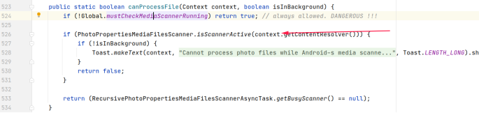
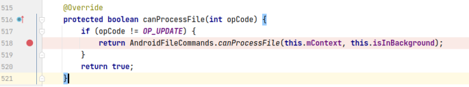
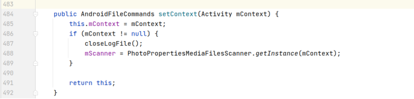
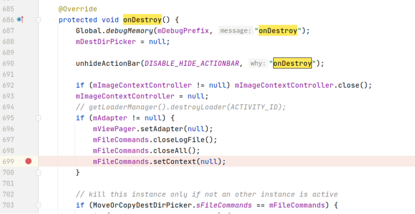
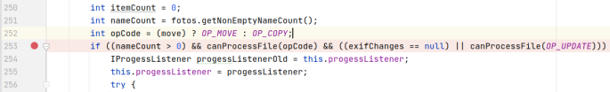
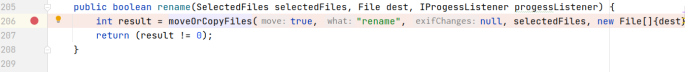
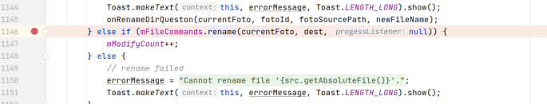
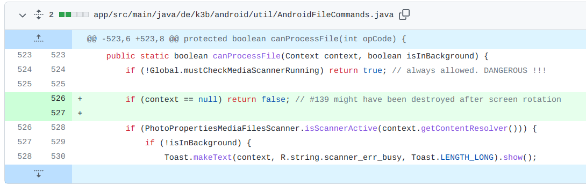

## 基本信息

app: [https://github.com/k3b/APhotoManager](https://github.com/k3b/APhotoManager)

issue: [https://github.com/k3b/APhotoManager/issues/139](https://github.com/k3b/APhotoManager/issues/139)

exception version: [https://github.com/k3b/APhotoManager/tree/045cebbb62bfb919d84a6856dfa6bb0a8ac78ba7](https://github.com/k3b/APhotoManager/tree/045cebbb62bfb919d84a6856dfa6bb0a8ac78ba7)

fix version: [https://github.com/k3b/APhotoManager/tree/09cf368d91af3b5abc74de3568a781aae650f18f](https://github.com/k3b/APhotoManager/tree/09cf368d91af3b5abc74de3568a781aae650f18f)

## 编译

正常

## 复现

复现视频: 目录下的re139

初始快照: 涉及旋转, 使用init

初始用例: 无

错误用例:

|Id|Type|Value|Desc|
|:----|:----|:----|:----|
|1|click|    |click a picture|
|2|click|    |click More options|
|3|click|    |click Rename|
|4|rotate|1|rotate h|
|5|editx|1|set text 1|
|6|rotate|0|rotate v|
|7|click|    |click OK|

覆盖(all:覆盖总数/代码总数, 其他:只被当前动作覆盖/被当前动作覆盖)

[all]1709/27564 [1]138/693 [2]0/47 [3]87/357 [4]0/617 [5]0/0 [6]2/619 [7]52/56  

## 崩溃信息

栈信息: 目录下的stack139

java.lang.NullPointerException: Attempt to invoke virtual method 'android.content.ContentResolver android.content.Context.getContentResolver()' on a null object reference

> de/k3b/android/util/AndroidFileCommands.java



## 分析

### root cause

分析context null的来源:

> de/k3b/android/util/AndroidFileCommands.java



经调试, this.mContext在这里赋值:

> de/k3b/android/util/AndroidFileCommands.java



setContext在这里被调用: 

> de/k3b/android/androFotoFinder/imagedetail/ImageDetailActivityViewPager.java



可以看到onDestroy时context将置空.

接下来分析一下出发崩溃的函数canProcessFile什么时候调用:

> de/k3b/io/FileCommands.java



> de/k3b/android/util/AndroidFileCommands.java



> de/k3b/android/androFotoFinder/imagedetail/ImageDetailActivityViewPager.java



可以看到重命名时会调用canProcessFile.

既然context是在onDestroy时置null, 在重命名时调用, 那我们可以猜测在重命名前发生了一次onDestroy. 根据经验应该是屏幕旋转引起的. 

经过我们的大量调试, 上述猜想是正确的, 只不过有几个细节让我们有些疑惑(不影响整体的错误原因):  修改名字的dialog在不旋转屏幕之前打开，这时我们假设对应对象是mFileCommands_4683, 而当旋转屏幕后会执行onDestroy方法将4683的context置空, 同时也会重新执行ImageDetailActivityViewPager的onCreate()，重新创建一个mFileCommands_4982(为什么是重新创建了一个, 而不是在4683上onCreate令我们疑惑), 此时点击rename, 它将调用mFileCommands_4683的mContext, 而mContext已经被置为空, 这导致了空指针异常

这个错误属于Component Lifecycle Error, 定位到onDestroy数据销毁处`de.k3b.android.androFotoFinder.imagedetail.ImageDetailActivityViewPager:699`

### fix

作者直接在context使用前判空, 属于Refine Condition Checks. 定位到`de.k3b.android.util.AndroidFileCommands:526`



## fix信息

修复模式: Refine Condition Checks

与栈信息的关系: =

距离:

|源文件总数|函数总数|回调总数|组件间通信|数据存储|
|:----|:----|:----|:----|:----|
|1|1|0|0|0|

标记(注释中的数字代表覆盖这条语句的动作):

```java
de.k3b.android.util.AndroidFileCommands
526 // 3,7
```
## root cause信息

root cause分类: Component Lifecycle Error

与栈信息的关系: >

距离:

|源文件总数|函数总数|回调总数|组件间通信|数据存储|
|:----|:----|:----|:----|:----|
|3|7|1|0|0|

标记(注释中的数字代表覆盖这条语句的动作):

```java
de.k3b.android.androFotoFinder.imagedetail.ImageDetailActivityViewPager
699 // 4,6
```
