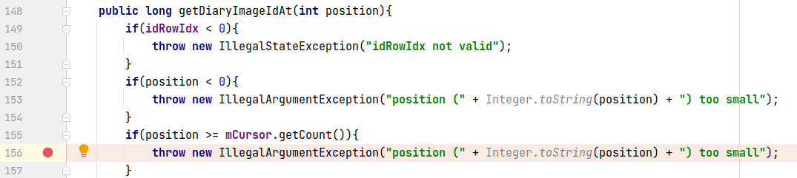
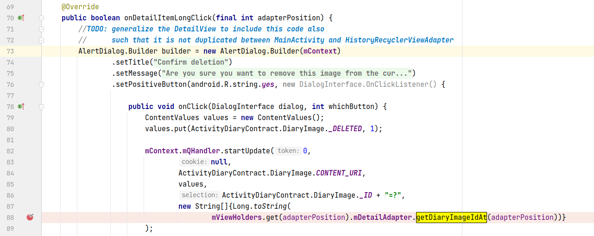
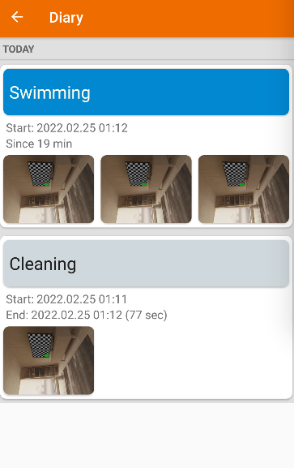
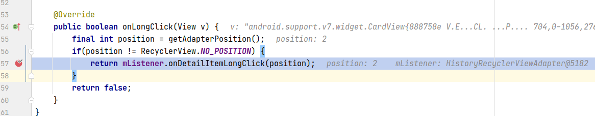
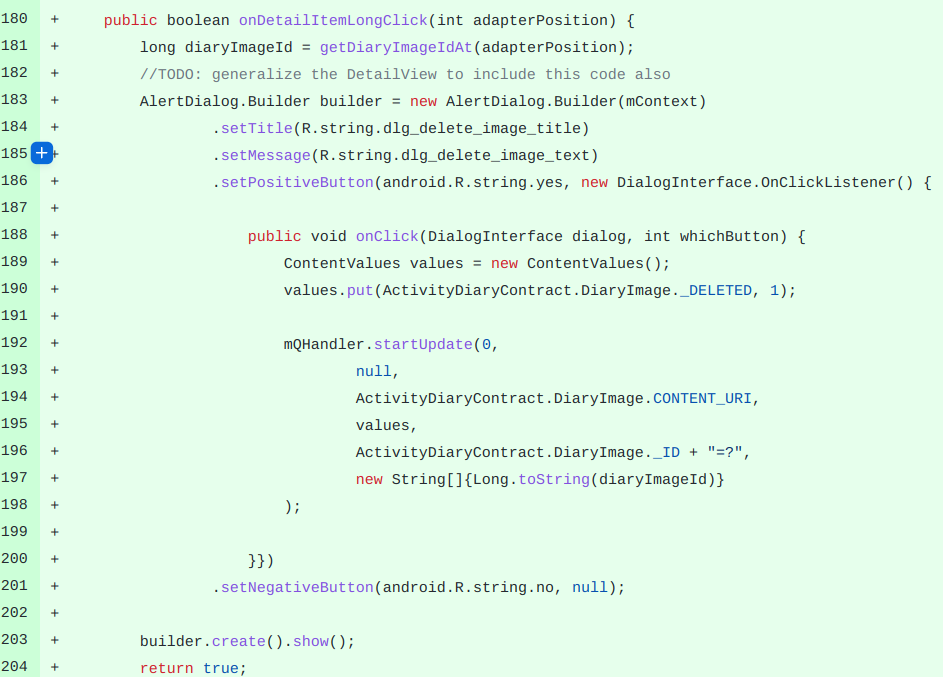

## 基本信息

app: [https://github.com/ramack/ActivityDiary](https://github.com/ramack/ActivityDiary)

issue: [https://github.com/ramack/ActivityDiary/issues/118](https://github.com/ramack/ActivityDiary/issues/118)

exception version: [https://github.com/ramack/ActivityDiary/tree/8cb2af1364c1ec99d49878d6a4e160150f547730](https://github.com/ramack/ActivityDiary/tree/8cb2af1364c1ec99d49878d6a4e160150f547730)

fix version: [https://github.com/ramack/ActivityDiary/tree/6f286be9cbae8d7016a061784dc7f6c8013632ca](https://github.com/ramack/ActivityDiary/tree/6f286be9cbae8d7016a061784dc7f6c8013632ca)

## 编译

正常编译

## 复现

复现视频: 目录下的re118

初始快照:

无

初始用例:

|1|click|    |click Cleaning|
|:----|:----|:----|:----|
|2|click|    |click camera|
|3|click|    |click ALLOW|

错误用例:

|1|click|    |click camera|
|:----|:----|:----|:----|
|2|click|    |click Shutter button|
|3|click|    |click YES|
|4|click|    |click Swimming|
|5|click|    |click Open navigation|
|6|click|    |click Diary|
|7|longclick|    |long click the image|
|8|click|    |click OK|

覆盖(all:覆盖总数/代码总数, 其他:只被当前动作覆盖/被当前动作覆盖)

[all]1029/6420 [1]9/56 [2]23/63 [3]24/335 [4]3/384 [5]4/11 [6]159/270 [7]10/18 [8]8/9

## 崩溃信息

栈信息: 目录下的stack118

java.lang.IllegalArgumentException: position (0) too small

>  de/rampro/activitydiary/ui/generic/DetailRecyclerViewAdapter.java



> de/rampro/activitydiary/ui/history/HistoryRecyclerViewAdapter.java



## 分析

### root cause

分析前首先根据界面介绍一下activity, recyclerview, adapter, holder等信息



整个界面是一个HistoryActivity, 包含一个historyRecyclerView, 与historyAdapter关联, 对应Swimming, Cleaning等条目. historyAdapter中的holder(HistoryViewHolders)中包含mImageRecycler, 关联mDetailAdapter, 对应每个条目中的图片.

理解view和adapter结构后就很容易分析了. 从长按选中出发:

> de/rampro/activitydiary/ui/generic/DetailViewHolders.java



这里onLongClick会把选中的图片id传递给onDetailItemLongClick处理. 比如上图中, 若我们选中Swimming的第3张图片则position为2, 若我们选中Cleaning的第1张图片则position为0. 接下来看一下确认删除对应的代码:

> de/rampro/activitydiary/ui/history/HistoryRecyclerViewAdapter.java


到这里错误就很清晰了, adapterPosition为图片的下标, 而不是Swimming, Cleaning等栏目的下标. 假如栏目0没有图片, 而我们选中了任意栏目的第一张图片, 那么实际会执行88行访问空栏目0的第一张图片, 从而产生数组溢出.

本质是下标出错引发的异常, root cause归为indexing error. 导致访问下标超出容量的位置在`de.rampro.activitydiary.ui.history.HistoryRecyclerViewAdapter:88`

### fix

看一下作者的修复, 实际是把onDetailItemLongClick逻辑移动到DetailRecyclerViewAdapter中, 从而可以直接调用getDiaryImageAt, 避免去mViewHolders中查询.



 作者的修复实际上是为了避免在mViewHolders查询mDetailAdapter, 本质是为了修复`de.rampro.activitydiary.ui.history.HistoryRecyclerViewAdapter:88` , 属于设计上的调整, fix模式归为Change Design

## fix信息

修复模式: Change Design

与栈信息的关系: =

距离:

|源文件总数|函数总数|回调总数|组件间通信|数据存储|
|:----|:----|:----|:----|:----|
|2|3|2|0|0|

标记(注释中的数字代表覆盖这条语句的动作):

```java
de.rampro.activitydiary.ui.history.HistoryRecyclerViewAdapter
88 // 8
```
## root cause信息

root cause分类: Indexing Error

与栈信息的关系: =

距离:

|源文件总数|函数总数|回调总数|组件间通信|数据存储|
|:----|:----|:----|:----|:----|
|2|3|2|0|0|

标记(注释中的数字代表覆盖这条语句的动作):

```java
de.rampro.activitydiary.ui.history.HistoryRecyclerViewAdapter
88 // 8
```
