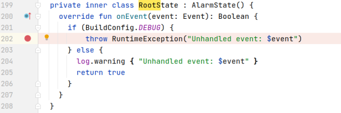
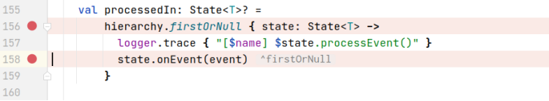
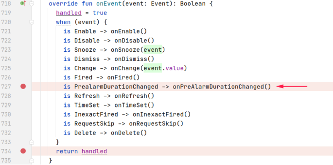
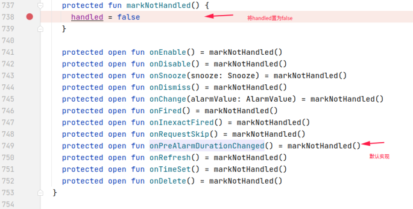
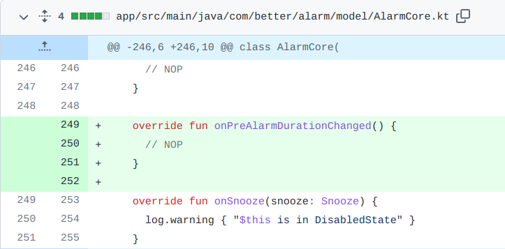

## 基本信息

app: [https://github.com/yuriykulikov/AlarmClock](https://github.com/yuriykulikov/AlarmClock)

issue: [https://github.com/yuriykulikov/AlarmClock/issues/389](https://github.com/yuriykulikov/AlarmClock/issues/389)

exception version: [https://github.com/yuriykulikov/AlarmClock/tree/3a380cce37e0731d5aa14011c5568d7bc0804cc5](https://github.com/yuriykulikov/AlarmClock/tree/3a380cce37e0731d5aa14011c5568d7bc0804cc5)

fix version: [https://github.com/yuriykulikov/AlarmClock/tree/d9569acce5fac896b9641a13b2f483a8305dfef9](https://github.com/yuriykulikov/AlarmClock/tree/d9569acce5fac896b9641a13b2f483a8305dfef9)

## 编译

应用崩溃后会立即打开gmail发送邮件, 导致我们的插桩插件不好自动捕捉崩溃, 因此使用MyCrash389手动捕捉崩溃.

## 复现

复现视频: 目录下的re389

初始快照: 无

初始用例: 无

错误用例:

|Id|Type|Value|Desc|
|:----|:----|:----|:----|
|1|click|    |click More options|
|2|click|    |click Settings|
|3|scroll|1|swipe up|
|4|click|    |click Pre-alarm duration|
|5|click|    |click 10 minutes|

覆盖(all:覆盖总数/代码总数, 其他:只被当前动作覆盖/被当前动作覆盖)

[all]1374/9001 [1]0/0 [2]135/211 [3]0/0 [4]3/3 [5]45/60 

## 崩溃信息

栈信息: 目录下的stack389

>  com/better/alarm/model/AlarmCore.kt



## 分析

### root cause

抛异常的原因是执行了这个onEnvent方法(其中BuildConfig.DEBUG是一个常量, 默认为true):

>  com/better/alarm/model/AlarmCore.kt


也就是说只要这个方法被调用就会抛出异常, 接下来分析这个函数在哪里被调用:

**关键函数**

关键是这个循环, 为了方便读者理解, 我们先说结论: 链表第一个元素是DisabledState, 第二个是RootState, 它们都继承自AlarmState. 调用DisabledState时返回了false, firstOrNull继续向下遍历, 从而调用了RootState的onEvent, 抛出了异常.

> com/better/alarm/statemachine/StateMachine.kt



为什么调用DisabledState的onEvent会返回false呢? 我们继续分析:

观察DisabledState，我们发现它没有重写onEvent方法，因此会调用父类AlarmState的onEvent, 此时会执行到onPreAlarmDurationChanged(). 由于DisabledState也没重写这个方法，因此它调用了默认实现:

>  com/better/alarm/model/AlarmCore.kt





而默认实现将handle置为false，这导致DisabledState的onEvent始终返回false, firstOrNull将继续遍历，从而执行RootState的onEvent并抛出异常.

这个异常的root cause超出了我们的分类范围, 归为其他. 不过可以确定的是, 问题的根本原因是调用了默认函数markNotHandled, 可以标记在`com.better.alarm.model.AlarmCore:738`

### fix

作者的修复是重写onPreAlarmDurationChanged, 这样就不会调用默认的markNotHandled了, 属于设计上的调整, 归为Change Design.



经过我们的分析, 作者主要是要防止调用默认的markNotHandled, 因此将fix标记在`com.better.alarm.model.AlarmCore:738`

## fix信息

修复模式: Change Design

与栈信息的关系: >

距离:

|源文件总数|函数总数|回调总数|组件间通信|数据存储|
|:----|:----|:----|:----|:----|
|2|5|0|0|0|

标记(注释中的数字代表覆盖这条语句的动作):

```java
com.better.alarm.model.AlarmCore
738 // 5
```
## root cause信息

root cause分类: 其他

与栈信息的关系: >

距离:

|源文件总数|函数总数|回调总数|组件间通信|数据存储|
|:----|:----|:----|:----|:----|
|2|5|0|0|0|

标记(注释中的数字代表覆盖这条语句的动作):

```java
com.better.alarm.model.AlarmCore
738 // 5
```
