## 基本信息

app: [https://github.com/TeamAmaze/AmazeFileManager](https://github.com/TeamAmaze/AmazeFileManager)

issue: [https://github.com/TeamAmaze/AmazeFileManager/issues/1796](https://github.com/TeamAmaze/AmazeFileManager/issues/1796)

exception version: [https://github.com/TeamAmaze/AmazeFileManager/tree/bad77788def71bfdb339d7df584056289c514832](https://github.com/TeamAmaze/AmazeFileManager/tree/bad77788def71bfdb339d7df584056289c514832)

fix version: [https://github.com/TeamAmaze/AmazeFileManager/tree/65a0a802d0f45b658d2bd0bdd2b28450aa2da994](https://github.com/TeamAmaze/AmazeFileManager/tree/65a0a802d0f45b658d2bd0bdd2b28450aa2da994)

## 编译

正常编译

## 复现

复现视频: 目录下的re1796

初始快照:

init

初始用例:

|1|click|    |click ALLOW|
|:----|:----|:----|:----|

错误用例:

|1|longclick|    |long click Alarm folder|
|:----|:----|:----|:----|
|2|click|    |click cut|
|3|click|    |click Alarms folder|
|4|click|    |click paste|

覆盖(all:覆盖总数/代码总数, 其他:只被当前动作覆盖/被当前动作覆盖)

[all]3149/50134 [1]112/352 [2]51/330 [3]50/410 [4]611/1067

## 崩溃信息

栈信息: 目录下的stack1796

java.lang.IndexOutOfBoundsException: Index: 0, Size: 0

>  com/amaze/filemanager/asynchronous/asynctasks/DeleteTask.java

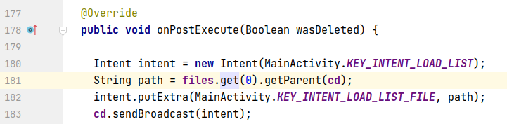

## 分析

### root cause

先来简单分析files元素来源:

>  com/amaze/filemanager/asynchronous/asynctasks/DeleteTask.java

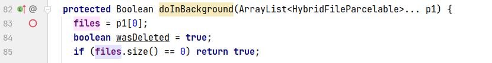

> com/amaze/filemanager/asynchronous/services/CopyService.java

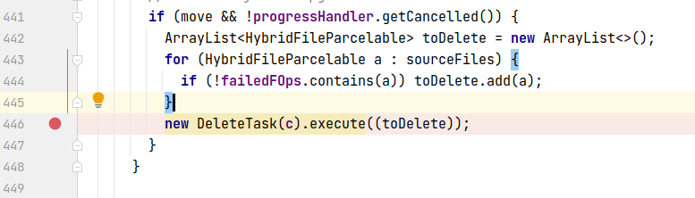

可以看到toDelete为空的原因是failedFOps与sourceFiles相同, 按理说我们接下来要它们两个的容量为什么相同, 但调试表明它们所在的execute函数只会在失败的时候执行, 因此我们更需要解答execute函数为什么只会在失败时执行. 我们通过逆向追踪sourceFiles的值进行分析:

> com/amaze/filemanager/asynchronous/services/CopyService.java

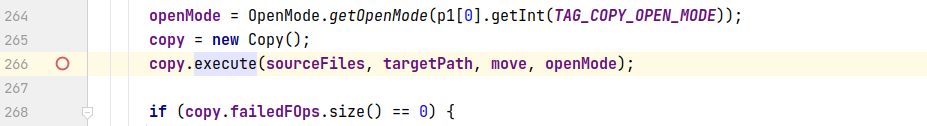

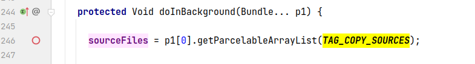

继续寻找调用doInBackground的execute函数, 同时寻找bundle的数据来源:

>  com/amaze/filemanager/asynchronous/services/CopyService.java


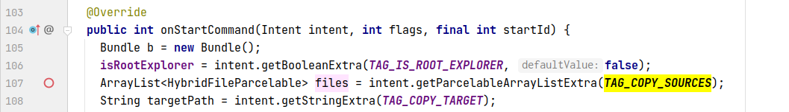

这里设计到了intent通信, 根据断点调试获取其数据来源:

>  com/amaze/filemanager/asynchronous/asynctasks/MoveFiles.java

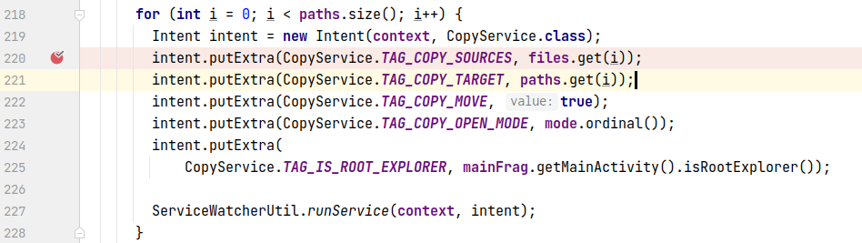

**关键函数**

现在我们来到了本次调试最关键的一个函数, 经过调试, 这个函数在崩溃时会执行false分支, 在不崩溃时会执行true分支, true分支会导致数组越界异常. 条件如下:

>  com/amaze/filemanager/asynchronous/asynctasks/MoveFiles.java

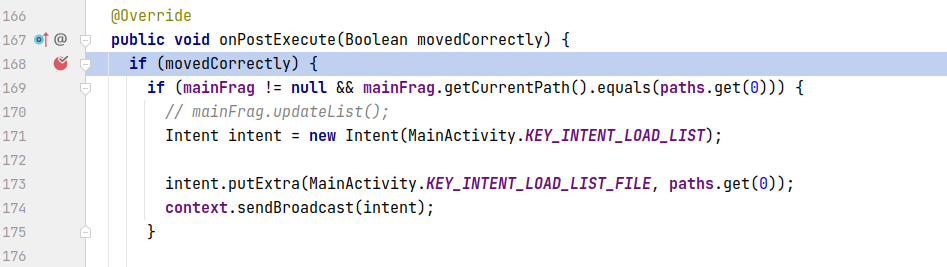

重点是movedCorredtly的来源, 我们知道onPostExecute的参数由doInBackground的返回值决定, 因此分析doInBackground:

>  com/amaze/filemanager/asynchronous/asynctasks/MoveFiles.java

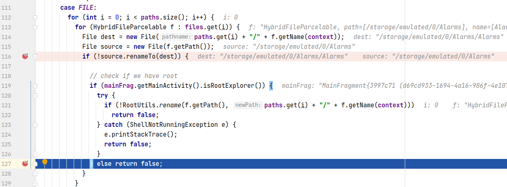

调试可知, 崩溃时进入了116的true分支, 最终执行到127返回false, 而不崩溃时会执行116的false分支. 导致崩溃的原因是rename失败:

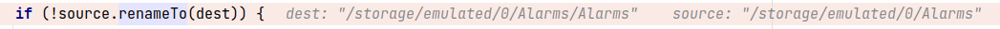

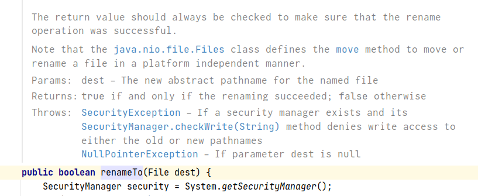

根据注释可知重命名失败时renameTo函数会返回false, 而像用例中这种将自己重命名为自己的子目录理所当然是会失败的. 这也是错误的根本原因.

这个异常属于API Usage Error, 非法参数导致renameTo返回false, 进一步引发异常. 我们将根本原因标记在`com.amaze.filemanager.asynchronous.asynctasks.MoveFiles:127`, 表示这是renameTo返回false引发的异常.

### fix

来看一下作者的修复, 整体上看作者把每个case中重复的循环拿到了switch外面, 把各个case中重复的变量也拿到外面统一声明, 这样是没有任何影响的. 需要注意的是作者在循环内先判断了是否可以合法移动, 这是一个新添加的函数, 只有在移动合法时才会执行各个case中的代码, 否则doInBackground返回true, 避免了renameTo返回false导致错误代码执行的问题. 作者的修复和我们的分析吻合. fix模式属于Refine Conditional Checks.

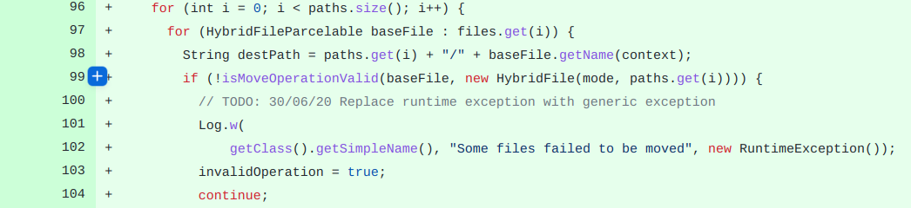

作者的修复本质上是为了避免路径非法时调用renameTo返回false, 标记在`com.amaze.filemanager.asynchronous.asynctasks.MoveFiles:127`.

## fix信息

修复模式: Refine Conditional Checks

与栈信息的关系: >

距离:

|源文件总数|函数总数|回调总数|组件间通信|数据存储|
|:----|:----|:----|:----|:----|
|3|6|6|4|0|

标记(注释中的数字代表覆盖这条语句的动作):

```java
com.amaze.filemanager.asynchronous.asynctasks.MoveFiles
127 // 4
```
## root cause信息

root cause分类: API Usage Error

与栈信息的关系: >

距离:

|源文件总数|函数总数|回调总数|组件间通信|数据存储|
|:----|:----|:----|:----|:----|
|3|6|6|4|0|

标记(注释中的数字代表覆盖这条语句的动作):

```java
com.amaze.filemanager.asynchronous.asynctasks.MoveFiles
127 // 4
```
