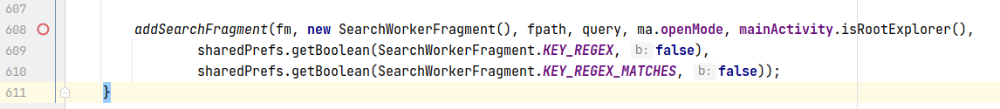
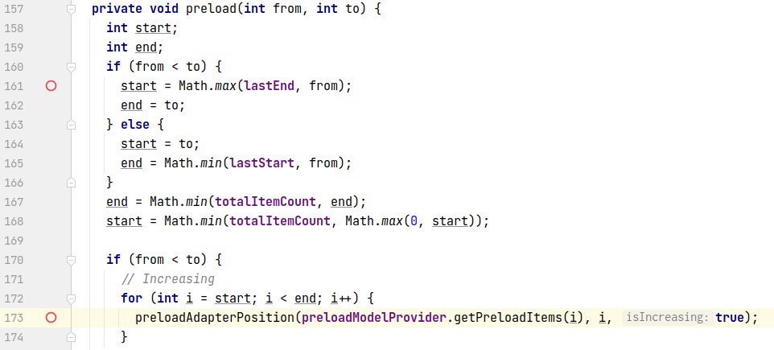

## 基本信息

app: [https://github.com/TeamAmaze/AmazeFileManager](https://github.com/TeamAmaze/AmazeFileManager)

issue: [https://github.com/TeamAmaze/AmazeFileManager/issues/1837](https://github.com/TeamAmaze/AmazeFileManager/issues/1837)

exception version: [https://github.com/marcinadd/AmazeFileManager/tree/3abca680d0c6bf5749761503664482a1706262ad](https://github.com/marcinadd/AmazeFileManager/tree/3abca680d0c6bf5749761503664482a1706262ad)

fix version: [https://github.com/marcinadd/AmazeFileManager/tree/897e847157305cab1919fdae1c127b72818c44d4](https://github.com/marcinadd/AmazeFileManager/tree/897e847157305cab1919fdae1c127b72818c44d4)

## 编译

正常编译

## 复现

复现视频: 目录下的re1837

初始快照: 无

初始用例:

|1|click|    |click ALLOW|
|:----|:----|:----|:----|

错误用例:

|1|click|    |click Search|
|:----|:----|:----|:----|
|2|edit|android|set text android|
|3|click|android|click Search|

覆盖(all:覆盖总数/代码总数, 其他:只被当前动作覆盖/被当前动作覆盖)

[all]2482/44849 [1]35/161 [2]2/8 [3]193/799

## 崩溃信息

栈信息: 目录下的stack1837

java.lang.IndexOutOfBoundsException: Index: 4, Size: 3

> com/amaze/filemanager/adapters/glide/RecyclerPreloadModelProvider.java


## 分析

### root cause

bug与搜索的内容有关, 从搜索看起:

> src/main/java/com/amaze/filemanager/ui/views/appbar/SearchView.java


setOnEditorActionListener负责响应用户的搜索动作, 功能是调用onSearch函数, 参数为用户输入的搜索内容. 这里的onSearch可以看作调用searchListener这个lamda表达式, 分析其源头:

> com/amaze/filemanager/ui/views/appbar/AppBar.java


> com/amaze/filemanager/activities/MainActivity.java


可以看到lamda表达式的功能是判断用户输入的搜索文本是否为空, 不为空的话调用mainActivityHelper的search方法. 看一下这个search方法:

> com/amaze/filemanager/utils/MainActivityHelper.java




循着search方法, 我们看到这里使用了bundle通信, 内容是用户输入的搜索文本, 根据key我们找一下接收方:

> com/amaze/filemanager/fragments/SearchWorkerFragment.java


可以看到接收方开启了一个异步任务处理用户的搜索请求, 我们来分析这个异步任务:

> com/amaze/filemanager/asynchronous/asynctasks/SearchAsyncTask.java


先看一下构造函数, SearchAsyncTask将用户输入的搜索文本保存到了成员变量mInput中, 另外需要注意的是mCallbacks这个成员变量, 经过简单分析可知它实际上就是MainActivity对象. 继续按照AsyncTask的生命周期进行分析, 我们发现错误时不会调用onPostExecute, 也就是说异步任务没有执行成功, 这里我们关注doInBackground和onProgressUpdate. 先看doInBackground:

> com/amaze/filemanager/asynchronous/asynctasks/SearchAsyncTask.java


这里调用了search函数, 并且将搜索内容全部转换成了小写, 之后就是递归寻找匹配搜索内容的文件, 每匹配到一个文件则调用publishPorgress, 将文件传递给onProgressUpdate处理. 这里需要注意搜索的整个过程是在异步任务内完成的, 隐约感觉这是一个并发错误.

接着看onProgressUpdate

> com/amaze/filemanager/asynchronous/asynctasks/SearchAsyncTask.java


这里调用了mCallbacks的onProgressUpdate函数, 回想上面的分析, 我们强调过mCallbacks其实就是MainActivity对象, 因此去分析MainActivity的onProgressUpdate函数:

> com/amaze/filemanager/asynchronous/asynctasks/SearchAsyncTask.java


> com/amaze/filemanager/fragments/MainFragment.java


**关键函数1**

这里来到了最关键的一个函数, 经过反复调试, 我们可以确定这段代码的功能为: 对第一个搜索到的文件, 调用true分支的代码, 对后续搜索到的文件调用false分支的代码. 先来看一下true分支做了什么, 主要是分析reloadListElements:

> com/amaze/filemanager/fragments/MainFragment.java


> com/amaze/filemanager/adapters/RecyclerAdapter.java


**关键函数2**

现在我们来到了第二个重要的函数, 这个函数会将itemsDigested与uris同步更新(createHeaders中itemsDigested与uris也是同步更新的, 可以自行验证), 接着创建RecyclerPreloadModelProvider对象, 并将uris的值传进去. 注意这里我们着重强调了"同步更新"的概念. 错误原因马上就会揭晓, 接着看一下RecyclerPreloadModelProvider类:

> com/amaze/filemanager/adapters/glide/RecyclerPreloadModelProvider.java


构造函数只是把uris保存在成员变量urisToLoad中, 重点是下面的getPreloadItem, 熟悉RecyclerView的话就知道这个函数会在数据加载时回调, 而我们的数组溢出错误正是在此处引发的. 仔细看一下, 我们发现根本原因是position的值超出了urisToload的容量. 现在需要分析position的值从何而来, 我们需要看一下glide源码:

> com/bumptech/glide/ListPreloader.java



position与start有关, start与from和totalItemCount有关, from是传参进来的, totalItemCount是成员变量. 继续分析preload的调用点:

> com/bumptech/glide/ListPreloader.java


> com/bumptech/glide/integration/recyclerview/RecyclerToListViewScrollListener.java


onScrolled函数除了滚动时回调, 也会在数据加载时回调, 不过这里我们更关心getItemCount这个方法, 这个我们比较熟悉, 是用户提供的RecycleView回调, 看一下相关源码:

> com/amaze/filemanager/adapters/RecyclerAdapter.java


itemsDigested! 我们上面一直强调itemsDigested和uris要同步更新, 如果二者的容量不一致的话就很可能导致数组溢出(这也是我们大量调试二者的容量总结出来的).  那二者的更新什么时候会出现差异呢? 回想关键函数1, 我们的false分支还没有分析:

> com/amaze/filemanager/adapters/RecyclerAdapter.java


可以看到这里只更新了itemsDigested, 导致itemsDigested和uris的容量出现了偏差. 另外, 这个崩溃其实也不是稳定发生的, 在不崩溃时, 整个异步任务结束后会调用onPostExecute, 进而调用关键函数1的true分支使得itemsDigested和uris的容量同步, 从而不会出现数组越界问题.

至此代码分析完毕, 我们来总结一下错误过程:

首先用户点击搜索, 开启异步任务进行文件搜索, 此时系统内有两个异步任务, 一个是文件搜索, 一个是RecycleView的数据加载. 当搜索涉及到两个以上的文件时文件搜索的异步任务会执行关键函数1的false分支, 导致itemsDigested和uris的容量不一致, 如果在其onPostExecute前调用RecycleView的getPreloadItems回调的话就会产生数组溢出问题

这个错误属于异步回调引发的并发错误, 归为Concurrency Error. 主要是`com.amaze.filemanager.adapters.RecyclerAdapter:341`导致itemsDigested和uris容量不一致, 接着`com.amaze.filemanager.adapters.glide.RecyclerPreloadModelProvider:36`使用itemsDigested相关下标访问uris引发的异常.

### fix

作者在数组访问处加了容量与position判断, 属于Refine Condition Checks. 修复的语句为`com.amaze.filemanager.adapters.glide.RecyclerPreloadModelProvider:36`


## fix信息

修复模式: Refine Conditional Checks

与栈信息的关系: =

距离:

|源文件总数|函数总数|回调总数|组件间通信|数据存储|
|:----|:----|:----|:----|:----|
|1|1|1|0|0|

标记(注释中的数字代表覆盖这条语句的动作):

```java
com.amaze.filemanager.adapters.glide.RecyclerPreloadModelProvider
36 // 0, 3
```
## root cause信息

root cause分类: Concurrency Error

与栈信息的关系: >

距离:

|源文件总数|函数总数|回调总数|组件间通信|数据存储|
|:----|:----|:----|:----|:----|
|8|19|8|2|0|

标记(注释中的数字代表覆盖这条语句的动作):

```java
com.amaze.filemanager.adapters.glide.RecyclerPreloadModelProvider
36 // 0, 3
com.amaze.filemanager.adapters.RecyclerAdapter
341 // 3
```
