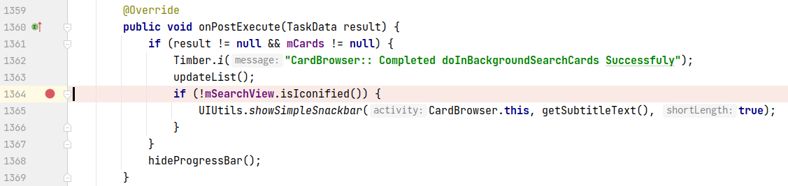
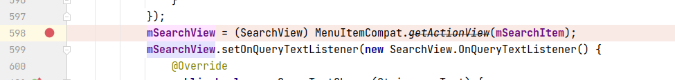
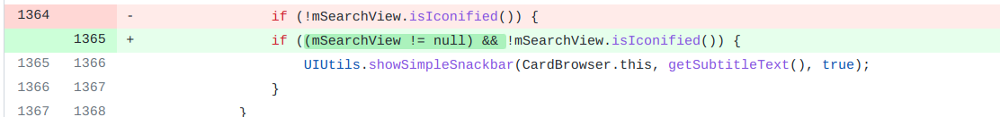

## 基本信息

app: [https://github.com/ankidroid/Anki-Android](https://github.com/ankidroid/Anki-Android)

issue: [https://github.com/ankidroid/Anki-Android/issues/4977](https://github.com/ankidroid/Anki-Android/issues/4977)

exception version: [https://github.com/mikehardy/Anki-Android/tree/dfa85850304bd8e71132f760f685a07d1f8749e3](https://github.com/mikehardy/Anki-Android/tree/dfa85850304bd8e71132f760f685a07d1f8749e3)

fix version: [https://github.com/mikehardy/Anki-Android/tree/49d449c9684f1e2a62f2d77a865358b071c0d384](https://github.com/mikehardy/Anki-Android/tree/49d449c9684f1e2a62f2d77a865358b071c0d384)

## 编译

androidTestUtil 'com.android.support.test:orchestrator:1.0.2'报错的话注释掉

## 复现

复现视频: 目录下的re4977

初始快照:

无

初始用例:

|Id|Type|Value|Desc|
|:----|:----|:----|:----|
|1|click|    |点击ALLOW|
|2|click|    |click Add|
|3|click|    |click Get shared decks|
|4|wait|1000|wait 1s|
|5|click|    |click back|

错误用例:

|Id|Type|Value|Desc|
|:----|:----|:----|:----|
|1|click|    |click Navigate up|
|2|click|    |click Card browser|

覆盖(all:覆盖总数/代码总数, 其他:只被当前动作覆盖/被当前动作覆盖)

[all]2016/70595 [1]8/43 [2]303/514 

## 崩溃信息

栈信息: 目录下的stack4977

java.lang.NullPointerException: Attempt to invoke virtual method 'boolean android.support.v7.widget.SearchView.isIconified()' on a null object reference

> com/ichi2/anki/CardBrowser.java



## 分析

### root cause

mSearchView的赋值在onCreateOptionsMenu中:

> com/ichi2/anki/CardBrowser.java



经过调试, 点击时触发的onCreateOptionsMenu和崩溃onPostExecute所在的异步任务是并发的, 可能出现onCreateOptionsMenu的mSearchView还没初始化, 但onPostExecute已经访问mSearchView的情况, 属于Concurrence Error(这个错误不太稳定). 标记在`com.ichi2.anki.CardBrowser:1364`共享数据读以及`com.ichi2.anki.CardBrowser:598`共享数据写.

注意`com.ichi2.anki.CardBrowser:598`可能执行不到, 这是因为先执行onCreateOptionsMenu后执行onPostExecute的情况很难发生,  实际中可能出现覆盖不到的情况.

### fix

作者的修复是加null判断, 属于Refine Condition Checks. 标记在`com.ichi2.anki.CardBrowser:1364`



## fix信息

修复模式: Refine Conditional Checks

与栈信息的关系: =

距离:

|源文件总数|函数总数|回调总数|组件间通信|数据存储|
|:----|:----|:----|:----|:----|
|1|1|1|0|0|

标记(注释中的数字代表覆盖这条语句的动作):

```java
com.ichi2.anki.CardBrowser
1364 // 2
```
## root cause信息

root cause分类: Concurrence Error

与栈信息的关系: >

距离:

|源文件总数|函数总数|回调总数|组件间通信|数据存储|
|:----|:----|:----|:----|:----|
|2|2|2|0|0|

标记(注释中的数字代表覆盖这条语句的动作):

```java
com.ichi2.anki.CardBrowser
1364 // 2
598 // -
```
## Ochi排名

art: 自动+手动生成相似用例

two: 错误用例+去除最后一步的正确用例

|用例/标记|fix|root cause|
|:----|:----|:----|
|art|136|136, -|
|two|268|268, -|

简单分析: `com.ichi2.anki.CardBrowser:1364`只被最后一个动作覆盖, 最后一个动作覆盖范围较大, 且其他用例也不具备区分性, 效果较差.`com.ichi2.anki.CardBrowser:598`为什么没有被覆盖在上面已经做了分析.
