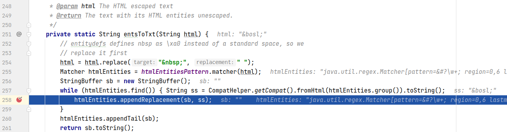
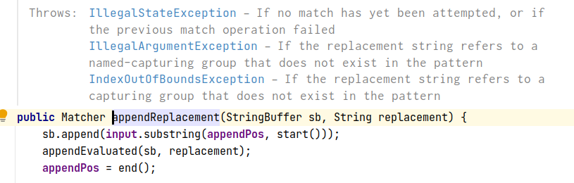
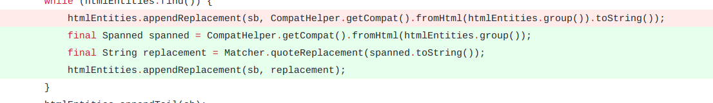

## 基本信息

app: [https://github.com/ankidroid/Anki-Android](https://github.com/ankidroid/Anki-Android)

issue: [https://github.com/ankidroid/Anki-Android/issues/5638](https://github.com/ankidroid/Anki-Android/issues/5638)

exception version: [https://github.com/pablode/Anki-Android/tree/ac527462170071626673b517d131e5c7f08a49a5](https://github.com/pablode/Anki-Android/tree/ac527462170071626673b517d131e5c7f08a49a5)

fix version: [https://github.com/pablode/Anki-Android/tree/f468cc0f76286e7e341282e6daf34bd5c528c98b](https://github.com/pablode/Anki-Android/tree/f468cc0f76286e7e341282e6daf34bd5c528c98b)

## 编译

正常

## 复现

复现视频: 目录下的re5638

初始快照:

无

初始用例:

|Id|Type|Value|Desc|
|:----|:----|:----|:----|
|1|click|    |click ALLOW|

错误用例:

|Id|Type|Value|Desc|
|:----|:----|:----|:----|
|1|click|    |click Add|
|2|click|    |click Add|
|3|edit|\|set text \(&bsol;)|

覆盖(all:覆盖总数/代码总数, 其他:只被当前动作覆盖/被当前动作覆盖)

[all]2155/68075 [1]0/1 [2]349/534 [3]32/50

## 崩溃信息

栈信息: 目录下的stack5638

java.lang.ArrayIndexOutOfBoundsException: Array index out of range: 1

> com/ichi2/libanki/Utils.java



为了方便查看变量值我在'{'后面添加了临时变量, 不会对代码产生影响.

## 分析

### root cause

appendReplacement(StringBuffer sb,String replacement)的用法: [https://blog.csdn.net/xiaojie119120/article/details/65439872](https://blog.csdn.net/xiaojie119120/article/details/65439872)

appendReplacement源码注释中说明了这个错误, replacement中包含特殊字符导致替换失败:



这个错误属于`com.ichi2.libanki.Utils:258`的API Usage Error, 传入了非法参数

### fix

作者修改:



主要是使用了quoteReplacement([https://21yi.com/java/java.util.regex.Matcher.quoteReplacement_10212.html](https://21yi.com/java/java.util.regex.Matcher.quoteReplacement_10212.html)), 将特殊字符转义. 

属于特殊的Refine Condition Checks. 标记在`com.ichi2.libanki.Utils:258`

## fix信息

修复模式: Refine Condition Checks

与栈信息的关系: =

距离:

|源文件总数|函数总数|回调总数|组件间通信|数据存储|
|:----|:----|:----|:----|:----|
|1|1|0|0|0|

标记(注释中的数字代表覆盖这条语句的动作):

```java
com.ichi2.libanki.Utils
258 // 3
```
## root cause信息

root cause分类: API Usage Error

与栈信息的关系: =

距离:

|源文件总数|函数总数|回调总数|组件间通信|数据存储|
|:----|:----|:----|:----|:----|
|1|1|0|0|0|

标记(注释中的数字代表覆盖这条语句的动作):

```java
com.ichi2.libanki.Utils
258 // 3
```
