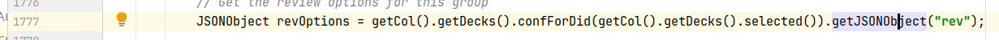
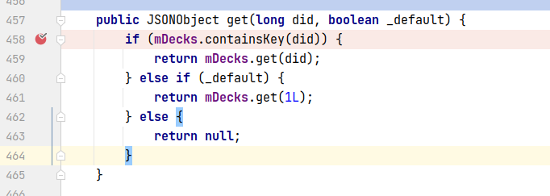
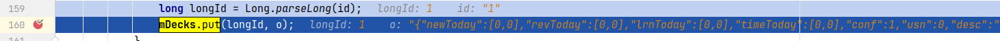
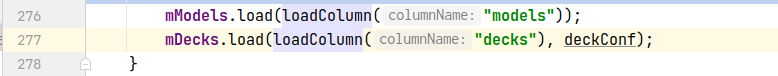
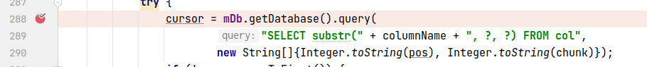
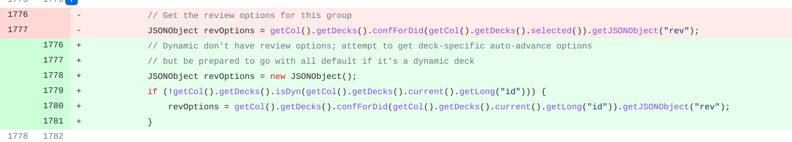

## 基本信息

app: [https://github.com/ankidroid/Anki-Android](https://github.com/ankidroid/Anki-Android)

issue: [https://github.com/ankidroid/Anki-Android/issues/5756](https://github.com/ankidroid/Anki-Android/issues/5756)

exception version: [https://github.com/mikehardy/Anki-Android/tree/006faf3621186e4f2e343d31c66f2fa8861512be](https://github.com/mikehardy/Anki-Android/tree/006faf3621186e4f2e343d31c66f2fa8861512be)

fix version: [https://github.com/mikehardy/Anki-Android/tree/cbb07e3c16bbd405cf2855e5eb150d5e82950e44](https://github.com/mikehardy/Anki-Android/tree/cbb07e3c16bbd405cf2855e5eb150d5e82950e44)

## 编译

正常

## 复现

复现视频: 目录下的re5756

初始快照:

为了避免上次创建的filtered deck产生影响, 需要一个干净的初始快照

|Id|Type|Value|Desc|
|:----|:----|:----|:----|
|1|click|    |click ALLOW|

错误用例:

|Id|Type|Value|Desc|
|:----|:----|:----|:----|
|1|click|    |click Add|
|2|click|    |click Add|
|3|editx|test|set text test(Front)|
|4|click|    |click Save|
|5|click|    |click back|
|6|click|    |click More options|
|7|click|    |click Create filtered deck|
|8|click|    |click Create|
|9|click|    |click cards selected by|
|10|click|    |click Random|
|11|click|    |click back|
|12|click|    |click back|
|13|click|    |click Filtered Deck 1|

覆盖(all:覆盖总数/代码总数, 其他:只被当前动作覆盖/被当前动作覆盖)

[all]3615/68656 [1]14/235 [2]142/542 [3]22/71 [4]281/597 [5]29/569 [6]0/22 [7]27/42 [8]221/776 [9]0/188 [10]29/80 [11]192/695 [12]19/647 [13]301/554 

## 崩溃信息

栈信息: 目录下的stack5756

java.lang.RuntimeException: Unable to start activity ComponentInfo{com.ichi2.anki/com.ichi2.anki.Reviewer}: java.lang.RuntimeException: org.json.JSONException: No value for rev

> com/ichi2/anki/AbstractFlashcardViewer.java



## 分析

### root cause

经过若干断点调试, 发现点击default时, deck有conf, 并且有rev; 点击非空deck filter时, deck没有conf, 且没有rev. conf和rev是绑定在一起的, 因此分析什么时候deck中会包含conf:

> com/ichi2/libanki/Decks.java



进一步断点调试发现, 当did为1, 此时mDecks.get(did)包含config, 否则不包含, 导致了rev的缺失(点击普通的default did为1, 点击deck fliter did不为1).

继续断点调试, 发现mDecks的赋值在这里:

> com/ichi2/libanki/Decks.java



而且只有longId为1时有config字段. 继续刨根:

> com/ichi2/libanki/Collection.java



> com/ichi2/libanki/Collection.java



最终定位到数据库文件, 我们看一下文件内容:

```plain
{
  "1644811206680": {
    "newToday": [
      0,
      0
    ],
    "revToday": [
      0,
      0
    ],
    "lrnToday": [
      0,
      0
    ],
    "timeToday": [
      0,
      0
    ],
    "collapsed": false,
    "dyn": 1,
    "desc": "",
    "usn": -1,
    "delays": null,
    "separate": true,
    "terms": [
      [
        "",
        100,
        0
      ]
    ],
    "resched": true,
    "return": true,
    "name": "Filtered Deck 1",
    "id": 1644811206680,
    "mod": 1644813865
  },
  "1": {
    "newToday": [
      0,
      0
    ],
    "revToday": [
      0,
      0
    ],
    "lrnToday": [
      0,
      0
    ],
    "timeToday": [
      0,
      0
    ],
    "conf": 1,
    "usn": 0,
    "desc": "",
    "dyn": 0,
    "collapsed": false,
    "extendNew": 10,
    "extendRev": 50,
    "id": 1,
    "name": "Default",
    "mod": 1644807038
  }
}
```
可以很清晰看到default和其他deck filter的区别, 体现在config的差异上. 

这个错误属于Resource Not Found Error, 在数据源头, 也就是数据库查询处可能存在一种不具备conf字段的json文件, 最终导致获取不到rev. 标记在数据源头`com.ichi2.libanki.Collection:288`.

### fix

作者修改时在rev获取处加了特判, 属于Refine Condition Check, 标记在`com.ichi2.anki.AbstractFlashcardViewer:1777`



## fix信息

修复模式: Refine Conditional Checks

与栈信息的关系: =

距离:

|源文件总数|函数总数|回调总数|组件间通信|数据存储|
|:----|:----|:----|:----|:----|
|1|1|0|0|1|

标记(注释中的数字代表覆盖这条语句的动作):

```java
com.ichi2.anki.AbstractFlashcardViewer
1777 // 13
```
## root cause信息

root cause分类: Resource Not Found Error

与栈信息的关系: >

距离:

|源文件总数|函数总数|回调总数|组件间通信|数据存储|
|:----|:----|:----|:----|:----|
|3|5|0|0|1|

标记(注释中的数字代表覆盖这条语句的动作):

```java
com.ichi2.libanki.Collection
288 // 0
```
