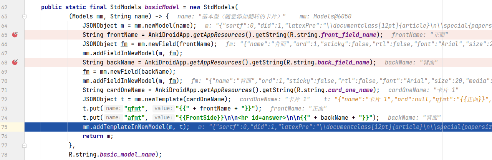

## 基本信息

app: [https://github.com/ankidroid/Anki-Android](https://github.com/ankidroid/Anki-Android)

issue: [https://github.com/ankidroid/Anki-Android/issues/6145](https://github.com/ankidroid/Anki-Android/issues/6145)

exception version: [https://github.com/Arthus/Anki-Android/tree/b8e3dd8da0abae3de86026a7aa2412aa50574781](https://github.com/Arthus/Anki-Android/tree/b8e3dd8da0abae3de86026a7aa2412aa50574781)

fix version: [https://github.com/Arthus/Anki-Android/tree/ee21e74e81b03a9217acac559a5a1029c96dc6d4](https://github.com/Arthus/Anki-Android/tree/ee21e74e81b03a9217acac559a5a1029c96dc6d4)

## 编译

正常

## 复现

复现视频: 目录下的re6145

初始快照:

由于要修改系统设置, 建议使用一个干净的初始快照, 避免每次运行系统状态不一致

初始用例:

|Id|Type|Value|Desc|
|:----|:----|:----|:----|
|1|click|    |click OK|
|2|click|    |click ALLOW|

错误用例:

|Id|Type|Value|Desc|
|:----|:----|:----|:----|
|1|click|    |click Navigate up|
|2|click|    |click Settings|
|3|click|    |click AnkiDroid|
|4|click|    |click Language|
|5|click|    |click Chinese (China)|
|6|click|    |click back|
|7|click|    |click Navigate up|
|8|click|    |click Settings|
|9|click|    |click 高级设置|
|10|scroll|1|up|
|11|scroll|1|up|
|12|scroll|1|up|
|13|click|    |enable v2|
|14|click|    |click OK|
|15|click|    |click back|
|16|click|    |click back|
|17|click|    |click More options|
|18|click|    |click Export collection|
|19|click|    |click OK|

覆盖(all:覆盖总数/代码总数, 其他:只被当前动作覆盖/被当前动作覆盖)

[all]2875/71670 [1]2/357 [2]16/208 [3]77/358 [4]0/0 [5]7/120 [6]0/1019 [7]0/94 [8]0/192 [9]90/371 [10]0/0 [11]0/0 [12]0/0 [13]8/70 [14]108/268 [15]0/20 [16]126/1042 [17]0/58 [18]41/70 [19]162/1103

## 崩溃信息

栈信息: 目录下的stack6145

java.lang.NullPointerException: Attempt to read from field 'java.lang.Object android.util.Pair.first' on a null object reference

> com/ichi2/libanki/Note.java


## 分析

### root cause

mFMap.get(key)为null, 断点调试可知"Front" key找不到, map中只有"正面", "背面", 猜测和语言有关. 另外, 关闭v2调度后崩溃代码不会被执行到, 将其视为一种另崩溃代码执行的必要条件, 重点分析语言影响:

> com/ichi2/libanki/Note.java


> com/ichi2/libanki/AnkiPackageExporter.java


**关键函数1**

可以看到"Front"是从447传入的, 作者没有考虑到语言切换的情况, 这也是错误的根本原因之一. 接下来我们分析map中为什么会是"正面"/"背面". 分析mFMap的put点, 其实就是这里的446 newNote引发的put:

> com/ichi2/libanki/Collection.java


> com/ichi2/libanki/Note.java


可以看到mFMap的值和mModel有关, 进而和76的model有关, 而model是Collection:550的mModels.current(forDeck)传入的, 因此分析current函数:

> com/ichi2/libanki/Models.java


断点调试发现current返回值与"curModel"的get有关, 而"curModel"的put操作是在262执行的, 与参数JSONObject m有关. 继续分析, 寻找JSONObject m的来源:

> com/ichi2/libanki/Models.java


> com/ichi2/libanki/StdModels.java




**关键函数2**

可以看到这里用了AnkiDroidApp.getAppResources().getString(R.string.front_field_name), 会根据当前的语言返回对应的字符串. 至此我们找到了错误数据来源.

总结一下, 系统语言设置为中文导致mFMap中保存了中文的"正面", 而get操作时使用了固定的字符串"Front"导致空指针异常. 这个错误的根本原因是`com.ichi2.libanki.StdModels:65`传入了中文数据, 导致"Front"找不到. 归为Resource Not Found Error.

### fix

作者修复时将"Front"换成了context.getString(R.string.front_field_name), 考虑到了系统语言的切换. 属于特殊的Refine Condition Checks. 标记在`com.ichi2.libanki.AnkiPackageExporter:447`


## fix信息

修复模式: Refine Condition Checks

与栈信息的关系: =

距离:

|源文件总数|函数总数|回调总数|组件间通信|数据存储|
|:----|:----|:----|:----|:----|
|2|3|0|0|0|

标记(注释中的数字代表覆盖这条语句的动作):

```java
com.ichi2.libanki.AnkiPackageExporter
447 // 19
```
## root cause信息

root cause分类: Resource Not Found Error

与栈信息的关系: >

距离:

|源文件总数|函数总数|回调总数|组件间通信|数据存储|
|:----|:----|:----|:----|:----|
|5|15|0|0|0|

标记(注释中的数字代表覆盖这条语句的动作):

```java
com.ichi2.libanki.StdModels
65 // 0, 19
```
