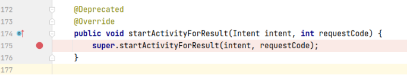
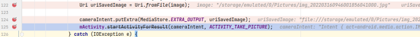
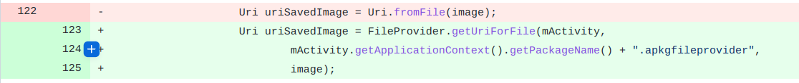

## 基本信息

app: [https://github.com/ankidroid/Anki-Android](https://github.com/ankidroid/Anki-Android)

issue: [https://github.com/ankidroid/Anki-Android/issues/4586](https://github.com/ankidroid/Anki-Android/issues/4586)

exception version: [https://github.com/ankidroid/Anki-Android/tree/8a19d76012f3bbe83fa3ea172a24a20229be2f53](https://github.com/ankidroid/Anki-Android/tree/8a19d76012f3bbe83fa3ea172a24a20229be2f53)

fix version: [https://github.com/ankidroid/Anki-Android/tree/237352c129ee5f45026edd24656bf369e155ed65](https://github.com/ankidroid/Anki-Android/tree/237352c129ee5f45026edd24656bf369e155ed65)

## 编译

插桩插件使用0.0.1, 兼容gradle2~3

## 复现

复现视频: 目录下的re4586

初始快照: 无

初始用例: 

|Id|Type|Value|Desc|
|:----|:----|:----|:----|
|1|click|    |click ALLOW|

错误用例:

|Id|Type|Value|Desc|
|:----|:----|:----|:----|
|1|click|    |click +|
|2|click|    |click Add|
|3|click|    |click attach|
|4|click|    |click Add image|
|5|click|    |click CAMERA|

覆盖(all:覆盖总数/代码总数, 其他:只被当前动作覆盖/被当前动作覆盖)

[all]1708/69833 [1]0/1 [2]332/534 [3]12/33 [4]197/364 [5]9/9 

## 崩溃信息

栈信息: 目录下的stack4586

android.os.FileUriExposedException: [file:///storage/emulated/0/Pictures/img_202203160933001279386420.jpg](file:///storage/emulated/0/Pictures/img_202203160933001279386420.jpg) exposed beyond app through ClipData.Item.getUri()

> com/ichi2/anki/AnkiActivity.java



## 分析

### root cause

startActivityForResult在这里调用:

> com/ichi2/anki/multimediacard/fields/BasicImageFieldController.java



android7.0修改了对私有存储的限制，不能通过Uri.fromFile获取资源. 归为`com.ichi2.anki.multimediacard.fields.BasicImageFieldController:122`的API Usage Error. 

### fix

作者修复时将Uri.fromFile换成了FileProvider.getUriForFile, 属于Change API. 标记在`com.ichi2.anki.multimediacard.fields.BasicImageFieldController:122`



## fix信息

修复模式: Change API

与栈信息的关系: >

距离:

|源文件总数|函数总数|回调总数|组件间通信|数据存储|
|:----|:----|:----|:----|:----|
|2|2|1|1|0|

标记(注释中的数字代表覆盖这条语句的动作):

```java
com.ichi2.anki.multimediacard.fields.BasicImageFieldController
122 // 5
```
## root cause信息

root cause分类: API Usage Error

与栈信息的关系: >

距离:

|源文件总数|函数总数|回调总数|组件间通信|数据存储|
|:----|:----|:----|:----|:----|
|2|2|1|1|0|

标记(注释中的数字代表覆盖这条语句的动作):

```java
com.ichi2.anki.multimediacard.fields.BasicImageFieldController
122 // 5
```
