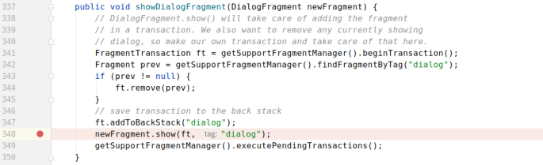
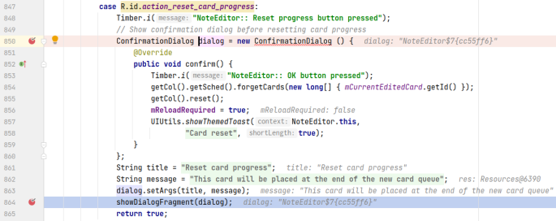
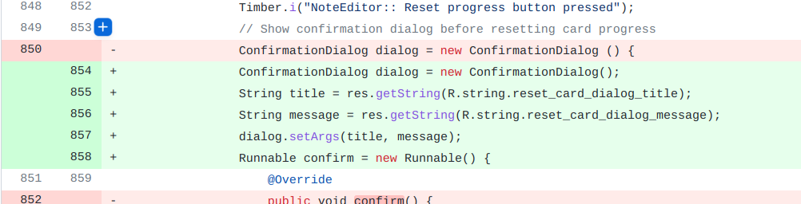

## 基本信息

app: [https://github.com/ankidroid/Anki-Android](https://github.com/ankidroid/Anki-Android)

issue: [https://github.com/ankidroid/Anki-Android/issues/4589](https://github.com/ankidroid/Anki-Android/issues/4589)

exception version: [https://github.com/timrae/Anki-Android/tree/05cb4e94aee076ee28dda00416e90d94e5002f91](https://github.com/timrae/Anki-Android/tree/05cb4e94aee076ee28dda00416e90d94e5002f91)

fix version: [https://github.com/timrae/Anki-Android/tree/5c8a30999eba23661d3e3a64072c64438ebf91a8](https://github.com/timrae/Anki-Android/tree/5c8a30999eba23661d3e3a64072c64438ebf91a8)

## 编译

gradle2.14.1换4.1

android gradle2.2.3换2.3.3

api模块buildTools 24.0.3->25.0.1

插桩插件使用0.0.1, 兼容gradle2~3

## 复现

复现视频: 目录下的re4589

初始快照: init

初始用例: 

|Id|Type|Value|Desc|
|:----|:----|:----|:----|
|1|click|    |click ALLOW|

错误用例:

|Id|Type|Value|Desc|
|:----|:----|:----|:----|
|1|click|    |click +|
|2|click|    |click Add|
|3|editx|test|set text test|
|4|click|    |click SAVE|
|5|click|    |click back|
|6|click|    |click Default|
|7|click|    |click More options|
|8|click|    |click Edit note|
|9|click|    |click More options|
|10|click|    |click Reset progress|

覆盖(all:覆盖总数/代码总数, 其他:只被当前动作覆盖/被当前动作覆盖)

[all]3532/69712 [1]0/1 [2]35/534 [3]33/70 [4]218/573 [5]52/527 [6]1060/1552 [7]19/189 [8]63/410 [9]6/116 [10]17/19 

## 崩溃信息

栈信息: 目录下的stack4589

java.lang.IllegalStateException: Fragment null must be a public static class to be  properly recreated from instance state.

> com/ichi2/anki/AnkiActivity.java



## 分析

### root cause

分析showDialogFragment的调用:

> com/ichi2/anki/NoteEditor.java



注意一下850用了匿名内部类的方式实现ConfirmationDialog. 经查阅, Fragment不能使用用匿名内部类的方式进行实现. 我们尝试修改fragment的实现方式后就不会报错了. 这个错误本质属于Framework Constraint Error. 标记在`com.ichi2.anki.NoteEditor:850`

### fix

作者虽然做了大规模修复, 但仔细观察会发现主要目的都是将ConfirmationDialog的匿名内部类作显示声明. 本质是对`com.ichi2.anki.NoteEditor:850`的修改, 属于Change Design. 另外, 作者也对其他位置的匿名内部类做了显示声明, 不过我们只考虑针对本次崩溃的修复, 因此只标记`com.ichi2.anki.NoteEditor:850`



## fix信息

修复模式: Change Design

与栈信息的关系: >

距离:

|源文件总数|函数总数|回调总数|组件间通信|数据存储|
|:----|:----|:----|:----|:----|
|2|2|1|0|0|

标记(注释中的数字代表覆盖这条语句的动作):

```java
com.ichi2.anki.NoteEditor
850 // 10
```
## root cause信息

root cause分类: Framework Constraint Error

与栈信息的关系: >

距离:

|源文件总数|函数总数|回调总数|组件间通信|数据存储|
|:----|:----|:----|:----|:----|
|2|2|1|0|0|

标记(注释中的数字代表覆盖这条语句的动作):

```java
com.ichi2.anki.NoteEditor
850 // 10
```
