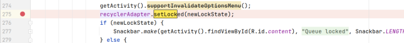
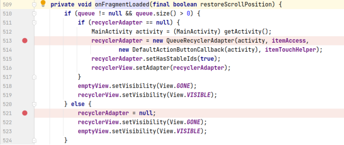
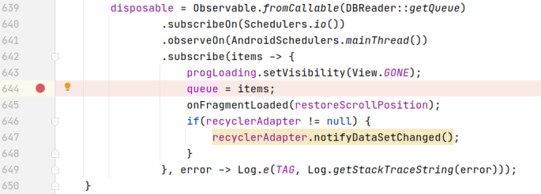
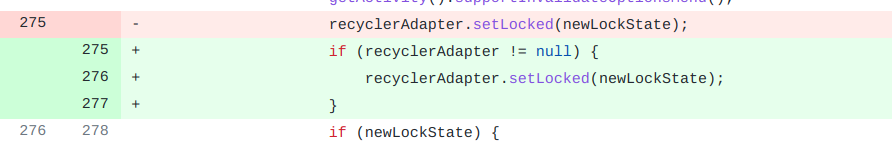

## 基本信息

app: [https://github.com/AntennaPod/AntennaPod](https://github.com/AntennaPod/AntennaPod)

issue: [https://github.com/AntennaPod/AntennaPod/issues/3138](https://github.com/AntennaPod/AntennaPod/issues/3138)

exception version: [https://github.com/AntennaPod/AntennaPod/tree/48ead285b3d465398b59d5296142f9a33ccd4835](https://github.com/AntennaPod/AntennaPod/tree/48ead285b3d465398b59d5296142f9a33ccd4835)

fix version: [https://github.com/AntennaPod/AntennaPod/tree/8e25f188c5d0cb04dcf56b864a11bd34c78e4642](https://github.com/AntennaPod/AntennaPod/tree/8e25f188c5d0cb04dcf56b864a11bd34c78e4642)

## 编译

正常

## 复现

复现视频: 目录下的re3138

初始快照: 为了方便复现, 先启动应用, 然后一直点击lock, 知道app崩溃, 接着再开启应用, 做个快照. 此时只要点击lock就会崩溃.

初始用例: 

无

错误用例:

|Id|Type|Value|Desc|
|:----|:----|:----|:----|
|1|click|    |click lock|

覆盖(all:覆盖总数/代码总数, 其他:只被当前动作覆盖/被当前动作覆盖)

[all]501/20740 [1]29/29 

## 崩溃信息

栈信息: 目录下的stack3138

java.lang.NullPointerException: Attempt to invoke virtual method 'void de.danoeh.antennapod.adapter.QueueRecyclerAdapter.setLocked(boolean)' on a null object reference

> app/src/main/java/de/danoeh/antennapod/fragment/QueueFragment.java



## 分析

### root cause

分析recycleAdapter null的来源, 发现onFragmentLoaded走了521行的else分支, 设置recycleAdapter为null:

> app/src/main/java/de/danoeh/antennapod/fragment/QueueFragment.java



而执行else是因为queue为空，queue是初始化时设为空的, 初始items的size为0, queue的size也为0, 是一定会走else分支的:

> app/src/main/java/de/danoeh/antennapod/fragment/QueueFragment.java



因此, 这个问题属于Resource Not Found, null来源于`de.danoeh.antennapod.fragment.QueueFragment:521`. 

### fix

作者修复时加了null特判, 属于Refine Condition Checks. 标记在`de.danoeh.antennapod.fragment.QueueFragment:275`



## fix信息

修复模式: Refine Condition Checks

与栈信息的关系: =

距离:

|源文件总数|函数总数|回调总数|组件间通信|数据存储|
|:----|:----|:----|:----|:----|
|1|1|0|0|0|

标记(注释中的数字代表覆盖这条语句的动作):

```java
de.danoeh.antennapod.fragment.QueueFragment
275 // 1
```
## root cause信息

root cause分类: Resource Not Found

与栈信息的关系: >

距离:

|源文件总数|函数总数|回调总数|组件间通信|数据存储|
|:----|:----|:----|:----|:----|
|1|1|0|0|0|

标记(注释中的数字代表覆盖这条语句的动作):

```java
de.danoeh.antennapod.fragment.QueueFragment
521 // 0
```
