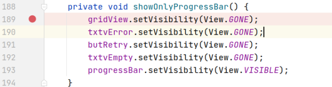
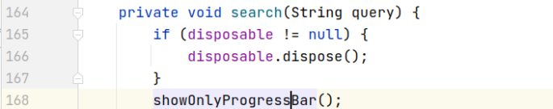
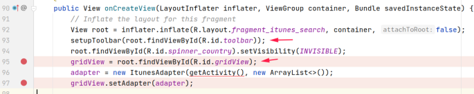
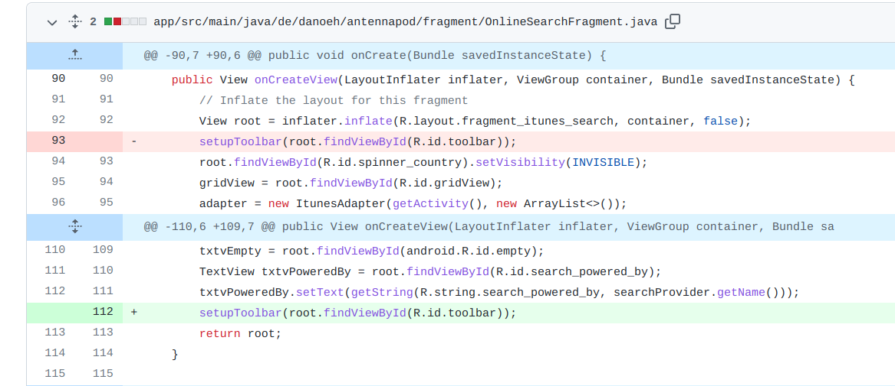

## 基本信息

app: [https://github.com/AntennaPod/AntennaPod](https://github.com/AntennaPod/AntennaPod)

issue: [https://github.com/AntennaPod/AntennaPod/pull/4645](https://github.com/AntennaPod/AntennaPod/pull/4645)

exception version: [https://github.com/ByteHamster/AntennaPod/tree/9f4c90ebfb2f7222bbbce3c19463be9f534f3c91](https://github.com/ByteHamster/AntennaPod/tree/9f4c90ebfb2f7222bbbce3c19463be9f534f3c91)

fix version: [https://github.com/ByteHamster/AntennaPod/tree/ad56eed255789bb3ea93ea6523276befab1233a2](https://github.com/ByteHamster/AntennaPod/tree/ad56eed255789bb3ea93ea6523276befab1233a2)

## 编译

正常

## 复现

复现视频: 目录下的re4645

初始快照: init

初始用例: 

|Id|Type|Value|Desc|
|:----|:----|:----|:----|
|1|keyevent|KEYCODE_BACK|back|

错误用例:

|Id|Type|Value|Desc|
|:----|:----|:----|:----|
|1|edit|abc|set text abc|
|2|click|    |click Search|

覆盖(all:覆盖总数/代码总数, 其他:只被当前动作覆盖/被当前动作覆盖)

[all]979/23496 [1]0/1 [2]93/96 

## 崩溃信息

栈信息: 目录下的stack4645

java.lang.NullPointerException: Attempt to invoke virtual method 'void android.view.View.setVisibility(int)' on a null object reference

> app/src/main/java/de/danoeh/antennapod/fragment/OnlineSearchFragment.java



## 分析

### root cause

这个空指针异常主要是因为调用顺序问题, 导致gridView未初始就被使用

先来看一下showOnlyProgressBar的调用:

> app/src/main/java/de/danoeh/antennapod/fragment/OnlineSearchFragment.java



> app/src/main/java/de/danoeh/antennapod/fragment/OnlineSearchFragment.java


> app/src/main/java/de/danoeh/antennapod/fragment/OnlineSearchFragment.java



可以看到onCreateView内先执行了setupToolbar, 然后再对gridView初始化. 然而setupToolbar会注册回调并立即触发, 访问gridView, 引发空指针异常.

这个问题属于Resource Not Found, setupToolbar在gridView初始化前调用导致gridView为null. 可参考作者的fix记录, 将setupToolbar的调用视为错误数据源头, 标记在`de.danoeh.antennapod.fragment.OnlineSearchFragment:93`

### fix

作者修复时将setupToolbar调整到了gridView初始化的下方. 属于设计上的调整, 归为Change Design. 定位到`de.danoeh.antennapod.fragment.OnlineSearchFragment:93`



## fix信息

修复模式: Change Design

与栈信息的关系: =

距离:

|源文件总数|函数总数|回调总数|组件间通信|数据存储|
|:----|:----|:----|:----|:----|
|1|4|2|0|0|

标记(注释中的数字代表覆盖这条语句的动作):

```java
de.danoeh.antennapod.fragment.OnlineSearchFragment
93 // 2
```
## root cause信息

root cause分类: Resource Not Found

与栈信息的关系: =

距离:

|源文件总数|函数总数|回调总数|组件间通信|数据存储|
|:----|:----|:----|:----|:----|
|1|4|2|0|0|

标记(注释中的数字代表覆盖这条语句的动作):

```java
de.danoeh.antennapod.fragment.OnlineSearchFragment
93 // 2
```
