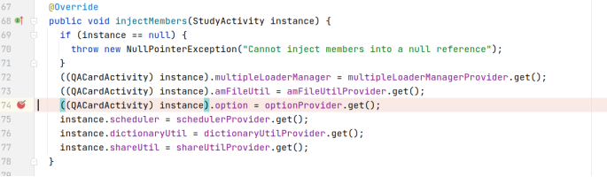

## 基本信息

app: [https://github.com/helloworld1/AnyMemo](https://github.com/helloworld1/AnyMemo)

issue: [https://github.com/helloworld1/AnyMemo/issues/422](https://github.com/helloworld1/AnyMemo/issues/422)

exception version: [https://github.com/helloworld1/AnyMemo/tree/23cfc4b1684e3944d0f0f650c7357651354474e3](https://github.com/helloworld1/AnyMemo/tree/23cfc4b1684e3944d0f0f650c7357651354474e3)

fix version: [https://github.com/helloworld1/AnyMemo/tree/3eb738ac52144fe7b50e16d24a6bed60aaeda51c](https://github.com/helloworld1/AnyMemo/tree/3eb738ac52144fe7b50e16d24a6bed60aaeda51c)

## 编译

正常

## 复现

复现视频: 目录下的re422

初始快照: 涉及屏幕旋转, 使用init快照

初始用例: 

|Id|Type|Value|Desc|
|:----|:----|:----|:----|
|1|click|    |click ALLOW|
|2|click|    |click OK|

错误用例:

|Id|Type|Value|Desc|
|:----|:----|:----|:----|
|1|click|    |click .db|
|2|rotate|1|rotate h|

覆盖(all:覆盖总数/代码总数, 其他:只被当前动作覆盖/被当前动作覆盖)

[all]1888/29092 [1]888/1278 [2]69/426 

## 崩溃信息

栈信息: 目录下的stack422

java.lang.NullPointerException: Attempt to invoke virtual method 'org.liberty.android.fantastischmemo.entity.Option$ButtonStyle org.liberty.android.fantastischmemo.entity.Option.getButtonStyle()' on a null object reference

> app/src/main/java/org/liberty/android/fantastischmemo/ui/GradeButtonsFragment.java


## 分析

### root cause

分析options为null的原因:

> app/src/main/java/org/liberty/android/fantastischmemo/ui/GradeButtonsFragment.java


> app/src/main/java/org/liberty/android/fantastischmemo/ui/QACardActivity.java


> app/build/generated/source/apt/dev/debug/org/liberty/android/fantastischmemo/ui/QACardActivity_MembersInjector.java




option在这里注入的, 正常情况会执行QACardActivity和StudyActivity的onCreate方法，对option进行注入:

> app/src/main/java/org/liberty/android/fantastischmemo/ui/StudyActivity.java


> app/src/main/java/org/liberty/android/fantastischmemo/ui/QACardActivity.java


而旋转屏幕时，GradeButtonsFragment的onAttach方法会在StudyActivity和QACardActivity的onCreate方法之前执行，这导致了option获取为空:

> app/src/main/java/org/liberty/android/fantastischmemo/ui/GradeButtonsFragment.java


这个问题属于Component Lifecycle Error, 旋转时onAttach在onCreate前执行导致option为null. 标记在onAttach中data loss处`org.liberty.android.fantastischmemo.ui.GradeButtonsFragment:118`

### fix

作者也是在`org.liberty.android.fantastischmemo.ui.GradeButtonsFragment:118`做了修复, 将this.activity换成了appComponents, 属于设计上的修改, 归为Change Design.


## fix信息

修复模式: Change Design

与栈信息的关系: >

距离:

|源文件总数|函数总数|回调总数|组件间通信|数据存储|
|:----|:----|:----|:----|:----|
|4|5|3|0|0|

标记(注释中的数字代表覆盖这条语句的动作):

```java
org.liberty.android.fantastischmemo.ui.GradeButtonsFragment
118 // 1,2
```
## root cause信息

root cause分类: Component Lifecycle Error

与栈信息的关系: >

距离:

|源文件总数|函数总数|回调总数|组件间通信|数据存储|
|:----|:----|:----|:----|:----|
|4|5|3|0|0|

标记(注释中的数字代表覆盖这条语句的动作):

```java
org.liberty.android.fantastischmemo.ui.GradeButtonsFragment
118 // 1,2
```
## Ochi排名

art: 自动+手动生成相似用例

two: 错误用例+去除最后一步的正确用例

|用例/标记|fix|root cause|
|:----|:----|:----|
|art|1106|1106|
|two|1106|1106|

简单分析: 动作1,2都会覆盖错误语句, 没有差异性, 效果不好.

