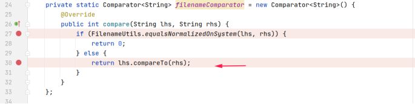
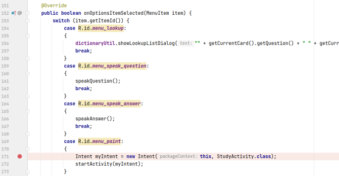
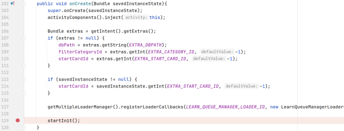
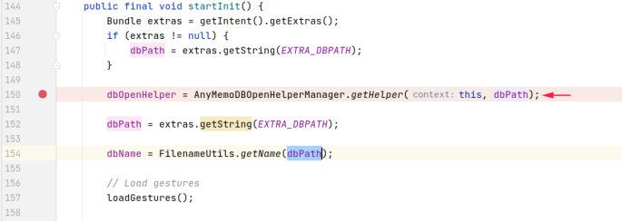
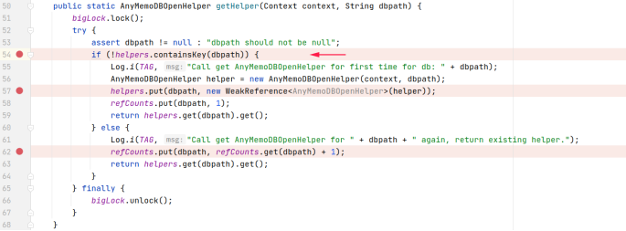
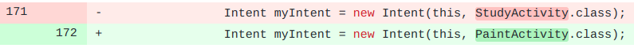

## 基本信息

app: [https://github.com/helloworld1/AnyMemo](https://github.com/helloworld1/AnyMemo)

issue: [https://github.com/helloworld1/AnyMemo/issues/440](https://github.com/helloworld1/AnyMemo/issues/440)

exception version: [https://github.com/helloworld1/AnyMemo/tree/dfb95080eaaf67055c9e5182be3e99260a56eaab](https://github.com/helloworld1/AnyMemo/tree/dfb95080eaaf67055c9e5182be3e99260a56eaab)

fix version: [https://github.com/helloworld1/AnyMemo/tree/e328ca8ffc7c8d076544208116795b3c98f6d4b1](https://github.com/helloworld1/AnyMemo/tree/e328ca8ffc7c8d076544208116795b3c98f6d4b1)

## 编译

注意使用插桩插件的0.0.1版本, 兼容gradle2~3

## 复现

复现视频: 目录下的re440

初始快照: 无

初始用例: 

|Id|Type|Value|Desc|
|:----|:----|:----|:----|
|1|click|    |click ALLOW|
|2|click|    |click OK|

错误用例:

|Id|Type|Value|Desc|
|:----|:----|:----|:----|
|1|click|    |click MORE|
|2|click|    |click Quiz|
|3|click|    |click START QUIZ|
|4|click|    |click More options|
|5|click|    |click Paint|

覆盖(all:覆盖总数/代码总数, 其他:只被当前动作覆盖/被当前动作覆盖)

[all]1788/29309 [1]43/64 [2]150/249 [3]781/908 [4]8/45 [5]41/129 

## 崩溃信息

栈信息: 目录下的stack440

java.lang.NullPointerException: Attempt to invoke virtual method 'int java.lang.String.compareTo(java.lang.String)' on a null object reference

> app/src/main/java/org/liberty/android/fantastischmemo/common/AnyMemoDBOpenHelperManager.java



## 分析

### root cause

这个比较器被map helpers使用:

> app/src/main/java/org/liberty/android/fantastischmemo/common/AnyMemoDBOpenHelperManager.java


下面分析helpers什么时候会传入null:

点击Paint时:

> app/src/main/java/org/liberty/android/fantastischmemo/ui/QuizActivity.java



**关键函数**

这里使用了Intent启动activity, 注意intent创建后并没有putExtra(). 现在来到StudyActivity的onCreate:

> app/src/main/java/org/liberty/android/fantastischmemo/ui/StudyActivity.java



启动StudyActivity方法时调用startInit():

> app/src/main/java/org/liberty/android/fantastischmemo/ui/QACardActivity.java



而调用startInit()时，extras为空(关键函数并没有putExtra), 进而dbPath为空，因此产生了空指针异常:

> app/src/main/java/org/liberty/android/fantastischmemo/common/AnyMemoDBOpenHelperManager.java



这个错误属于Resource Not Found. null的来源是关键函数并没有putExtra, 标记在`org.liberty.android.fantastischmemo.ui.QuizActivity:171`

### fix

观察作者的修复, 发现这个错其实是Activity写错了, 应该调用PaintActivity写成了StudyActivity. 作者的修改属于设计上的调整, 归为Change Design, 标记在`org.liberty.android.fantastischmemo.ui.QuizActivity:171`



## fix信息

修复模式: Change Design

与栈信息的关系: >

距离:

|源文件总数|函数总数|回调总数|组件间通信|数据存储|
|:----|:----|:----|:----|:----|
|3|6|2|1|0|

标记(注释中的数字代表覆盖这条语句的动作):

```java
org.liberty.android.fantastischmemo.ui.QuizActivity
171 // 5
```
## root cause信息

root cause分类: Resource Not Found

与栈信息的关系: >

距离:

|源文件总数|函数总数|回调总数|组件间通信|数据存储|
|:----|:----|:----|:----|:----|
|3|6|2|1|0|

标记(注释中的数字代表覆盖这条语句的动作):

```java
org.liberty.android.fantastischmemo.ui.QuizActivity
171 // 5
```
## Ochi排名

art: 自动+手动生成相似用例

two: 错误用例+去除最后一步的正确用例

|用例/标记|fix|root cause|
|:----|:----|:----|
|art|34|34|
|two|39|39|

简单分析: 崩溃语句只和最后一个动作相关. 最后一个动作覆盖范围较小, 定位效果也还可以.

