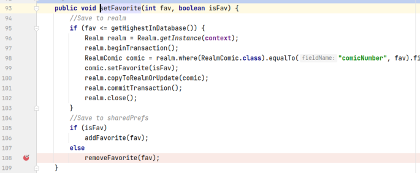

## 基本信息

app: [https://github.com/tom-anders/Easy_xkcd](https://github.com/tom-anders/Easy_xkcd)

issue: [https://github.com/tom-anders/Easy_xkcd/issues/134](https://github.com/tom-anders/Easy_xkcd/issues/134)

exception version: [https://github.com/tom-anders/Easy_xkcd/tree/23ade11a2bcb520e5d3868f8368050413db08ed3](https://github.com/tom-anders/Easy_xkcd/tree/23ade11a2bcb520e5d3868f8368050413db08ed3)

fix version: [https://github.com/tom-anders/Easy_xkcd/tree/983643696fe1074b8732e74e64a25d323f9948ce](https://github.com/tom-anders/Easy_xkcd/tree/983643696fe1074b8732e74e64a25d323f9948ce)

## 编译

正常

## 复现

复现视频: 目录下的re134

初始快照: 涉及旋转, 使用init

初始用例: 

|Id|Type|Value|Desc|
|:----|:----|:----|:----|
|1|wait|3000|wait 3s|

错误用例:

|Id|Type|Value|Desc|
|:----|:----|:----|:----|
|1|click|    |click Add to Favorites|
|2|click|    |click ALLOW|
|3|click|    |click Open navigation drawer|
|4|click|    |click Favorites|
|5|click|    |click Remove from Favorites|
|6|rotate|1|rotate h|

覆盖(all:覆盖总数/代码总数, 其他:只被当前动作覆盖/被当前动作覆盖)

[all]800/10841 [1]7/20 [2]49/106 [3]0/4 [4]43/221 [5]31/164 [6]32/415  

## 崩溃信息

栈信息: 目录下的stack134

java.lang.NullPointerException: Attempt to get length of null array

> app/src/main/java/de/tap/easy_xkcd/fragments/comics/FavoritesFragment.java


## 分析

### root cause

首先简单分析一下doInBackground所在的任务是在哪里创建的:

> app/src/main/java/de/tap/easy_xkcd/fragments/comics/FavoritesFragment.java


上面这个函数是FavoritesFragment的onCreateView, 可以大概理解为随着FavoritesFragment的创建, 执行updateFavorites任务, 最终引发崩溃.

注意, FavoritesFragment是在列表中点击Favorites后创建的, 刚启动app显示的页面是ComicBrowserFragment.


理解了updateFavorites任务何时启动, 接下来我们分析favorites null的来源:

> app/src/main/java/de/tap/easy_xkcd/database/DatabaseManager.java


favorites是从这个方法获取的，可以看到当fs为空时favorites也为空

接下来分析FAVORITES来源, 经过我们的调试, FAVORITES的设置和点击取消收藏动作相关(这里我们分析FavoritesFragment上的取消收藏动作):

> de/tap/easy_xkcd/fragments/comics/FavoritesFragment.java


> de/tap/easy_xkcd/fragments/comics/ComicFragment.java


> de/tap/easy_xkcd/database/DatabaseManager.java




可以看到这里将FAVORITES对应的值设为了null. 也就是说点击取消收藏fs会为null, 进而导致favorites的值为null, 此时若调用FavoritesFragment的onCreateView就会引发空指针异常.

结合我们的操作, 这个错误就很容易理解了. 首先我们通过在列表中点击Favorites开启FavoritesFragment, 接着取消收藏是的favorites的值为null. 然后, 我们旋转了屏幕, 致使FavoritesFragment重绘, 重新调用onCreateView, 产生空指针异常.

不过要注意的是取消收藏也是一个异步任务, 若取消收藏的速度比updateFavorites的速度慢则不会产生异常, 有一定的不确定性.

这个错误本质属于Component Lifecycle Error. 定位在`de.tap.easy_xkcd.database.DatabaseManager:135`设置FAVORITES对应的值为null. 

### fix

作者在FavoritesFragment上取消收藏动作时做了判断(确切来说是在onPostExecute做了特判), 如果没有favorites则删除FavoritesFragment, 归为特殊的Refine Condition Checks. 作者本质上是想修改DeleteImageTask的逻辑, 因此我们将修复标记在`de.tap.easy_xkcd.fragments.comics.FavoritesFragment:432`启动DeleteImageTask处


## fix信息

修复模式: Refine Condition Checks

与栈信息的关系: =

距离:

|源文件总数|函数总数|回调总数|组件间通信|数据存储|
|:----|:----|:----|:----|:----|
|3|8|4|0|1|

标记(注释中的数字代表覆盖这条语句的动作):

```java
de.tap.easy_xkcd.fragments.comics.FavoritesFragment
432 // 5
```
## root cause信息

root cause分类: Component Lifecycle Error

与栈信息的关系: >

距离:

|源文件总数|函数总数|回调总数|组件间通信|数据存储|
|:----|:----|:----|:----|:----|
|3|8|4|0|1|

标记(注释中的数字代表覆盖这条语句的动作):

```java
de.tap.easy_xkcd.database.DatabaseManager
135 // 5
```
## Ochi排名

art: 自动+手动生成相似用例

two: 错误用例+去除最后一步的正确用例

|用例/标记|fix|root cause|
|:----|:----|:----|
|art|22|117|
|two|569|265|

简单分析:错误和取消收藏操作有关, two体现不出这种差异效果比较差, 而art中有不进行收藏的用例, 可以体现这种差异. 至于art的root cause为什么效果不好目前还没法做深入分析, 可能是在并列排名中过于靠后.

