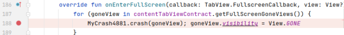
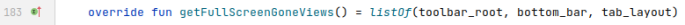
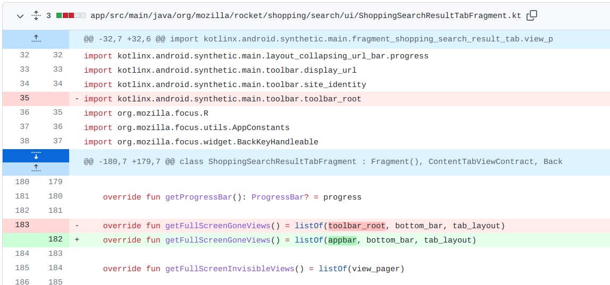

## 基本信息

app: [https://github.com/mozilla-tw/FirefoxLite](https://github.com/mozilla-tw/FirefoxLite)

issue: [https://github.com/mozilla-tw/FirefoxLite/issues/4881](https://github.com/mozilla-tw/FirefoxLite/issues/4881)

exception version: [https://github.com/proevan/Rocket/tree/3d43e9c5c03d8e780d72ec261b28baeb6bcbee30](https://github.com/proevan/Rocket/tree/3d43e9c5c03d8e780d72ec261b28baeb6bcbee30)

fix version: [https://github.com/proevan/Rocket/tree/dbf8fcac2ba4b1dcd97a0aea7a20dd08dc2ef3c2](https://github.com/proevan/Rocket/tree/dbf8fcac2ba4b1dcd97a0aea7a20dd08dc2ef3c2)

## 编译

编译时test有一行可能发生错误, 注释即可; 

permissionhandler去github拉取对应版本复制到项目相应位置

项目崩溃会自动重启, 推荐在崩溃时手动捕获异常

## 复现

复现视频: 目录下的re4881

初始快照: 无

初始用例:

|Id|Type|Value|Desc|
|:----|:----|:----|:----|
|1|click|    |click OK|

错误用例:

由于网络io时拉取ui tree较慢, 我们用了一些不需要ui tree的坐标操作. 另外, 为了提高复现的稳定性, 我们在全屏前先将视频暂停.

|Id|Type|Value|Desc|
|:----|:----|:----|:----|
|1|click|    |click Shop|
|2|edit|video|set text video|
|3|click|    |click Search|
|4|wait|8000|wait 8s|
|5|swipe|763 791 763 791 20|click the first video(by coordinate)|
|6|wait|10000|wait 10s|
|7|swipe|523 624 523 624 20|click any point of the video|
|8|dswipe|523 624 523 624 20 50|double click to pause|
|9|click|    |click Enter full screen|

覆盖(all:覆盖总数/代码总数, 其他:只被当前动作覆盖/被当前动作覆盖)

[all]4664/60287 [1]200/480 [2]88/173 [3]263/855 [4]91/581 [5]56/269 [6]3/272 [7]0/1 [8]0/1 [9]26/28 

## 崩溃信息

栈信息: 目录下的stack4881

java.lang.NullPointerException: Attempt to invoke virtual method 'void android.view.View.setVisibility(int)' on a null object reference

> org/mozilla/rocket/content/common/ui/ContentTabHelper.kt



## 分析

### root cause

goneView源自contentTableViewContract.getFullScreenGnoneView(), getFullScreenGnoneView()是一个抽象方法, 需要分析contentTableViewContract是哪个类. 通过断点调试可知contentTableViewContract是ShoppingSearchResultTabFragment类型, 其对于getFullScreenGnoneView()的实现为:

> org/mozilla/rocket/shopping/search/ui/ShoppingSearchResultTabFragment.kt



作者修复也是把tool_bar换成了appbar, 看一下二者的区别:

这是普通搜索:


这是在shop里搜索:


现在错误原因就清晰了, 点击shop时由于布局不一致导致tool_bar_root无法获取, 从而产生空指针. root cuase为Resource Not Found, 标记在`org.mozilla.rocket.shopping.search.ui.ShoppingSearchResultTabFragment:183`ui元素查询处, 这里是错误数据的来源.

### fix

作者替换掉了`org.mozilla.rocket.shopping.search.ui.ShoppingSearchResultTabFragment:183`错误的ui控件, 属于设计上的调整, 归为Change Design.



## fix信息

修复模式: Change Design

与栈信息的关系: >

距离:

|源文件总数|函数总数|回调总数|组件间通信|数据存储|
|:----|:----|:----|:----|:----|
|2|2|1|0|0|

标记(注释中的数字代表覆盖这条语句的动作):

```java
org.mozilla.rocket.shopping.search.ui.ShoppingSearchResultTabFragment
183 // 9
```
## root cause信息

root cause分类: Resource Not Found

与栈信息的关系: >

距离:

|源文件总数|函数总数|回调总数|组件间通信|数据存储|
|:----|:----|:----|:----|:----|
|2|2|1|0|0|

标记(注释中的数字代表覆盖这条语句的动作):

```java
org.mozilla.rocket.shopping.search.ui.ShoppingSearchResultTabFragment
183 // 9
```
