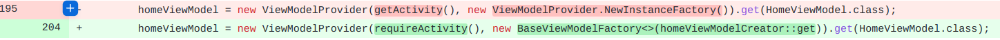

## 基本信息

app: [https://github.com/mozilla-tw/FirefoxLite](https://github.com/mozilla-tw/FirefoxLite)

issue: [https://github.com/mozilla-tw/FirefoxLite/issues/4942](https://github.com/mozilla-tw/FirefoxLite/issues/4942)

exception version: [https://github.com/benjamin-cheng/Rocket/tree/308e8a752a6c45dfa647d8275cede66e6887caed](https://github.com/benjamin-cheng/Rocket/tree/308e8a752a6c45dfa647d8275cede66e6887caed)

fix version: [https://github.com/benjamin-cheng/Rocket/tree/8a0c8b090c229e2dcab4cee2d2e5a23aad6b7ea8](https://github.com/benjamin-cheng/Rocket/tree/8a0c8b090c229e2dcab4cee2d2e5a23aad6b7ea8)

## 编译

permissionhandler去github拉取对应版本复制到项目相应位置

## 复现

复现视频: 目录下的re4942

初始快照: 

需要外部启动firefoxlite, 为了方便我们做个快照, 在启动点打快照, 并通过初始用例启动应用. 具体而言:

1. 安装app
2.  点击Maps


3. 点击地图上的一个点, 让底部栏目出现星星:


4. 点击底部栏目, 在新的页面中点击WEBSITE:


5. 在Open with界面选择firefoxlite, 在这里打快照, 以后我们就可以通过加载快照, 然后点击JUST ONCE启动应用了:


初始用例:

|Id|Type|Value|Desc|
|:----|:----|:----|:----|
|1|click|    |click JUST ONCE|
|2|wait|5000|wait 5s|

错误用例:

|Id|Type|Value|Desc|
|:----|:----|:----|:----|
|1|click|    |click label|

覆盖(all:覆盖总数/代码总数, 其他:只被当前动作覆盖/被当前动作覆盖)

[all]2920/60953 [1]309/560 

## 崩溃信息

栈信息: 目录下的stack4942

java.lang.InstantiationException: java.lang.Class<org.mozilla.rocket.home.HomeViewModel> has no zero argument constructor

> org/mozilla/focus/tabs/tabtray/TabTrayFragment.java


## 分析

### root cause

如果想为ViewModel类提供一个非零参数的构造函数, 则必须创建一个自定义ViewModelFactory类来初始化ViewModel实例:

[https://blog.csdn.net/crystal_xing/article/details/108868026](https://blog.csdn.net/crystal_xing/article/details/108868026)

归为`org.mozilla.focus.tabs.tabtray.TabTrayFragment:195`的API Usage Error.

### fix

作者调整了`org.mozilla.focus.tabs.tabtray.TabTrayFragment:195`的API的参数, 属于特殊的Change API(ViewModelProvider.NewInstanceFactory替换为BaseViewModelFactory<>(homeViewModelCreator::get)).



## fix信息

修复模式: Change API

与栈信息的关系: =

距离:

|源文件总数|函数总数|回调总数|组件间通信|数据存储|
|:----|:----|:----|:----|:----|
|1|1|1|0|0|

标记(注释中的数字代表覆盖这条语句的动作):

```java
org.mozilla.focus.tabs.tabtray.TabTrayFragment
195 // 1
```
## root cause信息

root cause分类: API Usage Error

与栈信息的关系: =

距离:

|源文件总数|函数总数|回调总数|组件间通信|数据存储|
|:----|:----|:----|:----|:----|
|1|1|1|0|0|

标记(注释中的数字代表覆盖这条语句的动作):

```java
org.mozilla.focus.tabs.tabtray.TabTrayFragment
195 // 1
```
