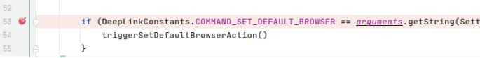
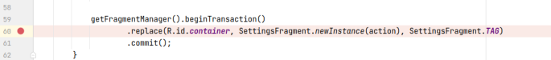
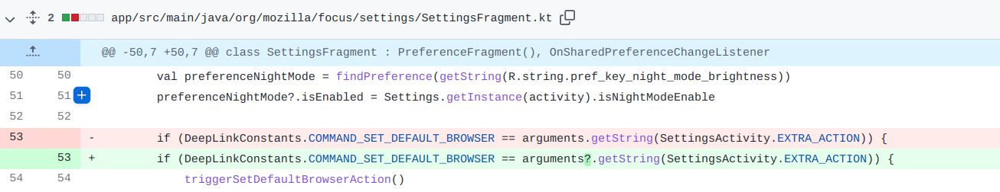

## 基本信息

app: [https://github.com/mozilla-tw/FirefoxLite](https://github.com/mozilla-tw/FirefoxLite)

issue: [https://github.com/mozilla-tw/FirefoxLite/issues/5085](https://github.com/mozilla-tw/FirefoxLite/issues/5085)

exception version: [https://github.com/benjamin-cheng/Rocket/tree/8e41701f3cbc44ea6ecf3fc44c4d1f695f0ee7ab](https://github.com/benjamin-cheng/Rocket/tree/8e41701f3cbc44ea6ecf3fc44c4d1f695f0ee7ab)

fix version: [https://github.com/benjamin-cheng/Rocket/tree/f33a0ba965e8c2904c19c689b1617153a0c68a29](https://github.com/benjamin-cheng/Rocket/tree/f33a0ba965e8c2904c19c689b1617153a0c68a29)

## 编译

编译时test有一行可能发生错误, 注释即可; 

permissionhandler去github拉取对应版本复制到项目相应位置

## 复现

复现视频: 目录下的re5085

初始快照: 无

初始用例:

|Id|Type|Value|Desc|
|:----|:----|:----|:----|
|1|click|    |click OK|

错误用例:

|Id|Type|Value|Desc|
|:----|:----|:----|:----|
|1|click|    |click menu|
|2|click|    |click Settings|
|3|click|    |click Language|
|4|click|    |click Basa Jawa|

覆盖(all:覆盖总数/代码总数, 其他:只被当前动作覆盖/被当前动作覆盖)

[all]4453/62340 [1]241/552 [2]304/729 [3]14/15 [4]75/318

## 崩溃信息

栈信息: 目录下的stack5085

java.lang.NullPointerException: Attempt to invoke virtual method 'java.lang.String android.os.BaseBundle.getString(java.lang.String)' on a null object reference

org/mozilla/focus/settings/SettingsFragment.kt



## 分析

### root cause

这个问题我们不是很确定. 

正常情况SettingsActivity绑定SettingsFragment后getArgument是不为空的:

> org/mozilla/focus/activity/SettingsActivity.java



但设置语言后只调用了SettingsFragment的onCreate, 且getArgument为空. 推测是设置语言导致SettingsFragment重绘(SettingsActivity没有重绘), 且丢失了之前SettingsActivity传来的bundle参数. 

可以确定的是这个问题的root cause属于Component Lifecycle Error. 定位在onCreate的data loss处`org.mozilla.focus.settings.SettingsFragment:53`

### fix

作者在`org.mozilla.focus.settings.SettingsFragment:53`获取argument处做了null判断, 属于Refine Condition Checks. 



## fix信息

修复模式: Refine Condition Checks

与栈信息的关系: =

距离:

|源文件总数|函数总数|回调总数|组件间通信|数据存储|
|:----|:----|:----|:----|:----|
|1|1|1|1|0|

标记(注释中的数字代表覆盖这条语句的动作):

```java
org.mozilla.focus.settings.SettingsFragment
53 // 2, 4
```
## root cause信息

root cause分类: Component Lifecycle Error.

与栈信息的关系: =

距离:

|源文件总数|函数总数|回调总数|组件间通信|数据存储|
|:----|:----|:----|:----|:----|
|1|1|1|1|0|

标记(注释中的数字代表覆盖这条语句的动作):

```java
org.mozilla.focus.settings.SettingsFragment
53 // 2, 4
```
