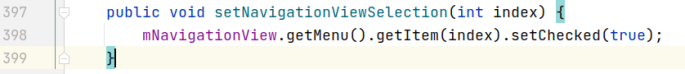
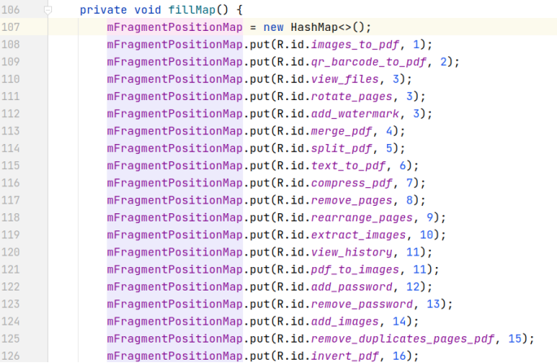
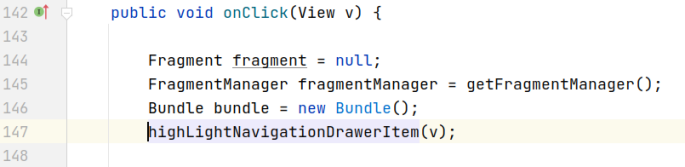
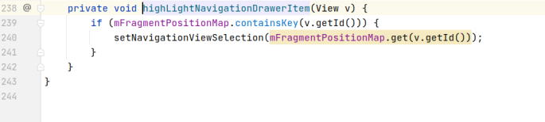
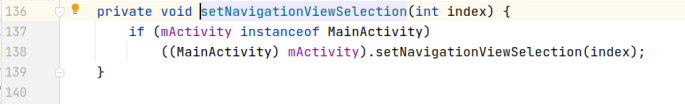
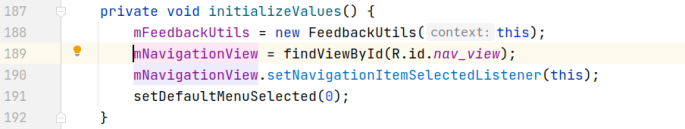
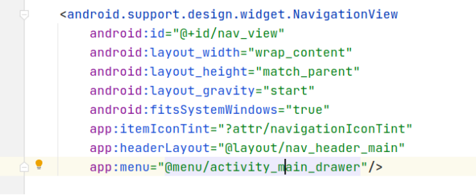
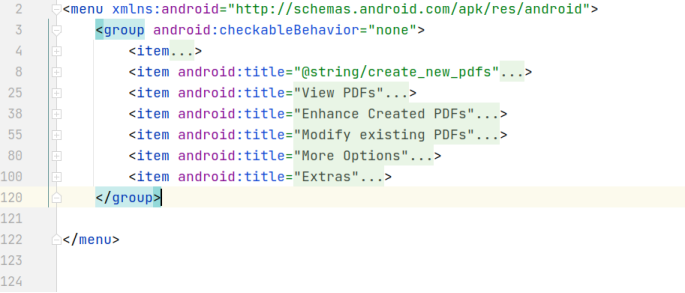
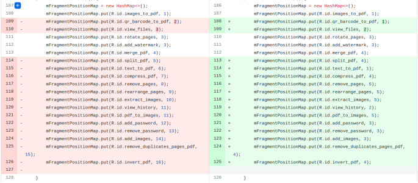

## 基本信息

app: [https://github.com/Swati4star/Images-to-PDF](https://github.com/Swati4star/Images-to-PDF)

issue: [https://github.com/Swati4star/Images-to-PDF/issues/585](https://github.com/Swati4star/Images-to-PDF/issues/585)

exception version: [https://github.com/Swati4star/Images-to-PDF/tree/7b18571394d541d3b2c4fdcef96666870aa4ca8d](https://github.com/Swati4star/Images-to-PDF/tree/7b18571394d541d3b2c4fdcef96666870aa4ca8d)

fix version: [https://github.com/Swati4star/Images-to-PDF/tree/2409f11e92d3afdc1b66529c3c8169c8a0bd06fd](https://github.com/Swati4star/Images-to-PDF/tree/2409f11e92d3afdc1b66529c3c8169c8a0bd06fd)

## 编译

正常

## 复现

复现视频: 目录下的re585

初始快照: 无

初始用例: 

|Id|Type|Value|Desc|
|:----|:----|:----|:----|
|1|click|    |click Skip|
|2|click|    |click ALLOW|
|3|click|    |click ALLOW|
|4|click|    |click Continue|

错误用例:

|Id|Type|Value|Desc|
|:----|:----|:----|:----|
|1|click|    |click Remove password|

覆盖(all:覆盖总数/代码总数, 其他:只被当前动作覆盖/被当前动作覆盖)

[all]247/12920 [1]9/9 

## 崩溃信息

栈信息: 目录下的stack585

java.lang.IndexOutOfBoundsException: Index: 13, Size: 7

swati4star/createpdf/activity/MainActivity.java



## 分析

### root cause

先看一下mNavigationView的容量:

> swati4star/createpdf/fragment/HomeFragment.java



可以看到有16个条目.

接着我们从点击Remove password动作出发进行分析setNavigationViewSelection什么时候被调用, 从而获取index来源:

> swati4star/createpdf/fragment/HomeFragment.java



> swati4star/createpdf/fragment/HomeFragment.java



> swati4star/createpdf/fragment/HomeFragment.java



可以看到setNavigationViewSelection是在这里调用的, index源自onClick的参数view, 也就是当前点击的view对象.

接下来我们分析mNavigationView的布局信息:

> swati4star/createpdf/activity/MainActivity.java





接下来看对应的menu布局:



可以看到只有menu只有7个item，而mFragmentPositionMap中为控件赋予的下标会到16, 因此当index大于7时就会报IndexOutOfBoundsException

这个错误属于Indexing Error. 导致下标超出容量的原因是`swati4star.createpdf.fragment.HomeFragment:107`map初始化时赋予了错误的id.

### fix

作者修复时重新标记了`swati4star.createpdf.fragment.HomeFragment:107`map中的id, 属于设计上的调整, 归为Change Design:



## fix信息

修复模式: Change Design

与栈信息的关系: >

距离:

|源文件总数|函数总数|回调总数|组件间通信|数据存储|
|:----|:----|:----|:----|:----|
|2|6|1|0|0|

标记(注释中的数字代表覆盖这条语句的动作):

```java
swati4star.createpdf.fragment.HomeFragment
107 // 0
```
## root cause信息

root cause分类: Indexing Error

与栈信息的关系: >

距离:

|源文件总数|函数总数|回调总数|组件间通信|数据存储|
|:----|:----|:----|:----|:----|
|2|6|1|0|0|

标记(注释中的数字代表覆盖这条语句的动作):

```java
swati4star.createpdf.fragment.HomeFragment
107 // 0
```
