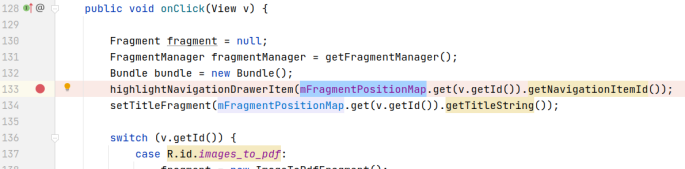
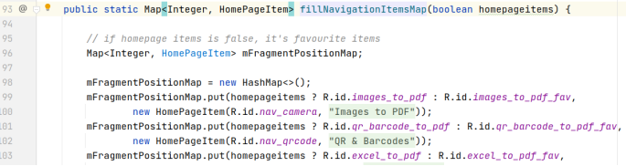
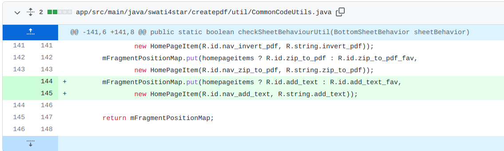

## 基本信息

app: [https://github.com/Swati4star/Images-to-PDF](https://github.com/Swati4star/Images-to-PDF)

issue: [https://github.com/Swati4star/Images-to-PDF/issues/771](https://github.com/Swati4star/Images-to-PDF/issues/771)

exception version: [https://github.com/Swati4star/Images-to-PDF/tree/4d090935265b0b681c3e433df7a5a437a88899c4](https://github.com/Swati4star/Images-to-PDF/tree/4d090935265b0b681c3e433df7a5a437a88899c4)

fix version: [https://github.com/Swati4star/Images-to-PDF/tree/b9936a2ac17c1e05c4e0a5d68b6d513baf91d365](https://github.com/Swati4star/Images-to-PDF/tree/b9936a2ac17c1e05c4e0a5d68b6d513baf91d365)

## 编译

正常

## 复现

复现视频: 目录下的re771

初始快照: 无

初始用例: 

|Id|Type|Value|Desc|
|:----|:----|:----|:----|
|1|click|    |click Skip|
|2|click|    |click ALLOW|
|3|click|    |click ALLOW|
|4|click|    |click Continue|

错误用例:

|Id|Type|Value|Desc|
|:----|:----|:----|:----|
|1|click|    |click Add Text|

覆盖(all:覆盖总数/代码总数, 其他:只被当前动作覆盖/被当前动作覆盖)

[all]287/16345 [1]4/4 

## 崩溃信息

栈信息: 目录下的stack771

java.lang.NullPointerException: Attempt to invoke virtual method 'int swati4star.createpdf.model.HomePageItem.getNavigationItemId()' on a null object reference

> swati4star/createpdf/fragment/HomeFragment.java



## 分析

### root cause

这个错误的原因是开发者没有将Add Text这个操作所对应的viewId加入mFragmentPositionMap, 导致mFragmentPositionMap.get(v.getId())获取为空:

mFragmentPositionMap初始化:

> swati4star/createpdf/fragment/HomeFragment.java


> swati4star/createpdf/util/CommonCodeUtils.java



在这里少了:

```xml
mFragmentPositionMap.put(homepageitems ? R.id.add_text : R.id.add_text_fav,
                new HomePageItem(R.id.nav_add_text, R.string.add_text));
```
这个错误属于Resource Not Found, 定位到数据源头`swati4star.createpdf.util.CommonCodeUtils:98`

### fix

作者在`swati4star.createpdf.util.CommonCodeUtils:98`添加了上述分析中缺失的元素, 属于设计上的改变, 归为Change Design. 



## fix信息

修复模式: Change Design

与栈信息的关系: >

距离:

|源文件总数|函数总数|回调总数|组件间通信|数据存储|
|:----|:----|:----|:----|:----|
|2|2|1|0|0|

标记(注释中的数字代表覆盖这条语句的动作):

```java
swati4star.createpdf.util.CommonCodeUtils
98 // 0
```
## root cause信息

root cause分类: Resource Not Found

与栈信息的关系: >

距离:

|源文件总数|函数总数|回调总数|组件间通信|数据存储|
|:----|:----|:----|:----|:----|
|2|2|1|0|0|

标记(注释中的数字代表覆盖这条语句的动作):

```java
swati4star.createpdf.util.CommonCodeUtils
98 // 0
```
## Ochi排名

art: 自动+手动生成相似用例

two: 错误用例+去除最后一步的正确用例

|用例/标记|fix|root cause|
|:----|:----|:----|
|art|274|274|
|two|215|215|

简单分析: 错误语句被初始动作覆盖, 效果不会好.

