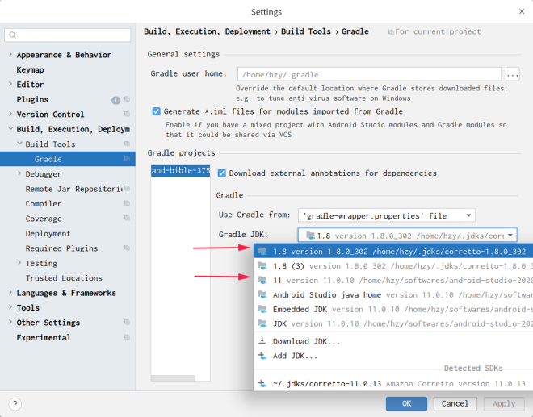
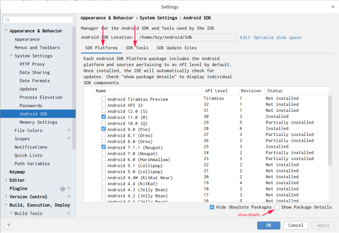

# DroidFL
Android fault localization benchmark

## 通用的编译问题解决方案

以下是android项目编译过程中的一些常见问题, 若遇到编译错误先检查一下是否可以用以下方法解决. 不行的话再去各个项目下寻找具体项目的编译失败解决方案. 若还没有解决的话可以通过issue联系我们.

1 切换gradle jdk为jdk1.8/jdk11. 具体做法是在android studio中点击File->Settings:



2 缺失的android sdk自己安装一下, 可以在这里下载:



注意有时虽然显示蓝色勾选, 但可能还是没安装全, 这个时候取消对象条目的蓝色勾选, 点击apply卸载, 接着重新勾选安装即可.

3 android gradle找不到的把形如'3.2.0-xxx'后面的'-xxx'去掉试试

4 编译大型项目资源超限时尝试在全局的gradle.proerties中加入:

``` 
#开启线程守护，第一次编译时开线程，之后就不会再开了
org.gradle.daemon=true
#配置编译时的虚拟机大小
org.gradle.jvmargs=-Xmx2048m -XX:MaxPermSize=512m -XX:+HeapDumpOnOutOfMemoryError -Dfile.encoding=UTF-8
#开启并行编译，相当于多条线程再走
org.gradle.parallel=true
#启用新的孵化模式
org.gradle.configureondemand=true
```

5 有的项目(and-bible)需要安装node, 需要使用v12.15, 并在/usr/bin下创建符号链接

6 网络问题可以配置gradle全局代理. 或者在项目中添加阿里云代理:

```
maven {
    url 'https://maven.aliyun.com/repository/central'
}
maven {
    url 'https://maven.aliyun.com/repository/public'
}
maven {
    url 'https://maven.aliyun.com/repository/google'
}
maven {url "https://dl.google.com/dl/android/maven2/"}
```

## 用auiauto查看实验数据

推荐使用auiauto查看实验数据:

https://github.com/qaqcatz/auiauto
