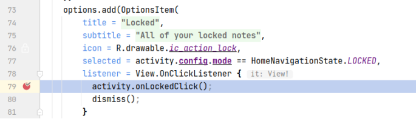

## 基本信息

app: [https://github.com/BijoySingh/Scarlet-Notes](https://github.com/BijoySingh/Scarlet-Notes)

issue: [https://github.com/BijoySingh/Scarlet-Notes/issues/114](https://github.com/BijoySingh/Scarlet-Notes/issues/114)

exception version: [https://github.com/BijoySingh/Scarlet-Notes/tree/61cb834c9124fc6a43752a3a06b704ede98baaa5](https://github.com/BijoySingh/Scarlet-Notes/tree/61cb834c9124fc6a43752a3a06b704ede98baaa5)

fix version: [https://github.com/BijoySingh/Scarlet-Notes/tree/b4e028c1f9ba3a064292fa53b84d9dd747f57834](https://github.com/BijoySingh/Scarlet-Notes/tree/b4e028c1f9ba3a064292fa53b84d9dd747f57834)

## 编译

没有gradle wrapper, 自己配置一下

File google-services.json is missing: [https://blog.csdn.net/u012934325/article/details/71721304](https://blog.csdn.net/u012934325/article/details/71721304)

Android Studio Cannot fit requested classes in a single dex file (# methods: 72633 ＞ 65536):  [https://stackoverflow.com/questions/51341627/android-gives-error-cannot-fit-requested-classes-in-a-single-dex-file](https://stackoverflow.com/questions/51341627/android-gives-error-cannot-fit-requested-classes-in-a-single-dex-file)

崩溃在app依赖的module中, 需要对scarlet模块插桩

## 复现

复现视频: 目录下的re114

初始快照: 无

初始用例: 

无

错误用例:

|Id|Type|Value|Desc|
|:----|:----|:----|:----|
|1|click|    |click add book|
|2|editx|myBook|set text myBook|
|3|click|    |click SAVE|
|4|click|    |click myBook|
|5|click|    |click leftbottom|
|6|click|    |click Locked|
|7|click|    |click X|

覆盖(all:覆盖总数/代码总数, 其他:只被当前动作覆盖/被当前动作覆盖)

[all]982/16661 [1]90/127 [2]0/0 [3]144/266 [4]15/158 [5]106/144 [6]15/72 [7]10/59 

## 崩溃信息

栈信息: 目录下的stack114

java.lang.Exception: Invalid Search Mode

> com/maubis/scarlet/base/support/SearchConfig.kt


## 分析

### root cause

这是一个用户自定义的异常, 主要是没有处理好config.mode各种可能的情况导致的.

接下来分析异常值的来源, 从点击lock开始:

> com/maubis/scarlet/base/main/sheets/HomeNavigationBottomSheet.kt



> com/maubis/scarlet/base/MainActivity.kt


可以看到点击lock时config.mode设置成了"LOCKED", 而when没有考虑到这种情况, 导致了异常的抛出.

这个错误属于Resource Not Found, 标记在错误数据来源, 也就是LOCKED的赋值处`com.maubis.scarlet.base.MainActivity:210`. 

### fix

作者的修复在`com.maubis.scarlet.base.support.SearchConfig:121 `添加了对LOCKED的判断, 属于Refine Condition Checks.


## fix信息

修复模式: Refine Condition Checks

与栈信息的关系: =

距离:

|源文件总数|函数总数|回调总数|组件间通信|数据存储|
|:----|:----|:----|:----|:----|
|1|1|0|0|0|

标记(注释中的数字代表覆盖这条语句的动作):

```java
com.maubis.scarlet.base.support.SearchConfig
121 // 7
```
## root cause信息

root cause分类: Resource Not Found

与栈信息的关系: >

距离:

|源文件总数|函数总数|回调总数|组件间通信|数据存储|
|:----|:----|:----|:----|:----|
|3|3|1|0|0|

标记(注释中的数字代表覆盖这条语句的动作):

```java
com.maubis.scarlet.base.MainActivity
210 // 6
```
