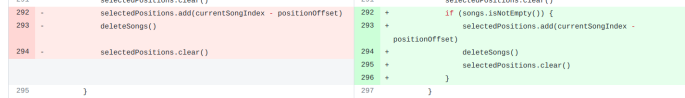

## 基本信息

app: [https://github.com/SimpleMobileTools/Simple-Music-Player](https://github.com/SimpleMobileTools/Simple-Music-Player)

issue: [https://github.com/SimpleMobileTools/Simple-Music-Player/issues/128](https://github.com/SimpleMobileTools/Simple-Music-Player/issues/128)

exception version: [https://github.com/SimpleMobileTools/Simple-Music-Player/tree/d7e6e85400a2b0ef7b02c40fd182b7b74520bc5f](https://github.com/SimpleMobileTools/Simple-Music-Player/tree/d7e6e85400a2b0ef7b02c40fd182b7b74520bc5f)

fix version: [https://github.com/SimpleMobileTools/Simple-Music-Player/tree/af0577b4062c000ee0235e4cf36e6dc6759d6508](https://github.com/SimpleMobileTools/Simple-Music-Player/tree/af0577b4062c000ee0235e4cf36e6dc6759d6508)

## 编译

正常

## 复现

复现视频: 目录下的re128

初始快照: 

使用前首先在/sdcard/Music下push一首音乐

``` 
adb push bensound-sunny.mp3 /sdcard/Music
```

做个快照

初始用例: 

|Id|Type|Value|Desc|
|:----|:----|:----|:----|
|1|click|    |ALLOW|

错误用例:

|Id|Type|Value|Desc|
|:----|:----|:----|:----|
|1|click|    |click More options|
|2|click|    |click Open playlist|
|3|click|    |click Create playlist|
|4|editx|1|set text 1|
|5|click|    |click ok|
|6|click|    |click Add folder to playlist|
|7|click|    |click Music|
|8|click|    |click More options|
|9|click|    |click Open playlist|
|10|click|    |click 1|
|11|click|    |click More options|
|12|click|    |click Delete current song|
|13|click|    |click YES|
|14|click|    |click More options|
|15|click|    |click Delete current song|
|16|click|    |click YES|

覆盖(all:覆盖总数/代码总数, 其他:只被当前动作覆盖/被当前动作覆盖)

[all]982/16661 [1]90/127 [2]0/0 [3]144/266 [4]15/158 [5]106/144 [6]15/72 [7]10/59 

## 崩溃信息

栈信息: 目录下的stack128

java.lang.ArrayIndexOutOfBoundsException: length=0; index=-1

> com/simplemobiletools/musicplayer/adapters/SongAdapter.kt


## 分析

### root cause

根据作者的设计, 点击Open playlist时会执行重置menu按钮, 此时如果playlist为空就不会显示Delete current song这个按钮. 然而, 进入一个不为空的playlist时Delete current song按钮是会显示的, 我们通过Delete current song将playlist下的所有音乐删除, 发现Delete current song依然存在, 此时再点击一次Delete current song就会触发异常.

这里是Open playlist时隐藏Delete current song的逻辑:

> com/simplemobiletools/musicplayer/activities/MainActivity.kt


根据上述分析我们大概确定了错误原因, 下面做一些代码层面的定位. 也就是分析为什么崩溃处selectedPositions.first()为-1:

> com/simplemobiletools/musicplayer/adapters/SongAdapter.kt


可以看到292给selectedPositions添加一个位置(currentSongIndex - positionOffset), 这个地方会直接影响selectedPositions.first的值. 接下来分析currentSongIndex和positionOffset的赋值:

初始化时positionOffset为2, 且通过android studio的usage分析我们发现positionOffset的值不会被修改, 一直为2:

> com/simplemobiletools/musicplayer/adapters/SongAdapter.kt


> com/simplemobiletools/musicplayer/helpers/Constants.kt


接下来只要分析currentSongIndex的赋值即可(分析什么时候currentSongIndex会变成1):

现在假设playlist中有一首音乐, 执行删除操作时:


> com/simplemobiletools/musicplayer/activities/MainActivity.kt


点击ok:

> com/simplemobiletools/musicplayer/adapters/SongAdapter.kt


>可以看到这里的currentSongIndex - positionOffset = 2 - 2 = 0, 我们不关注currentSongIndex为什么为2, 重点关注接下来它是怎么变化的:

执行删除操作后, 后台的MusicService会执行onStartCommand, 进而调用markCurrentSong, 最后调用updateCurrentSongIndex:


> com/simplemobiletools/musicplayer/activities/MainActivity.kt


> com/simplemobiletools/musicplayer/adapters/SongAdapter.kt


> com/simplemobiletools/musicplayer/helpers/Constants.kt


**关键函数**

重点看markCurrentSong的561行, 这里使用firstOrNull获取音乐下标. 然而, playlist中唯一的音乐之前已经被删除了, 这里会执行?:的内容, 返回-1. 接着, markCurrentSong会把songIndex(值为-1)传给updateCurrentSongIndex. 再来看updateCurrentSongIndex的261, LIST_HEADERS_COUNT的值恒为2, 这里相当于-1+2 = 1. 266将currentSongIndex赋值为1.

现在错误原因就清晰了, 当删除音乐导致playlist为空时currentSongIndex会变成1, 此时再进行一次删除会导致currentSongIndex - positionOffset = 1 - 2 = -1, 进而令selectedPositions.first的值为-1引发崩溃.

这个问题属于Indexing Error. 导致容量与下标异常的位置是`com.simplemobiletools.musicplayer.activities.MainActivity:561`, 这里当歌曲为空时会返回-1, 导致后面的下标异常.

### fix

作者的修复是特判在`com.simplemobiletools.musicplayer.adapters.SongAdapter:292`添加特判, 为空时不进行删除操作, 属于Refine Condition Checks:



## fix信息

修复模式: Refine Condition Checks

与栈信息的关系: >

距离:

|源文件总数|函数总数|回调总数|组件间通信|数据存储|
|:----|:----|:----|:----|:----|
|2|6|1|0|0|

标记(注释中的数字代表覆盖这条语句的动作):

```java
com.simplemobiletools.musicplayer.adapters.SongAdapter
292 // 7
```
## root cause信息

root cause分类: Indexing Error

与栈信息的关系: >

距离:

|源文件总数|函数总数|回调总数|组件间通信|数据存储|
|:----|:----|:----|:----|:----|
|2|6|1|0|0|

标记(注释中的数字代表覆盖这条语句的动作):

```java
com.simplemobiletools.musicplayer.activities.MainActivity
561 // 0 5 7 10 13 14
```
## Ochi排名

art: 自动+手动生成相似用例

two: 错误用例+去除最后一步的正确用例

|用例/标记|fix|root cause|
|:----|:----|:----|
|art|305|193|
|two|305|193|

简单分析: fix语句被动作7覆盖, 但用例中体现不出7的差异, 效果不好. root cause错误语句被初始动作覆盖, 且还被5,6,10,13,14动作覆盖, 效果不会好.
