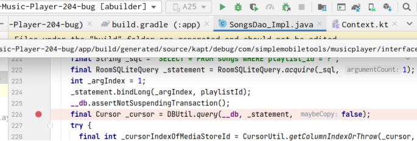
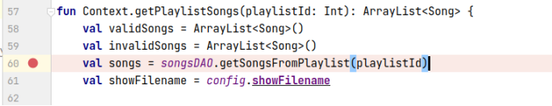
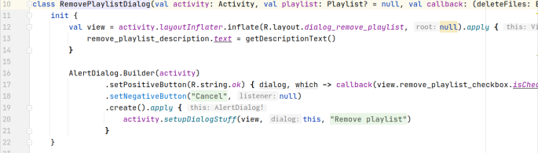
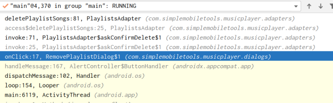
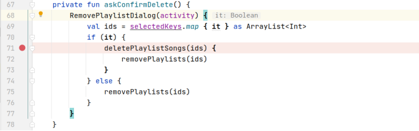
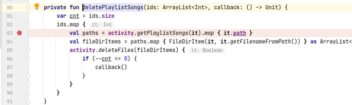
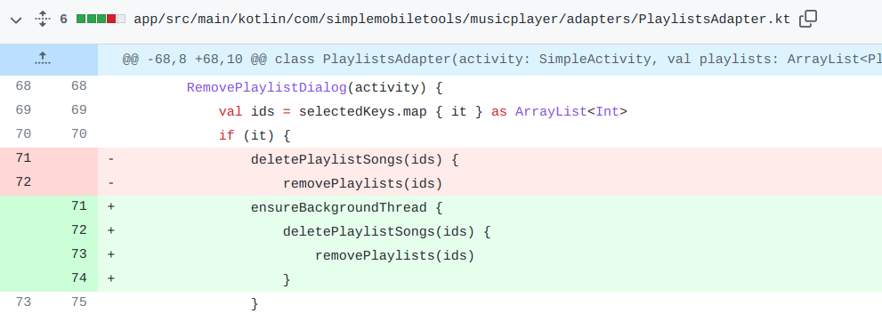

## 基本信息

app: [https://github.com/SimpleMobileTools/Simple-Music-Player](https://github.com/SimpleMobileTools/Simple-Music-Player)

issue: [https://github.com/SimpleMobileTools/Simple-Music-Player/issues/204](https://github.com/SimpleMobileTools/Simple-Music-Player/issues/204)

exception version: [https://github.com/SimpleMobileTools/Simple-Music-Player/tree/2aef755930068013dbbd7361cd135a2732e5db03](https://github.com/SimpleMobileTools/Simple-Music-Player/tree/2aef755930068013dbbd7361cd135a2732e5db03)

fix version: [https://github.com/SimpleMobileTools/Simple-Music-Player/tree/ae40944fdbc8fed96fc58fcb15ad7542d6055648](https://github.com/SimpleMobileTools/Simple-Music-Player/tree/ae40944fdbc8fed96fc58fcb15ad7542d6055648)

## 编译

正常

## 复现

复现视频: 目录下的re204

初始快照: 无

初始用例: 

|Id|Type|Value|Desc|
|:----|:----|:----|:----|
|1|click|    |ALLOW|

错误用例:

|Id|Type|Value|Desc|
|:----|:----|:----|:----|
|1|click|    |click More options|
|2|click|    |click Settings|
|3|click|    |click Manage playlists|
|4|click|    |click +|
|5|editx|1|set text 1|
|6|click|    |click ok|
|7|longclick|    |long click playlist 1|
|8|click|    |click Delete|
|9|click|    |Delete the files too|
|10|click|    |click OK|

覆盖(all:覆盖总数/代码总数, 其他:只被当前动作覆盖/被当前动作覆盖)

[all]982/16661 [1]90/127 [2]0/0 [3]144/266 [4]15/158 [5]106/144 [6]15/72 [7]10/59 

## 崩溃信息

栈信息: 目录下的stack204

java.lang.IllegalStateException: Cannot access database on the main thread since it may potentially lock the UI for a long period of time.



这个SongsDao_Impl是编译时自动生成的, 不在源码中. 为了分析方便我们将占崩溃位置标记在这个函数的调用点:

> com/simplemobiletools/musicplayer/extensions/Context.kt



## 分析

### root cause

根据栈信息我们可以看出这个错是因为在UI中执行耗时的操作导致的(数据库耗时操作). 下面分析一下崩溃触发过程:

点击dialog的OK时:

> com/simplemobiletools/musicplayer/dialogs/RemovePlaylistDialog.kt





从debug的栈信息可知, 上述函数通过17的callback调用askConfirmDelete:

> com/simplemobiletools/musicplayer/adapters/PlaylistsAdapter.kt



> com/simplemobiletools/musicplayer/adapters/PlaylistsAdapter.kt



接下来会执行activity.getPlaylistSongs(it)这个方法, 从而在ui线程执行数据库耗时操作. 

root cause归为Framework Constraint Error. 由于SongsDao_Impl是编译时自动生成的, 我们参考作者的fix信息将错误标记在`com.simplemobiletools.musicplayer.adapters.PlaylistsAdapter:71`的deletePlaylistSongs处, 这也是耗时函数的上层调用点.

### fix

作者的修复是在`com.simplemobiletools.musicplayer.adapters.PlaylistsAdapter:71`deletePlaylistSongs时加了ensureBackgroundThread, 属于Move Code into Correct Thread.



## fix信息

修复模式: Move Code into Correct Thread

与栈信息的关系: =

距离:

|源文件总数|函数总数|回调总数|组件间通信|数据存储|
|:----|:----|:----|:----|:----|
|4|5|1|0|0|

标记(注释中的数字代表覆盖这条语句的动作):

```java
com.simplemobiletools.musicplayer.adapters.PlaylistsAdapter
71 // 10
```
## root cause信息

root cause分类: Framework Constraint Error

与栈信息的关系: =

距离:

|源文件总数|函数总数|回调总数|组件间通信|数据存储|
|:----|:----|:----|:----|:----|
|4|5|1|0|0|

标记(注释中的数字代表覆盖这条语句的动作):

```java
com.simplemobiletools.musicplayer.adapters.PlaylistsAdapter
71 // 10
```
## Ochi排名

art: 自动+手动生成相似用例

two: 错误用例+去除最后一步的正确用例

|用例/标记|fix|root cause|
|:----|:----|:----|
|art|4|4|
|two|5|5|

简单分析: 语句只和最后一个动作相关. 最后一个动作覆盖范围很小, 效果不错. 
