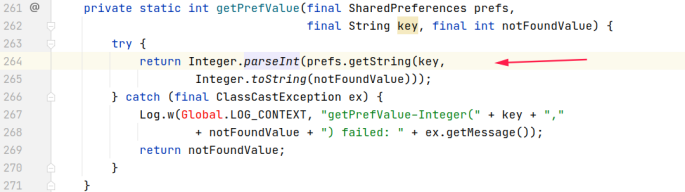
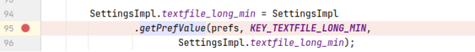
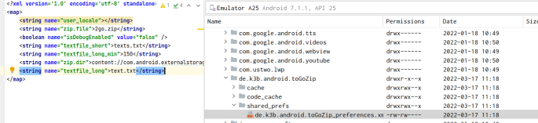
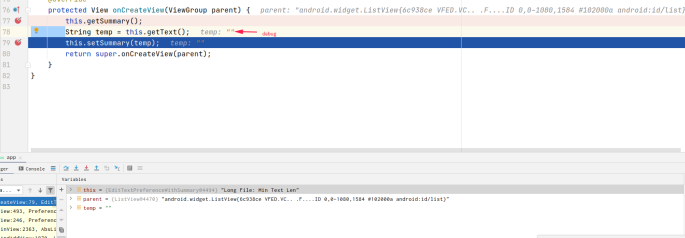
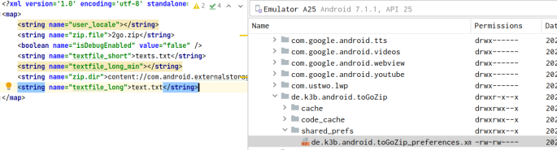
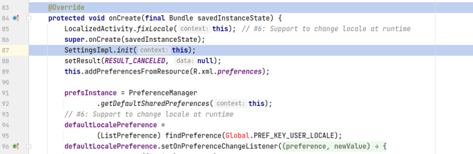
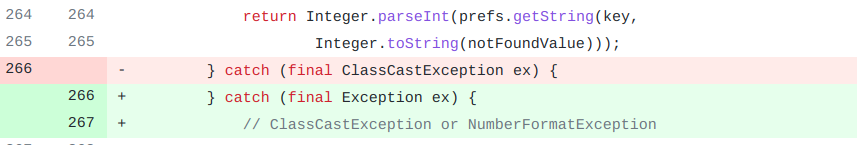

## 基本信息

app: [https://github.com/k3b/ToGoZip](https://github.com/k3b/ToGoZip)

issue: [https://github.com/k3b/ToGoZip/issues/10](https://github.com/k3b/ToGoZip/issues/10)

exception version: [https://github.com/k3b/ToGoZip/tree/356eea7069f9a4c6271701cf754258d7fc79c37c](https://github.com/k3b/ToGoZip/tree/356eea7069f9a4c6271701cf754258d7fc79c37c)

fix version: [https://github.com/k3b/ToGoZip/tree/0da0cd9bb24e9aaccb5357d2807e44bd1e9b96bd](https://github.com/k3b/ToGoZip/tree/0da0cd9bb24e9aaccb5357d2807e44bd1e9b96bd)

## 编译

虽然是gradle2.3.3, 不过1.0.0的插桩插件也能正常工作, 应该是没用什么奇奇怪怪的配置.

## 复现

复现视频: 目录下的re10

初始快照: 设计系统设置的改变, 使用init快照

初始用例: 

|Id|Type|Value|Desc|
|:----|:----|:----|:----|
|1|click|    |click EDIT|
|2|click|    |click ALLOW|

错误用例:

|Id|Type|Value|Desc|
|:----|:----|:----|:----|
|1|click|    |click SDCARD|
|2|click|    |click SELECT|
|3|click|    |click Long Text File in zip|
|4|edit|    |set text ""|
|5|click|    |click OK|
|6|click|    |click Language|
|7|click|    |click simplified Chinese|

覆盖(all:覆盖总数/代码总数, 其他:只被当前动作覆盖/被当前动作覆盖)

[all]184/2188 [1]0/0 [2]16/25 [3]0/5 [4]0/0 [5]4/9 [6]0/0 [7]11/61 

## 崩溃信息

栈信息: 目录下的stack10

java.lang.NumberFormatException: For input string: ""

> de/k3b/android/ToGoZip/SettingsImpl.java



## 分析

### root cause

""是从SharedPreferences中获取的, 我们首先要知道key是什么:

> de/k3b/android/ToGoZip/SettingsImpl.java



看一下sharepreference存储的内容



接下来我们分析一下textfile_long_min什么时候会被置"". 当修改long file:min text len时会触发下面这个EditTextPreference([https://developer.android.com/reference/android/preference/EditTextPreference](https://developer.android.com/reference/android/preference/EditTextPreference))的onCreateView:

> de/k3b/android/widget/EditTextPreferenceWithSummary.java



可以看到空值是通过setSummary写入的. 此时share preference中的textfile_long_min已被置空:



最后让我们看看发生崩溃的getPrefValue函数(上面分析过它是SettingsImpl.java的init函数调用的, 这里其实分析的是init的调用)是什么时候被调用的:

> de/k3b/android/ToGoZip/SettingsActivity.java



可以看到是SettingsActivity的onCreate调用的. 切换语言会重绘当前的Activity. 至此分析完毕.

这个问题可以归为Component Lifecycle Error或API Usage Error, 但最根本的还是parseInt传入了空参数, 应该归为`de.k3b.android.ToGoZip.SettingsImpl:264`的API Usage Error. 

### fix

作者在`de.k3b.android.ToGoZip.SettingsImpl:264`为parseInt加了异常捕获, 考虑到了parseInt参数格式的情况, 属于Refine Condition Error. 另外, 我们只分析当前崩溃的修复, 因此不考虑作者其他位置的修复.



## fix信息

修复模式: Refine Condition Checks

与栈信息的关系: =

距离:

|源文件总数|函数总数|回调总数|组件间通信|数据存储|
|:----|:----|:----|:----|:----|
|1|1|0|0|1|

标记(注释中的数字代表覆盖这条语句的动作):

```java
de.k3b.android.ToGoZip.SettingsImpl
264 // 0,7
```
## root cause信息

root cause分类: API Usage Error

与栈信息的关系: =

距离:

|源文件总数|函数总数|回调总数|组件间通信|数据存储|
|:----|:----|:----|:----|:----|
|1|1|0|0|1|

标记(注释中的数字代表覆盖这条语句的动作):

```java
de.k3b.android.ToGoZip.SettingsImpl
264 // 0,7
```
## Ochi排名

art: 自动+手动生成相似用例

two: 错误用例+去除最后一步的正确用例

|用例/标记|fix|root cause|
|:----|:----|:----|
|art|143|143|
|two|134|134|

简单分析: 错误语句被初始动作覆盖, 效果不会好.

