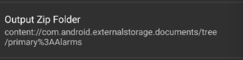

## 基本信息

app: [https://github.com/k3b/ToGoZip](https://github.com/k3b/ToGoZip)

issue: [https://github.com/k3b/ToGoZip/issues/20](https://github.com/k3b/ToGoZip/issues/20)

exception version: [https://github.com/k3b/ToGoZip/tree/21536233dd9285a34efb0c1f3da0157c8e5714db](https://github.com/k3b/ToGoZip/tree/21536233dd9285a34efb0c1f3da0157c8e5714db)

fix version: [https://github.com/k3b/ToGoZip/tree/22987ba96f609d4344611b5d8e8bd1613c652b68](https://github.com/k3b/ToGoZip/tree/22987ba96f609d4344611b5d8e8bd1613c652b68)

## 编译

正常

## 复现

复现视频: 目录下的re20

初始快照: init, 否则一开始选择x86那里界面可能不一致

初始用例: 

|Id|Type|Value|Desc|
|:----|:----|:----|:----|
|1|click|    |click EDIT|
|2|click|    |click ALLOW|

错误用例:

|Id|Type|Value|Desc|
|:----|:----|:----|:----|
|1|swipe|921 675 921 675 20|click right(by coordinate)|
|2|click|    |click More options|
|3|click|    |click Show internal storage|
|4|click|    |click Show roots|
|5|click|    |click Android SDK built for x86_64|
|6|click|    |click SELECT|
|7|scroll|1|swipe to bottom|
|8|click|    |click Save LogCat to file|

覆盖(all:覆盖总数/代码总数, 其他:只被当前动作覆盖/被当前动作覆盖)

[all]298/2974 [1]0/0 [2]0/0 [3]0/0 [4]0/0 [5]0/0 [6]21/28 [7]0/0 [8]38/51 

## 崩溃信息

栈信息: 目录下的stack20

java.lang.ArrayIndexOutOfBoundsException: length=1; index=1

> de/k3b/android/toGoZip/ZipStorageDocumentFile.java


## 分析

### root cause

这个崩溃是split数组越界导致的, 分析一下split的容量:

> de/k3b/android/toGoZip/ZipStorageDocumentFile.java


可以看到split的容量与docId有关, docId是一个和文件路径有关的值. 我们来分析一下用例中涉及的路径:

先来看这个x86的跟路径地址:


其中%3A代表的是冒号.

接着看一下根目录下Alarms文件夹的路径:



再来分析split. 所以可以看到, 当选择根目录时, 冒号后面没有内容, split[]的容量为1;

而选择根目录下的Alarms时, 冒号后面有Alarms, split[]的容量为2. 当我们选根目录并访问split[1]时就会产生数组越界问题.

这个错误是路径错误引发的Indexing Error, 根本原因是没考虑好`de.k3b.android.toGoZip.ZipStorageDocumentFile:157`的split传入特殊路径的情况.

### fix

作者的修复是在访问`de.k3b.android.toGoZip.ZipStorageDocumentFile:161`split[1]前特判容量, 属于Refine Condition Checks. 


## fix信息

修复模式: Refine Condition Checks

与栈信息的关系: =

距离:

|源文件总数|函数总数|回调总数|组件间通信|数据存储|
|:----|:----|:----|:----|:----|
|1|1|0|0|0|

标记(注释中的数字代表覆盖这条语句的动作):

```java
de.k3b.android.toGoZip.ZipStorageDocumentFile
161 // 8
```
## root cause信息

root cause分类: Indexing Error

与栈信息的关系: >

距离:

|源文件总数|函数总数|回调总数|组件间通信|数据存储|
|:----|:----|:----|:----|:----|
|1|1|0|0|0|

标记(注释中的数字代表覆盖这条语句的动作):

```java
de.k3b.android.toGoZip.ZipStorageDocumentFile
157 // 8
```
