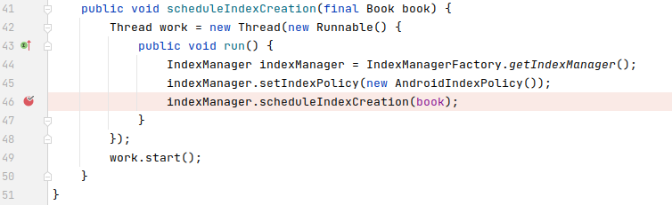
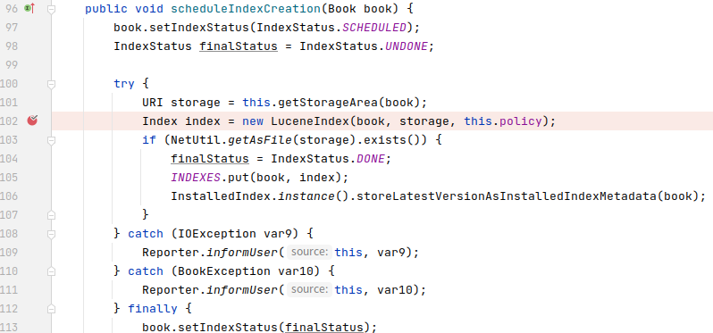
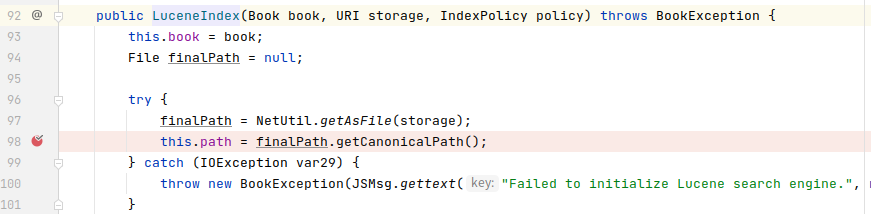
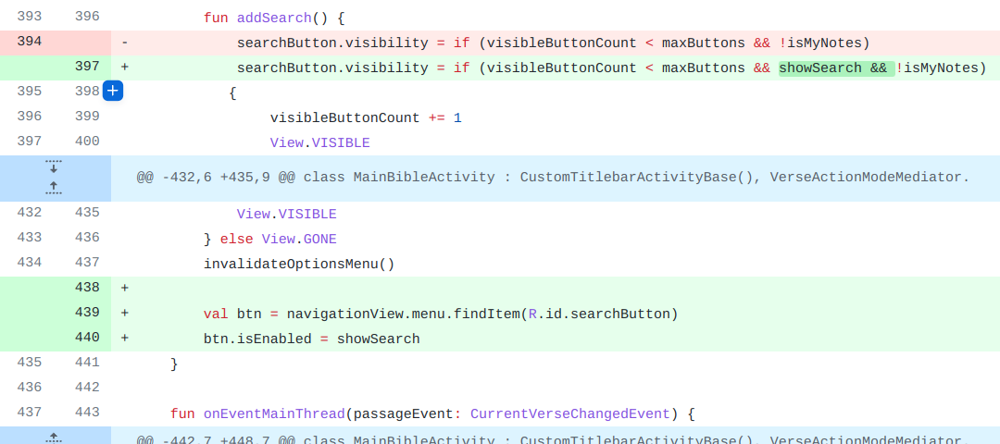

## 基本信息

app: [https://github.com/AndBible/and-bible](https://github.com/AndBible/and-bible)

issue: [https://github.com/AndBible/and-bible/issues/261](https://github.com/AndBible/and-bible/issues/261)

exception version: [https://github.com/AndBible/and-bible/tree/8595e35da75ee6277000bc0c2961f04dca5d725b](https://github.com/AndBible/and-bible/tree/8595e35da75ee6277000bc0c2961f04dca5d725b)

fix version: [https://github.com/AndBible/and-bible/tree/7617eddc01f264ae80796de1c7a7b6a74a0d5afa](https://github.com/AndBible/and-bible/tree/7617eddc01f264ae80796de1c7a7b6a74a0d5afa)

## 编译

需要先将项目用git初始化并提交一次, 不然git会报错

```dart
git init
git add .
git commit -m "test"
```
## 复现

复现视频: 目录下的re261

初始快照:

可以用初始用例, 使用初始用例的话不需要快照. 但是网络下载有时非常慢, 推荐把初始用例做成快照.

初始用例:

|Id|Type|Value|Desc|
|:----|:----|:----|:----|
|1|click|    |click OK|
|2|wait|12000|wait 12s|
|3|click|    |click AB|
|4|click|    |click OK|
|5|wait|2000|wait 2s|
|6|click|    |click Bible|
|7|click|    |click Book|
|8|click|    |click 1646|
|9|click|    |click OK|
|10|click|    |click OK|

错误用例:

|Id|Type|Value|Desc|
|:----|:----|:----|:----|
|1|click|    |click Menu|
|2|click|    |click Choose Document|
|3|click|    |click Bible|
|4|click|    |click Book|
|5|click|    |click 1646|
|6|click|    |click Confession|
|7|click|    |click Find|
|8|click|    |click CREATE|

覆盖(all:覆盖总数/代码总数, 其他:只被当前动作覆盖/被当前动作覆盖)

[all]3764/43489 [1]21/57 [2]63/499 [3]0/9 [4]0/42 [5]115/406 [6]128/1109 [7]26/240 [8]140/324

## 崩溃信息

栈信息: 目录下的stack261

java.lang.StackOverflowError: stack size 1037KB

> net/bible/service/sword/index/IndexCreator.java



## 分析

### root cause

去库中追溯一下:

> libs/jsword.jar!/org/crosswire/jsword/index/lucene/LuceneIndexManager.class



> /libs/jsword.jar!/org/crosswire/jsword/index/lucene/LuceneIndex.class



经过断点调试以及文件搜索确定是这里book路径找不到引发的IOException, 导致子线程宕机, 进而导致主线程StackOverflow(至于为什么会栈溢出不在我们讨论的范围内, 我们只需要找到root cause即可). 

这个异常可以归结为`LuceneIndexManager:102`的API Usage Error, 给LuceneIndex提供了不存在的storage路径. 不过考虑到三方库不好获取源码, 我们最终将root cause定位在`net.bible.service.sword.index.IndexCreator:46`, 视为给三方库传入了不正确的参数.

### fix

作者的修复比较有意思. 首先忽略掉函数的重命名. 接着通过分析可知添加的函数都是为`MainBibleActivity:394`服务的:



运行修复后的app会看到作者在当前界面为book时将search设置为不可点击, 算是变相的解决了这个问题. 修复模式属于特殊的Refine Condition Checks. 标记在`net.bible.android.view.activity.page.MainBibleActivity:394`

## fix信息

修复模式: Refine Condition Checks

与栈信息的关系: >

距离:

因为这个修复很特殊, 不是修复错误, 而是避免错误发生, 因此不详细分析其距离, 默认为1.

|源文件总数|函数总数|回调总数|组件间通信|数据存储|
|:----|:----|:----|:----|:----|
|1|1|1|0|0|

标记(注释中的数字代表覆盖这条语句的动作):

```java
net.bible.android.view.activity.page.MainBibleActivity
394 // 0, 6
```
## root cause信息

root cause分类: API Usage Error

与栈信息的关系: =

距离:

|源文件总数|函数总数|回调总数|组件间通信|数据存储|
|:----|:----|:----|:----|:----|
|1|1|0|0|0|

标记(注释中的数字代表覆盖这条语句的动作):

```java
net.bible.service.sword.index.IndexCreator
46 // 8
```
