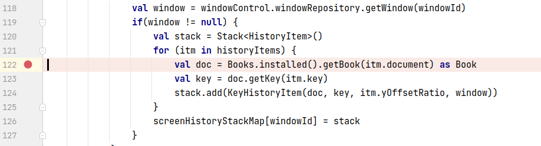
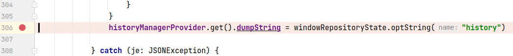
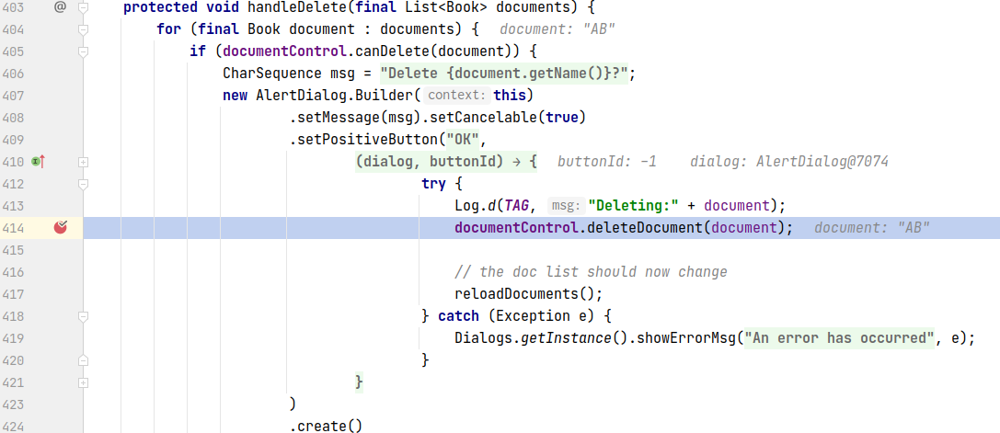
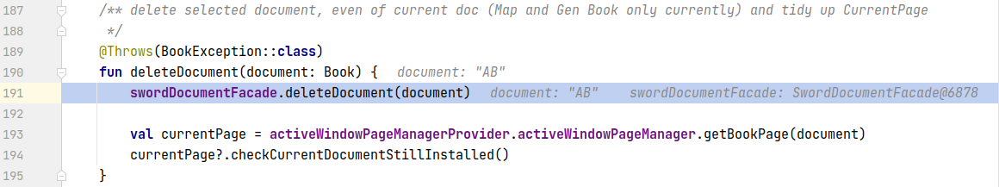
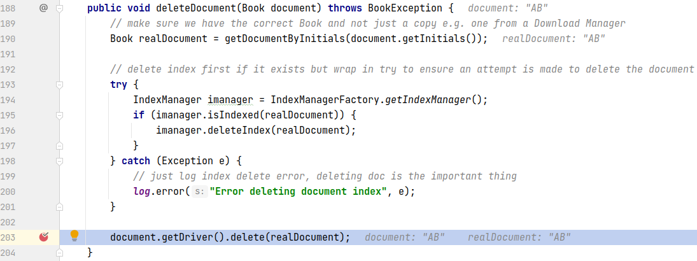
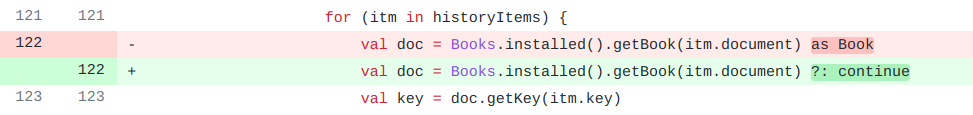

## 基本信息

app: [https://github.com/AndBible/and-bible](https://github.com/AndBible/and-bible)

issue: [https://github.com/AndBible/and-bible/issues/375](https://github.com/AndBible/and-bible/issues/375)

exception version: [https://github.com/timbze/and-bible/tree/50a20bbc59b664637aae9aaad3a78953abce454d](https://github.com/timbze/and-bible/tree/50a20bbc59b664637aae9aaad3a78953abce454d)

fix version: [https://github.com/timbze/and-bible/tree/0c59786ca4e3334d8e7cf7de469a591c38be58cc](https://github.com/timbze/and-bible/tree/0c59786ca4e3334d8e7cf7de469a591c38be58cc)

## 编译

需要先将项目用git初始化并提交一次, 不然git会报错

```dart
git init
git add .
git commit -m "test"
```
## 复现

复现视频: 目录下的re375

初始快照:

可以用初始用例, 使用初始用例的话不需要快照. 但是网络下载有时很慢, 推荐把初始用例做成快照.

初始用例:

|1|click|    |click OK|
|:----|:----|:----|:----|
|2|wait|14000|wait 14s|
|3|click|    |click AB|
|4|click|    |click OK|
|5|click|    |click ABP|
|6|click|    |click OK|
|7|click|    |click ACV|
|8|click|    |click OK|
|9|wait|24000|wait 24s|
|10|click|    |click OK|

错误用例:

|1|click|    |click ABP|
|:----|:----|:----|:----|
|2|click|    |click More options|
|3|click|    |click Workspaces|
|4|click|    |click New workspaces|
|5|click|    |click ACV|
|6|swipe|220 133 220 133 1500|long click Genesis(by coordinate)|
|7|longclick|    |long click AB|
|8|click|    |click delete|
|9|click|    |click OK|
|10|click|    |click back|
|11|click|    |click More options|
|12|click|    |click Workspaces|
|13|click|    |click Switch to workspace|
|14|click|    |click Workspace1: Gen 1:1|

覆盖(all:覆盖总数/代码总数, 其他:只被当前动作覆盖/被当前动作覆盖)

[all]4085/43931 [1]137/1960 [2]0/62 [3]0/64 [4]80/2090 [5]4/1306 [6]40/518 [7]14/33 [8]46/56 [9]24/174 [10]24/107 [11]0/62 [12]0/27 [13]27/258 [14]7/191

## 崩溃信息

栈信息: 目录下的stack375

kotlin.TypeCastException: null cannot be cast to non-null type org.crosswire.jsword.book.Book

> net/bible/service/history/HistoryManager.kt



> net/bible/android/control/page/window/WindowRepository.kt



## 分析

### root cause

根据栈信息, 我们得知是getBook AB时找不到对象返回空指针引发的异常, 这里Books是一个单例:

> net/bible/service/history/HistoryManager.kt


接下来只要分析Books中为什么找不到AB即可. 从操作序列我们基本就能确定是删除AB操作导致AB缺失. 删除AB时:

> net/bible/android/view/activity/base/DocumentSelectionBase.java



> net/bible/android/control/document/DocumentControl.kt



> net/bible/service/sword/SwordDocumentFacade.java



可以看到203行将AB删除. 属于删除操作引发的Resource Not Found, 错误标记在`net.bible.service.sword.SwordDocumentFacade:203`

### fix

作者添加了null判断. 属于Refine Condition Checks. 标记在`net.bible.service.history.HistoryManager:122`



## fix信息

修复模式: Refine Condition Checks

与栈信息的关系: =

距离:

|源文件总数|函数总数|回调总数|组件间通信|数据存储|
|:----|:----|:----|:----|:----|
|1|1|0|0|0|

标记(注释中的数字代表覆盖这条语句的动作):

```java
net.bible.service.history.HistoryManager
122 // 14
```
## root cause信息

root cause分类: Resource Not Found Error

与栈信息的关系: >

距离:

|源文件总数|函数总数|回调总数|组件间通信|数据存储|
|:----|:----|:----|:----|:----|
|4|4|1|0|0|

标记(注释中的数字代表覆盖这条语句的动作):

```java
net.bible.service.sword.SwordDocumentFacade
203 // 9
```
