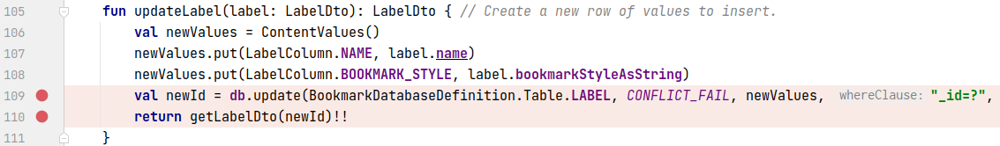
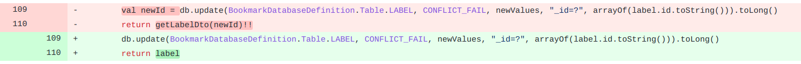

## 基本信息

app: [https://github.com/AndBible/and-bible](https://github.com/AndBible/and-bible)

issue: [https://github.com/AndBible/and-bible/issues/480](https://github.com/AndBible/and-bible/issues/480)

exception version: [https://github.com/AndBible/and-bible/tree/774c20731e3eadb01c56f499efee1fb001be20e9](https://github.com/AndBible/and-bible/tree/774c20731e3eadb01c56f499efee1fb001be20e9)

fix version: [https://github.com/AndBible/and-bible/tree/508e8884bb9b6f32bc9ce013913fb7957e6f3a40](https://github.com/AndBible/and-bible/tree/508e8884bb9b6f32bc9ce013913fb7957e6f3a40)

## 编译

需要先将项目用git初始化并提交一次, 不然git会报错

```dart
git init
git add .
git commit -m "test"
```
## 复现

复现视频: 目录下的re480

初始快照:

可以用初始用例, 使用初始用例的话不需要快照. 但是网络下载有时很慢, 推荐把初始用例做成快照.

初始用例:

|Id|Type|Value|Desc|
|:----|:----|:----|:----|
|1|click|    |click OK|
|2|wait|14000|wait 14s|
|3|click|    |click AB|
|4|click|    |click OK|
|5|wait|8000|wait 8s|
|6|click|    |click OK|

错误用例:

|Id|Type|Value|Desc|
|:----|:----|:----|:----|
|1|click|    |click Menu|
|2|click|    |click Manage Bookmark Labels|
|3|click|    |click NEW LABEL|
|4|editx|first|set name first|
|5|click|    |click OK|
|6|click|    |click NEW LABEL|
|7|click|    |click OK|
|8|click|    |click delete(name first)|
|9|click|    |click Edit|
|10|editx|first|set text first|
|11|click|    |click OK|

覆盖(all:覆盖总数/代码总数, 其他:只被当前动作覆盖/被当前动作覆盖)

[all]3574/43585 [1]95/160 [2]110/362 [3]1/107 [4]0/0 [5]0/109 [6]0/98 [7]2/112 [8]20/97 [9]7/100 [10]0/1 [11]6/32

## 崩溃信息

栈信息: 目录下的stack480

kotlin.KotlinNullPointerException

> net/bible/service/db/bookmark/BookmarkDBAdapter.kt



## 分析

### root cause

先来简单阐明一下原因. sqlite的update函数返回的是更新影响的条目数量, 而不是条目的id. 作者每次只更新一条数据, 并认为update返回的是更新的条目的id. 这就导致"作者认为的这个id"始终为1.

假设我们在数据库表中创建2行数据, id为1,2. 接着删除id为1的行. 现在只剩下id为2的行, 而作者update返回的"id"为1, 这就导致数据库查询失败, 返回null.

接下来看代码, 点击删除时:

> net/bible/android/view/activity/bookmark/ManageLabelItemAdapter.java


> net/bible/android/view/activity/bookmark/ManageLabels.java


> net/bible/android/control/bookmark/BookmarkControl.kt


> net/bible/service/db/bookmark/BookmarkDBAdapter.kt


这个地方做了label的删除, 就像上面说的"删除id为1的行".

接着看一下重命名操作:

> net/bible/android/view/activity/bookmark/LabelDialogs.java


> net/bible/android/control/bookmark/BookmarkControl.kt


> net/bible/service/db/bookmark/BookmarkDBAdapter.kt


这里的update就是作者没有注意到的地方, 始终返回1

> net/bible/service/db/bookmark/BookmarkDBAdapter.kt


最终在query时查询失败, 引发空指针异常.

这个错误最根本的原因是作者没有理解update的返回值, 导致查询id出错, 因此归为Indexing Error. 导致下标与容量不一致的位置为`net.bible.service.db.bookmark.BookmarkDBAdapter:109`

### fix

作者修复时也是意识到了update返回值出错, 并做了一些设计上的调整. 归为Change Design. 标记在`net.bible.service.db.bookmark.BookmarkDBAdapter:109`



## fix信息

修复模式: Change Design

与栈信息的关系: >

距离(上面的分析过程有些冗余, 我们不会全部统计在距离信息中):

|源文件总数|函数总数|回调总数|组件间通信|数据存储|
|:----|:----|:----|:----|:----|
|1|2|0|0|1|

标记(注释中的数字代表覆盖这条语句的动作):

```java
net.bible.service.db.bookmark.BookmarkDBAdapter
109 // 11
```
## root cause信息

root cause分类: Indexing Error

与栈信息的关系: >

距离(上面的分析过程有些冗余, 我们不会全部统计在距离信息中):

|源文件总数|函数总数|回调总数|组件间通信|数据存储|
|:----|:----|:----|:----|:----|
|1|2|0|0|1|

标记(注释中的数字代表覆盖这条语句的动作):

```java
net.bible.service.db.bookmark.BookmarkDBAdapter
109 // 11
```
