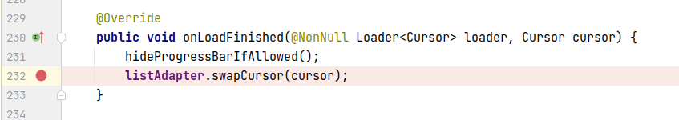
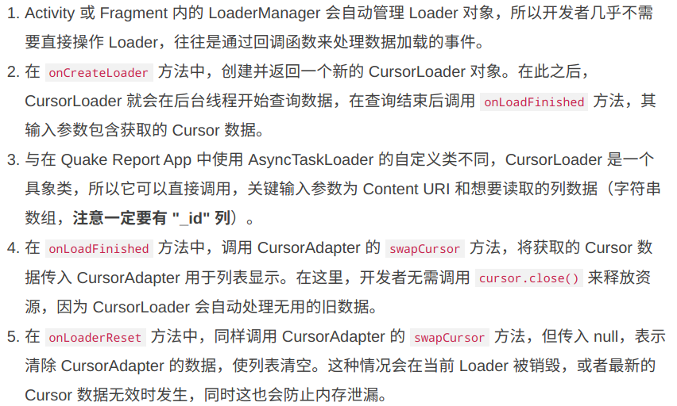
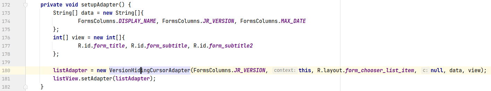
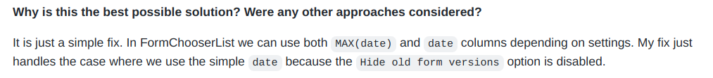
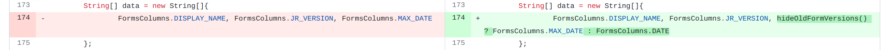

## 基本信息

app: [https://github.com/getodk/collect](https://github.com/getodk/collect)

issue: [https://github.com/getodk/collect/issues/3222](https://github.com/getodk/collect/issues/3222)

exception version: [https://github.com/grzesiek2010/collect/tree/c9a58427cf2321b006de8c0bfd836df01127d4e9](https://github.com/grzesiek2010/collect/tree/c9a58427cf2321b006de8c0bfd836df01127d4e9)

fix version: [https://github.com/grzesiek2010/collect/tree/f7ba8f7b7ba7566b527ddb1f89ae5433f62f076c](https://github.com/grzesiek2010/collect/tree/f7ba8f7b7ba7566b527ddb1f89ae5433f62f076c)

## 编译

org.opendatakit:opendatakit-javarosa:2.15.0可能要去掉SNAPSHOT

## 复现

复现视频: 目录下的re3222

初始快照:

无

初始用例:

|Id|Type|Value|Desc|
|:----|:----|:----|:----|
|1|click|    |click ALLOW|

错误用例:

|Id|Type|Value|Desc|
|:----|:----|:----|:----|
|1|click|    |click More options|
|2|click|    |click General Settings|
|3|click|    |click Form management|
|4|click|    |uncheck Hide old form versions|
|5|keyevent|KEYCODE_BACK|back|
|6|keyevent|KEYCODE_BACK|back|
|7|click|    |click Fill Blank Form|

覆盖(all:覆盖总数/代码总数, 其他:只被当前动作覆盖/被当前动作覆盖)

[all]955/65887 [1]145/243 [2]45/152 [3]55/115 [4]0/0 [5]4/59 [6]3/96 [7]173/261 

## 崩溃信息

栈信息: 目录下的stack3222

java.lang.IllegalArgumentException: column 'MAX(date)' does not exist

> org/odk/collect/android/activities/FormChooserList.java



## 分析

### root cause

CursorAdapter的错误, 主要负责在ListView中动态显示数据库中创建的数据. 这里是listAdapter与数据库格式不匹配导致的错误.

关于CursorAdapter: [https://www.jianshu.com/p/b2cdb2314f4d](https://www.jianshu.com/p/b2cdb2314f4d)




接下来分析listAdapter为什么与数据库格式不匹配, 找到listAdapter创建的地方:

> org/odk/collect/android/activities/FormChooserList.java



结合修复者的描述信息:





可以看到根据设置的不同, MAX(date)和date的情况都可能出现, 而作者只考虑了MAX(data)的情况, 导致了这个错误.

这个错误属于Resource Not Found Error, 作者在数据源头处没有考虑周全导致listAdapter显示数据时列不匹配. 标记在数据源头`org.odk.collect.android.activities.FormChooserList:173`

### fix

作者的修复是添加特判, 属于Refine Condition Checks. 标记在`org.odk.collect.android.activities.FormChooserList:173`

## fix信息

修复模式: Refine Conditional Checks

与栈信息的关系: >

距离:

|源文件总数|函数总数|回调总数|组件间通信|数据存储|
|:----|:----|:----|:----|:----|
|1|2|1|0|1|

标记(注释中的数字代表覆盖这条语句的动作):

```java
org.odk.collect.android.activities.FormChooserList
173 // 7
```
## root cause信息

root cause分类: Resource Not Found Error,

与栈信息的关系: >

距离:

|源文件总数|函数总数|回调总数|组件间通信|数据存储|
|:----|:----|:----|:----|:----|
|1|2|1|0|1|

标记(注释中的数字代表覆盖这条语句的动作):

```java
org.odk.collect.android.activities.FormChooserList
173 // 7
```
