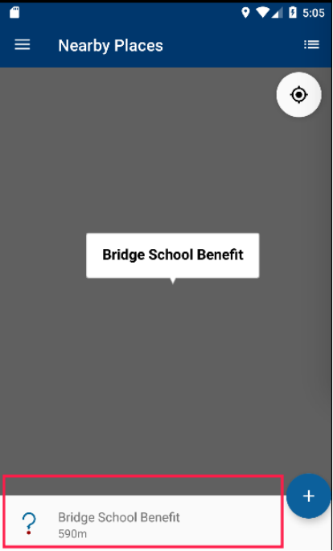
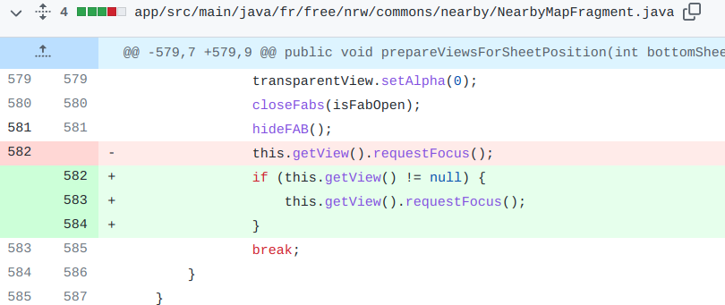

## 基本信息

app: [https://github.com/commons-app/apps-android-commons](https://github.com/commons-app/apps-android-commons)

issue: [https://github.com/commons-app/apps-android-commons/pull/1391](https://github.com/commons-app/apps-android-commons/pull/1391)

exception version: [https://github.com/commons-app/apps-android-commons/tree/6fc294ab3f9f4d635459f9fba56096303120b454](https://github.com/commons-app/apps-android-commons/tree/6fc294ab3f9f4d635459f9fba56096303120b454)

fix version: [https://github.com/commons-app/apps-android-commons/tree/499d64bb262e8d96be437de82a59e89057c89ddb](https://github.com/commons-app/apps-android-commons/tree/499d64bb262e8d96be437de82a59e89057c89ddb)

## 编译

```xml
git init
git add .
git commit -m "test"
```
## 复现

复现视频: 目录下的re1391

初始快照: 无

初始用例:

|Id|Type|Value|Desc|
|:----|:----|:----|:----|
|1|scroll|0|<-|
|2|scroll|0|<-|
|3|scroll|0|<-|
|4|scroll|0|<-|
|5|click|    |click YES|
|6|editx|haozongyin|set username haozongyin|
|7|editx|123$%^asdFGH|set password 123$%^asdFGH|
|8|click|    |click log in|
|9|wait|5000|wait 5s|

错误用例:

|Id|Type|Value|Desc|
|:----|:----|:----|:----|
|1|click|    |click Open|
|2|click|    |click Nearby|
|3|click|    |click ALLOW|
|4|wait|8000|wait 8s|
|5|click|    |click center|
|6|click|    |click Open|
|7|click|    |click Settings|
|8|click|    |turn on night mode|
|9|click|    |click Open|
|10|click|    |click Nearby|

覆盖(all:覆盖总数/代码总数, 其他:只被当前动作覆盖/被当前动作覆盖)

[all]1604/17280 [1]0/0 [2]42/183 [3]26/132 [4]33/122 [5]430/650 [6]0/0 [7]8/114 [8]3/85 [9]0/0 [10]40/334 

## 崩溃信息

栈信息: 目录下的stack1391

java.lang.NullPointerException: Attempt to invoke virtual method 'boolean android.view.View.requestFocus()' on a null object reference

> fr/free/nrw/commons/nearby/NearbyMapFragment.java


## 分析

### root cause

崩溃所在的函数由BottomSheetBehavior的onStateChanged调用. BottomSheetBehavior是个底部动作条,可以设置最小高度和最大高度, 执行进入/退出动画响应拖动/滑动手势等. 当底部动作条状态改变是调用onStateChanged:

> fr/free/nrw/commons/nearby/NearbyMapFragment.java


当点击地图上的位置时, 底部动作条会出现. 此时切换到其他栏目(如Settings), 再切换回Nearby后底部动作条会消失. 底部动作条的状态改变会调用onStateChanged.



再来看一下NearbyMapFragment, 我们知道只有fragment创建并时才会调用onCreateView, 正常的fragment切换不会调用onCreateView.  比如切换到其他栏目(如Settings), 再切换回Nearby, 是不会调用onCreateView的. 到这里看似没什么问题, 然而当启用夜间模式时, 切换回Nearby会导致NearbyMapFragment重绘, 进而调用onCreateView. 这里就有问题了. 我们知道onCreateView前getView是会返回null的, 而切换到Nearby后fragment的重绘和BottomSheetBehavior的onStateChanged是同时执行的, 如果onStateChanged先执行就会导致getView为null, 抛出空指针异常.

这个错误属于Component Lifecycle Error(尽管也有一定的Concurrency Error在里面, 但主要是Component Lifecycle Error), 错误定位到异常回调onStateChanged的prepareViewForSheetPosition函数的调用处`fr.free.nrw.commons.nearby.NearbyMapFragment:408`以及prepareViewForSheetPosition中getView()的data loss处`fr.free.nrw.commons.nearby.NearbyMapFragment:582`.

### fix

作者在崩溃处加了null判断, 修复属于Refine Condition Checks. 定位到`fr.free.nrw.commons.nearby.NearbyMapFragment:582`



## fix信息

修复模式: Refine Conditional Checks

与栈信息的关系: =

距离:

|源文件总数|函数总数|回调总数|组件间通信|数据存储|
|:----|:----|:----|:----|:----|
|1|1|0|0|0|

标记(注释中的数字代表覆盖这条语句的动作):

```java
fr.free.nrw.commons.nearby.NearbyMapFragment
582 // 10
```
## root cause信息

root cause分类: Component Lifecycle Error

与栈信息的关系: =

距离:

|源文件总数|函数总数|回调总数|组件间通信|数据存储|
|:----|:----|:----|:----|:----|
|1|2|1|0|0|

标记(注释中的数字代表覆盖这条语句的动作):

```java
fr.free.nrw.commons.nearby.NearbyMapFragment
408 // 5,10
582 // 10
```
