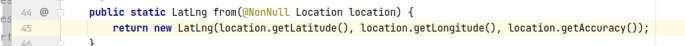
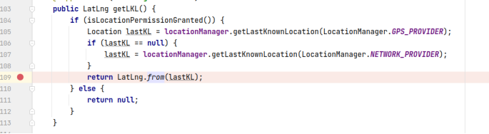
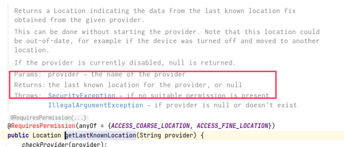
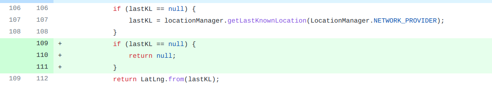

## 基本信息

app: [https://github.com/commons-app/apps-android-commons](https://github.com/commons-app/apps-android-commons)

issue: [https://github.com/commons-app/apps-android-commons/issues/1581](https://github.com/commons-app/apps-android-commons/issues/1581)

exception version: [https://github.com/hoplite390/apps-android-commons/tree/6a254741efe3c6155b2c3e2495c15b47b0d4ed53](https://github.com/hoplite390/apps-android-commons/tree/6a254741efe3c6155b2c3e2495c15b47b0d4ed53)

fix version: [https://github.com/hoplite390/apps-android-commons/tree/f4294f957ef7b20ba4d988e8af4f915ada4f2f9d](https://github.com/hoplite390/apps-android-commons/tree/f4294f957ef7b20ba4d988e8af4f915ada4f2f9d)

## 编译

```xml
git init
git add .
git commit -m "test"
```
## 复现

复现视频: 目录下的re1581

初始快照: 关闭系统定位, 打快照(顺带说一句, 正确用例是开启系统定位后执行错误用例, 此时不会报错, 开启系统定位可以用init快照)

初始用例:

|Id|Type|Value|Desc|
|:----|:----|:----|:----|
|1|scroll|0|<-|
|2|scroll|0|<-|
|3|scroll|0|<-|
|4|scroll|0|<-|
|5|click|    |click YES|
|6|editx|haozongyin|set username haozongyin|
|7|editx|123$%^asdFGH|set password 123$%^asdFGH|
|8|click|    |click LOG IN|
|9|wait|8000|wait 8s|

错误用例:

|Id|Type|Value|Desc|
|:----|:----|:----|:----|
|1|click|    |click Open|
|2|click|    |click Nearby|
|3|click|    |click ALLOW|

覆盖(all:覆盖总数/代码总数, 其他:只被当前动作覆盖/被当前动作覆盖)

[all]1049/24949 [1]0/0 [2]143/211 [3]11/23  

## 崩溃信息

栈信息: 目录下的stack1581

Caused by: java.lang.NullPointerException: Attempt to invoke virtual method 'double android.location.Location.getLatitude()' on a null object reference

> fr/free/nrw/commons/location/LatLng.java



## 分析

### root cause

分析null来源:

> fr/free/nrw/commons/location/LocationServiceManager.java



查看getLastKnownLocation:



可以看到`fr.free.nrw.commons.location.LocationServiceManager:107`的getLastKnownLocation是可能返回null的, 作者没有注意到这一点, 属于API Usage Error. 

### fix

作者在`fr.free.nrw.commons.location.LocationServiceManager:109`加了null判断, 属于Refine Condition Checks. 



## fix信息

修复模式: Refine Conditional Checks

与栈信息的关系: =

距离:

|源文件总数|函数总数|回调总数|组件间通信|数据存储|
|:----|:----|:----|:----|:----|
|2|2|0|0|0|

标记(注释中的数字代表覆盖这条语句的动作):

```java
fr.free.nrw.commons.location.LocationServiceManager
109 // 3
```
## root cause信息

root cause分类: API Usage Error

与栈信息的关系: =

距离:

|源文件总数|函数总数|回调总数|组件间通信|数据存储|
|:----|:----|:----|:----|:----|
|2|2|0|0|0|

标记(注释中的数字代表覆盖这条语句的动作):

```java
fr.free.nrw.commons.location.LocationServiceManager
107 // 3
```
## Ochi排名

art: 自动+手动生成相似用例

two: 错误用例+去除最后一步的正确用例

|用例/标记|fix|root cause|
|:----|:----|:----|
|art|15|1|
|two|7|8|

简单分析:root cause和fix都只和最后一步有关, 最后一步覆盖范围很小, 定位效果会很好. 

