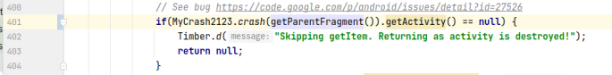
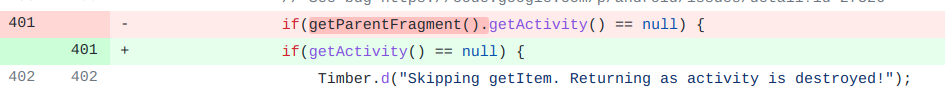

## 基本信息

app: [https://github.com/commons-app/apps-android-commons](https://github.com/commons-app/apps-android-commons)

issue: [https://github.com/commons-app/apps-android-commons/issues/2123](https://github.com/commons-app/apps-android-commons/issues/2123)

exception version: [https://github.com/commons-app/apps-android-commons/tree/102b2d7e568701486884cd6e7fb21620e5703285](https://github.com/commons-app/apps-android-commons/tree/102b2d7e568701486884cd6e7fb21620e5703285)

fix version: [https://github.com/commons-app/apps-android-commons/tree/7b5e1068ee8abf7609d27e3c808cf04210ba5bcc](https://github.com/commons-app/apps-android-commons/tree/7b5e1068ee8abf7609d27e3c808cf04210ba5bcc)

## 编译

```xml
git init
git add .
git commit -m "test"
```
应用会自动捕捉崩溃重启, 需要在崩溃时手动用MyCrash2123捕捉异常
## 复现

复现视频: 目录下的re2123

初始快照: 无

初始用例:

|Id|Type|Value|Desc|
|:----|:----|:----|:----|
|1|scroll|0|<-|
|2|scroll|0|<-|
|3|scroll|0|<-|
|4|scroll|0|<-|
|5|click|    |click YES|
|6|click|    |click Skip|
|7|click|    |click YES|

错误用例:

|Id|Type|Value|Desc|
|:----|:----|:----|:----|
|1|click|    |click First picture|

覆盖(all:覆盖总数/代码总数, 其他:只被当前动作覆盖/被当前动作覆盖)

[all]925/30860 [1]335/385 

## 崩溃信息

栈信息: 目录下的stack2123

Attempt to invoke virtual method 'android.support.v4.app.FragmentActivity android.support.v4.app.Fragment.getActivity()' on a null object reference

> fr/free/nrw/commons/media/MediaDetailPagerFragment.java



## 分析

### root cause

[https://stackoverflow.com/questions/14804526/getparentfragment-returning-null#:~:text=getParentFragment%20%28%29%20was%20introduced%20in%20API%20level%2017,fragment%20has%20a%20parent%20which%20is%20an%20Activity.](https://stackoverflow.com/questions/14804526/getparentfragment-returning-null#:~:text=getParentFragment%20%28%29%20was%20introduced%20in%20API%20level%2017,fragment%20has%20a%20parent%20which%20is%20an%20Activity.)

如果fragment已经与activity绑定, 则getParentFragment返回null. 我们将其视作getParentFragment的Resource Not Found, 定位到`fr.free.nrw.commons.media.MediaDetailPagerFragment:401`

### fix

作者在`fr.free.nrw.commons.media.MediaDetailPagerFragment:401`添加了null判断, 修复模式为 Refine Conditional Checks. 另外我们只考虑当前崩溃的修复, 因此不考虑作者在`fr.free.nrw.commons.media.MediaDetailPagerFragment:346`的修复



## fix信息

修复模式: Refine Conditional Checks

与栈信息的关系: =

距离:

|源文件总数|函数总数|回调总数|组件间通信|数据存储|
|:----|:----|:----|:----|:----|
|1|1|1|0|0|

标记(注释中的数字代表覆盖这条语句的动作):

```java
fr.free.nrw.commons.media.MediaDetailPagerFragment
401 // 1
```
## root cause信息

root cause分类: Resource Not Found Error

与栈信息的关系: =

距离:

|源文件总数|函数总数|回调总数|组件间通信|数据存储|
|:----|:----|:----|:----|:----|
|1|1|1|0|0|

标记(注释中的数字代表覆盖这条语句的动作):

```java
fr.free.nrw.commons.media.MediaDetailPagerFragment
401 // 1
```
