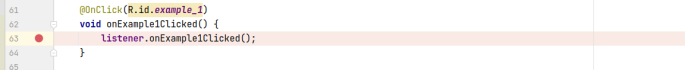
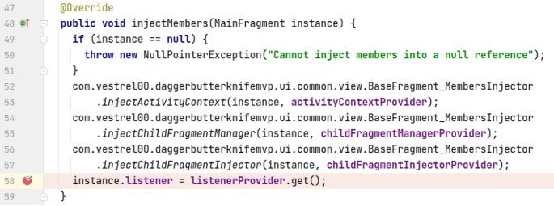
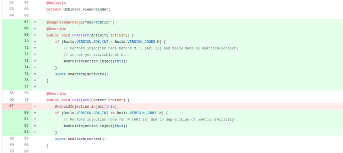
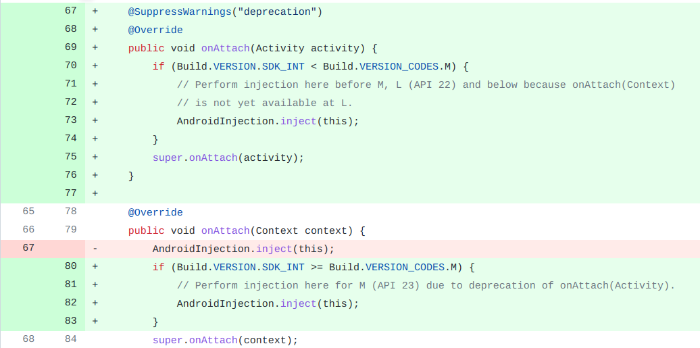

## 基本信息

app: [https://github.com/vestrel00/android-dagger-butterknife-mvp](https://github.com/vestrel00/android-dagger-butterknife-mvp)

issue: [https://github.com/vestrel00/android-dagger-butterknife-mvp/issues/46](https://github.com/vestrel00/android-dagger-butterknife-mvp/issues/46)

exception version: [https://github.com/vestrel00/android-dagger-butterknife-mvp/tree/89dcdfaec7cd6b78fa4eeab2383065e567599486](https://github.com/vestrel00/android-dagger-butterknife-mvp/tree/89dcdfaec7cd6b78fa4eeab2383065e567599486)

fix version: [https://github.com/vestrel00/android-dagger-butterknife-mvp/tree/b611137b1e8bf28917c90e7b8137667b33315750](https://github.com/vestrel00/android-dagger-butterknife-mvp/tree/b611137b1e8bf28917c90e7b8137667b33315750)

## 编译

正常

使用插桩插件0.0.1, 兼容gradle2~3

## 复现

复现视频: 目录下的re46

初始快照: 无

初始用例: 无

错误用例:

需要在API22上复现

使用A25做对比

|Id|Type|Value|Desc|
|:----|:----|:----|:----|
|1|click|    |click Ex1: Activity with 1 Fragment|

覆盖(all:覆盖总数/代码总数, 其他:只被当前动作覆盖/被当前动作覆盖, 这里是a25上的数据)

[all]77/3181 [1]41/62 

## 崩溃信息

栈信息: 目录下的stack46

java.lang.NullPointerException: Attempt to invoke interface method 'void com.vestrel00.daggerbutterknifemvp.ui.main.view.MainFragmentListener.onExample1Clicked()' on a null object reference

> com/vestrel00/daggerbutterknifemvp/ui/main/view/MainFragment.java



## 分析

### root cause

分析listener来源:

> com/vestrel00/daggerbutterknifemvp/ui/main/view/MainFragment_MembersInjector.java



> com/vestrel00/daggerbutterknifemvp/ui/common/view/BaseFragment.java


正常情况下应该在onAttach中注入, 接着在injectMembers中设置listener. 然而经过调试A22上根本没有调用onAttach. 查看作者的修复:



可以看到作者添加了onAttach(Activity). <=A22时会调用onAttach(Activity), 而>A22时会调用onAttach(Context), app在A25上就会正常调用onAttach(Context)不报错. 

这个问题与android版本有关, 属于API Updates and Compatibility Error, 标记在onAttach(Context)(为了定位方便标记在这个函数第一行`com.vestrel00.daggerbutterknifemvp.ui.common.view.BaseFragment:67`)

### fix

作者添加了onAttach(Activity)函数并做了版本判断, 使得 <=A22时会调用onAttach(Activity), 而>A22时会调用onAttach(Context), 修复模式属于Work in Right Callbacks. 本质是对onAttach(Context)的修复, 标记在`com.vestrel00.daggerbutterknifemvp.ui.common.view.BaseFragment:67`



## fix信息

修复模式: Work in Right Callbacks

与栈信息的关系: >

距离:

|源文件总数|函数总数|回调总数|组件间通信|数据存储|
|:----|:----|:----|:----|:----|
|3|3|2|0|0|

标记(注释中的数字代表覆盖这条语句的动作):

```java
com.vestrel00.daggerbutterknifemvp.ui.common.view.BaseFragment
67 // 0,1(a25)
```
## root cause信息

root cause分类: API Updates and Compatibility Error

与栈信息的关系: >

距离:

|源文件总数|函数总数|回调总数|组件间通信|数据存储|
|:----|:----|:----|:----|:----|
|3|3|2|0|0|

标记(注释中的数字代表覆盖这条语句的动作):

```java
com.vestrel00.daggerbutterknifemvp.ui.common.view.BaseFragment
67 // 0,1(a25)
```
