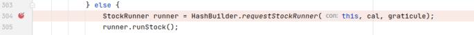

## 基本信息

app: [https://github.com/CaptainSpam/geohashdroid](https://github.com/CaptainSpam/geohashdroid)

issue: [https://github.com/CaptainSpam/geohashdroid/issues/73](https://github.com/CaptainSpam/geohashdroid/issues/73)

exception version: [https://github.com/CaptainSpam/geohashdroid/tree/4f4c6a2a9fbf221e9ecbb82b2d79313537e98c1c](https://github.com/CaptainSpam/geohashdroid/tree/4f4c6a2a9fbf221e9ecbb82b2d79313537e98c1c)

fix version: [https://github.com/CaptainSpam/geohashdroid/tree/03bb35511655d9ae21bbfa501558a3e195350aaf](https://github.com/CaptainSpam/geohashdroid/tree/03bb35511655d9ae21bbfa501558a3e195350aaf)

## 编译

编译时缺失api_map_key, 解决方案:

[https://developers.google.com/maps/documentation/android-sdk/start?hl=en](https://developers.google.com/maps/documentation/android-sdk/start?hl=en)

主要步骤: Android Studio下载Goole Play services SDK, 云控制台创建项目, 启用Maps SDK for Android, 去凭据里创建一个API KEY, 在values/strings下创建相关v2条目, value为刚刚创建的api key.

## 复现

复现视频: 目录下的re73

初始快照: 无

初始用例:

|Id|Type|Value|Desc|
|:----|:----|:----|:----|
|1|click|    |click allow|
|2|click|    |click cool|

错误用例:

|Id|Type|Value|Desc|
|:----|:----|:----|:----|
|1|click|    |click GRATICULE|
|2|click|    |click Globalhash!|

覆盖(all:覆盖总数/代码总数, 其他:只被当前动作覆盖/被当前动作覆盖)

[all]1562/16496 [1]183/558 [2]8/116 

## 崩溃信息

栈信息: 目录下的stack73

java.lang.NullPointerException: Attempt to invoke virtual method 'java.lang.String net.exclaimindustries.geohashdroid.util.Graticule.getLatitudeString(boolean)' on a null object reference

> app/src/main/java/net/exclaimindustries/geohashdroid/util/HashBuilder.java


## 分析

### root cause

分析mGrat的空指针来源:

成员变量mGrat由StockRunner()设置, StockRunner由requestStockRunner调用

> app/src/main/java/net/exclaimindustries/geohashdroid/util/HashBuilder.java


根据断点调试与android studio依赖分析, requestStockRunner由如下代码调用:

> app/src/main/java/net/exclaimindustries/geohashdroid/services/StockService.java



 这个else分支无论正确和错误都能执行到, 因此认为错误和分支判断无关, 继续向上追溯

> app/src/main/java/net/exclaimindustries/geohashdroid/services/StockService.java


> app/src/main/java/net/exclaimindustries/geohashdroid/activities/CentralMap.java


> app/src/main/java/net/exclaimindustries/geohashdroid/activities/CentralMap.java


> net/exclaimindustries/geohashdroid/util/SelectAGraticuleMode.java


> net/exclaimindustries/geohashdroid/widgets/GraticulePicker.java


toSend来自buildGraticule

> net/exclaimindustries/geohashdroid/widgets/GraticulePicker.java


最终我们发现当mGlobal被选中时, buildGraticule产生空指针. 

root cause归为Resource Not Found, 标记在`net.exclaimindustries.geohashdroid.widgets.GraticulePicker:256`, 这里是null的来源. 

### fix

作者直接在`net.exclaimindustries.geohashdroid.util.HashBuilder:148`加了判空, 修复模式为Refine Condition Checks.


## fix信息

修复模式: Refine Condition Checks

与栈信息的关系: =

距离:

|源文件总数|函数总数|回调总数|组件间通信|数据存储|
|:----|:----|:----|:----|:----|
|1|1|0|0|0|

标记(注释中的数字代表覆盖这条语句的动作):

```java
net.exclaimindustries.geohashdroid.util.HashBuilder
148 // 0, 2
```
## root cause信息

root cause分类: Resource Not Found

与栈信息的关系: >

距离:

|源文件总数|函数总数|回调总数|组件间通信|数据存储|
|:----|:----|:----|:----|:----|
|5|10|2|1|0|

标记(注释中的数字代表覆盖这条语句的动作):

```java
net.exclaimindustries.geohashdroid.widgets.GraticulePicker
256 // 2
```
