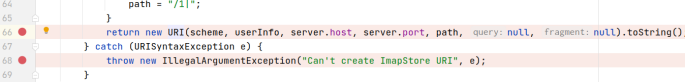
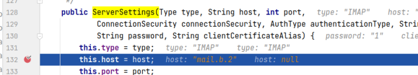
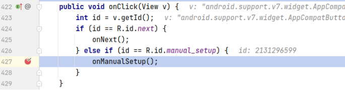
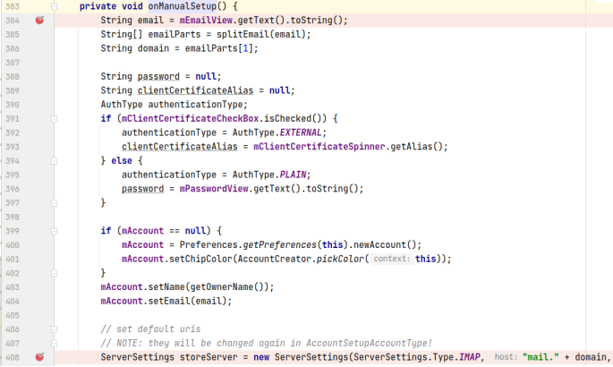
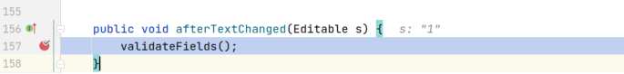
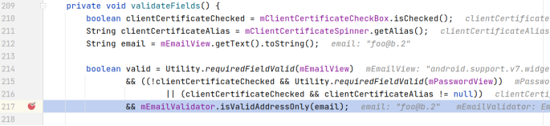
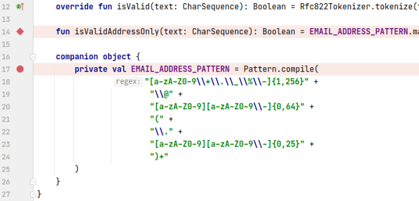
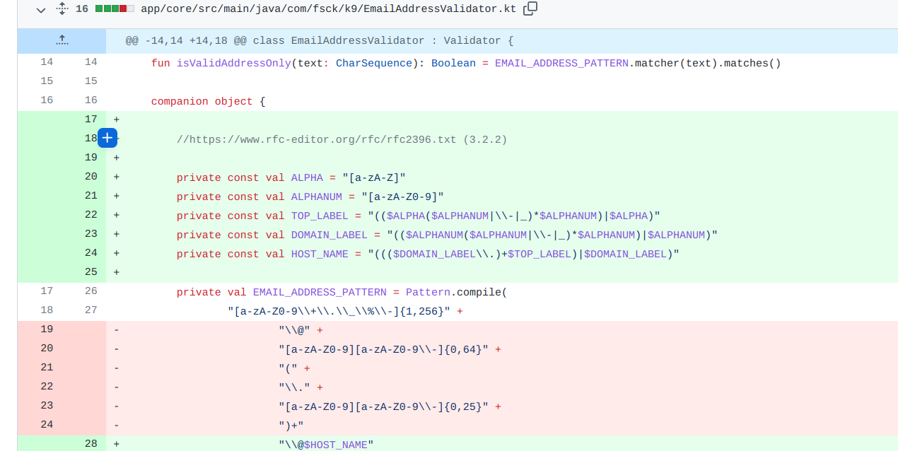

## 基本信息

app: [https://github.com/k9mail/k-9](https://github.com/k9mail/k-9)

issue: [https://github.com/k9mail/k-9/issues/3255#issuecomment-378459040](https://github.com/k9mail/k-9/issues/3255#issuecomment-378459040)

exception version: [https://github.com/hichamboushaba/k-9/tree/fe0e55f49ccb5a703113b32a0cdbbc3cfa37d4f1](https://github.com/hichamboushaba/k-9/tree/fe0e55f49ccb5a703113b32a0cdbbc3cfa37d4f1)

fix version: [https://github.com/hichamboushaba/k-9/tree/f994562b47dada4f4537e3de4c17b1f4c1e80e59](https://github.com/hichamboushaba/k-9/tree/f994562b47dada4f4537e3de4c17b1f4c1e80e59)

## 编译

正常

## 复现

复现视频: 目录下的re3255

初始快照: 无

初始用例: 

|Id|Type|Value|Desc|
|:----|:----|:----|:----|
|1|click|    |click next|

错误用例:

|Id|Type|Value|Desc|
|:----|:----|:----|:----|
|1|edit|foo@b.2|set text foo@b.2|
|2|edit|123|set password 123|
|3|click|    |click MANUAL SETUP|

覆盖(all:覆盖总数/代码总数, 其他:只被当前动作覆盖/被当前动作覆盖)

[all]1497/74944 [1]0/18 [2]2/20 [3]309/380 

## 崩溃信息

栈信息: 目录下的stack3255

java.net.URISyntaxException: Illegal character in hostname at index 41: imap+ssl+://PLAIN:foo%2540b.2:123@mail.b.2/1%7C

> com/fsck/k9/mail/store/imap/ImapStoreUriCreator.java



## 分析

### root cause

先来分析一下调用关系, 根据栈信息得知是server.host的值异常, 获取值的来源:

> com/fsck/k9/mail/ServerSettings.java



ServerSettings构造函数是在最后一步点击动作时, 调用onclick, 接着调用onManualSetup执行到的:

> com/fsck/k9/activity/setup/AccountSetupBasics.java





可以看到ServerSettings构造函数参数的值来源于mEmailView.getText(). 源自用户的错误输入. 现在要知道用户的输入为什么会引发崩溃, 继续分析:

看一下崩溃信息:Illegal character in hostname at index 42:imap+ssl+://PLAIN:foo%2540b.2:1234@mail.b.2/1%7C 

这个字符串第42个字符属于非法字符，导致创建URI失败,也就是foo@b.2这个用户名的最后一个字符2，域名后缀开头不能为数字。

在输入字符改变时会调用这个方法验证输入字符:

> com/fsck/k9/activity/setup/AccountSetupBasics.java



接着会调用

> com/fsck/k9/activity/setup/AccountSetupBasics.java



这里会调用这个方法来验证，因为作者考虑不全，导致输入错误邮箱时，依然会去创建URI,导致出错:

> com/fsck/k9/EmailAddressValidator.kt



这个问题本质上属于isValidAddressOnly没有处理好异常的参数格式, 是一个API Usage Error. 标记在`com.fsck.k9.EmailAddressValidator:14`

### fix

作者修改了EMAIL_ADDRESS_PATTERN的规则, 考虑到了异常参数格式的情况, 归为Refine Condition Checks. 标记在`com.fsck.k9.EmailAddressValidator:17`



## fix信息

修复模式: Refine Condition Checks

与栈信息的关系: >

距离:

|源文件总数|函数总数|回调总数|组件间通信|数据存储|
|:----|:----|:----|:----|:----|
|5|7|2|0|0|

标记(注释中的数字代表覆盖这条语句的动作):

```java
com.fsck.k9.EmailAddressValidator
17 // 0
```
## root cause信息

root cause分类: API Usage Error

与栈信息的关系: >

距离:

|源文件总数|函数总数|回调总数|组件间通信|数据存储|
|:----|:----|:----|:----|:----|
|5|7|2|0|0|

标记(注释中的数字代表覆盖这条语句的动作):

```java
com.fsck.k9.EmailAddressValidator
14 // 2(这里应该也有1, 可能是因为执行得太快event id变更请求没来得及生效就被下一个取代了)
```
