## 基本信息

app: [https://github.com/gsantner/markor](https://github.com/gsantner/markor)

issue: [https://github.com/gsantner/markor/issues/194](https://github.com/gsantner/markor/issues/194)

exception version: [https://github.com/gsantner/markor/tree/0c8a946db1b65c0654096a1f80e0350e582e7dd4](https://github.com/gsantner/markor/tree/0c8a946db1b65c0654096a1f80e0350e582e7dd4)

fix version: [https://github.com/gsantner/markor/tree/8147ed11a55afcf763283fe339b2e5ea5d76a689](https://github.com/gsantner/markor/tree/8147ed11a55afcf763283fe339b2e5ea5d76a689)

## 编译

本质上是两个空指针异常, 这里我们只考虑_dopt的空指针异常

## 复现

复现视频: 目录下的re194

初始快照: 涉及旋转, 推荐用init

初始用例: 

|Id|Type|Value|Desc|
|:----|:----|:----|:----|
|1|click|    |ok|
|2|click|    |+|
|3|click|    |allow|

错误用例:

|Id|Type|Value|Desc|
|:----|:----|:----|:----|
|1|click|    |click +|
|2|click|    |click picture|
|3|click|    |click BROWSE FILESYSTEM|
|4|rotate|1|rotate h|

覆盖(all:覆盖总数/代码总数, 其他:只被当前动作覆盖/被当前动作覆盖)

[all]1159/11944 [1]49/548 [2]25/27 [3]183/218 [4]10/445

## 崩溃信息

栈信息: 目录下的stack194

java.lang.NullPointerException: Attempt to read from field 'boolean net.gsantner.opoc.ui.FilesystemDialogData$Options.cancelButtonEnable' on a null object reference

> app/src/main/java/net/gsantner/opoc/ui/FilesystemDialog.java

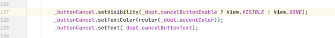

## 分析

### root cause

寻找_dopt空指针来源:

> app/src/main/java/net/gsantner/opoc/ui/FilesystemDialog.java

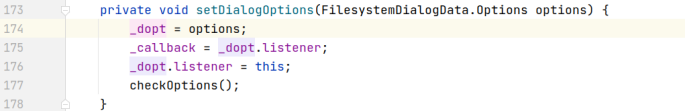

newInstance将值传递给setDialogOptions:

> app/src/main/java/net/gsantner/opoc/ui/FilesystemDialog.java

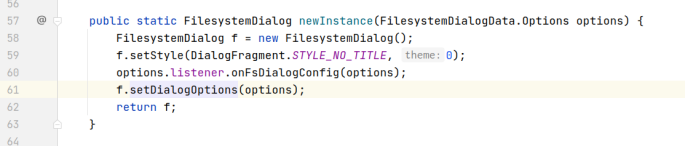

showDialog将opts传递给newInstance方法:

> app/src/main/java/net/gsantner/markor/ui/FilesystemDialogCreator.java

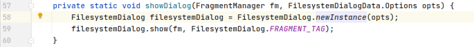

showFileDialog或showFolderDialog创建opts这个实例:

> app/src/main/java/net/gsantner/markor/ui/FilesystemDialogCreator.java

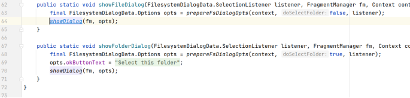

正常情况点击时会创建opts实例，并不会出现空指针。但旋转屏幕时会重新执行onCreateView和onViewCreated, 而_dopt的赋值操作不会重新执行，所以_dopt为空，因此，可以分析出，旋转屏幕时，_dopt这个实例没有保存而丢失，导致空指针。

> app/src/main/java/net/gsantner/opoc/ui/FilesystemDialog.java

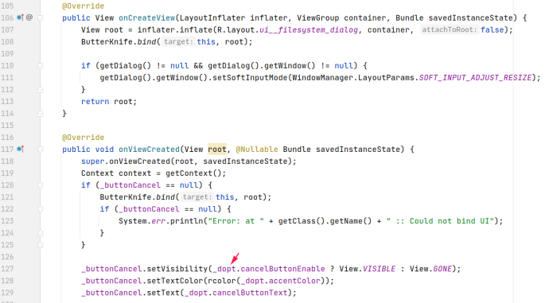

如果只加一个判空语句并return,依然会报空指针异常

> app/src/main/java/net/gsantner/opoc/ui/FilesystemDialog.java

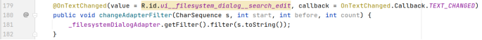

原因_filesystemDialogAdapter是在onViewCreated中new的，只加一个判空语句并return的话，_filesystemDialogAdapter不会被创建

> app/src/main/java/net/gsantner/opoc/ui/FilesystemDialog.java

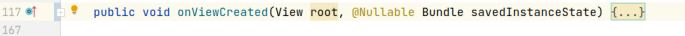

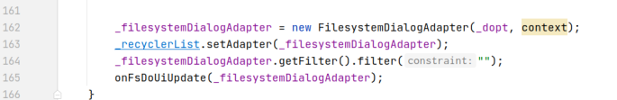

而changeAdapterFilter方法也会被重新执行，并产生空指针异常

> app/src/main/java/net/gsantner/opoc/ui/FilesystemDialog.java

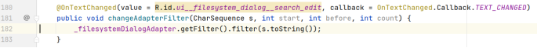

这个问题本质是旋转屏幕时重新执行onCreateView和onViewCreated, 而_dopt的赋值操作不会重新执行，导致_dopt出现空指针异常, 归为

Component Lifecycle Error. 由于我们只考虑当前的崩溃, 因此只定位dopt的崩溃原因, 即`net.gsantner.opoc.ui.FilesystemDialog:127`onViewCreated中的data loss处.

### fix

我们只考虑当前的崩溃的修复, 因此只分析dopt为null的修复. 可以看到作者在`net.gsantner.opoc.ui.FilesystemDialog:127`添加了null特判, 属于Refine Condition Checks

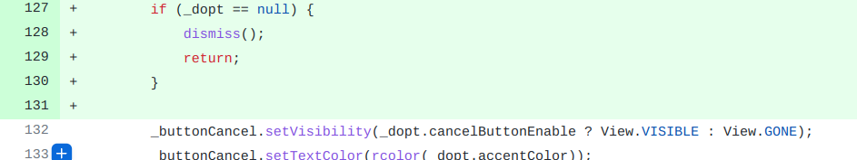

## fix信息

修复模式: Refine Condition Checks

与栈信息的关系: =

距离:

|源文件总数|函数总数|回调总数|组件间通信|数据存储|
|:----|:----|:----|:----|:----|
|1|1|1|0|0|

标记(注释中的数字代表覆盖这条语句的动作):

```java
net.gsantner.opoc.ui.FilesystemDialog
127 // 3,4
```
## root cause信息

root cause分类: Component Lifecycle Error

与栈信息的关系: =

距离:

|源文件总数|函数总数|回调总数|组件间通信|数据存储|
|:----|:----|:----|:----|:----|
|1|1|1|0|0|

标记(注释中的数字代表覆盖这条语句的动作):

```java
net.gsantner.opoc.ui.FilesystemDialog
127 // 3,4
```
## Ochi排名

art: 自动+手动生成相似用例

two: 错误用例+去除最后一步的正确用例

|用例/标记|fix|root cause|
|:----|:----|:----|
|art|958|958|
|two|958|958|

简单分析: 错误语句被动作3覆盖, 动作3的覆盖范围很大, 不好体现差异性.

