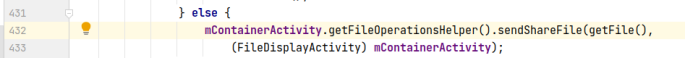
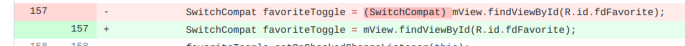
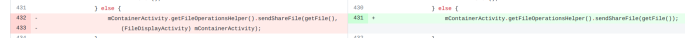
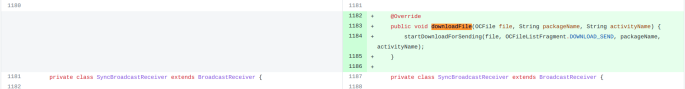

## 基本信息

app: [https://github.com/nextcloud/android](https://github.com/nextcloud/android)

issue: [https://github.com/nextcloud/android/issues/1918](https://github.com/nextcloud/android/issues/1918)

exception version: [https://github.com/nextcloud/android/tree/919ffc436f24b3b4c4bd012d84e07ca34fb2ac6f](https://github.com/nextcloud/android/tree/919ffc436f24b3b4c4bd012d84e07ca34fb2ac6f)

fix version: [https://github.com/nextcloud/android/tree/d4346743153c0455efb928d5c37bd3924f8d4247](https://github.com/nextcloud/android/tree/d4346743153c0455efb928d5c37bd3924f8d4247)

## 编译

依赖用master暂时没问题, 如果后面遇到编译问题的话请通过issue向我们反馈

java.lang.OutOfMemoryError: GC overhead limit exceeded的话参考通用的编译错误处理方案

## 复现

复现视频: 目录下的re4792

初始快照: 无

初始用例: 

|Id|Type|Value|Desc|
|:----|:----|:----|:----|
|1|click|    |skip|
|2|editx|[https://shared02.opsone-cloud.ch/](https://shared02.opsone-cloud.ch/)|set url: [https://shared02.opsone-cloud.ch/](https://shared02.opsone-cloud.ch/)|
|3|click|    |enter|
|4|wait|5000|wait 5s|
|5|click|    |click login|
|6|editx|droid_fuzzing_9@163.com|set username: droid_fuzzing_9@163.com|
|7|editx|droid.fuzzing|set password: droid.fuzzing|
|8|click|    |login|
|9|wait|2000|wait 2s|
|10|click|    |click grant access|
|11|wait|2000|wait 2s|
|12|click|    |click allow|
|13|wait|3000|wait 3s|

错误用例:

|Id|Type|Value|Desc|
|:----|:----|:----|:----|
|1|click|    |click Nextcloud.png|
|2|click|    |click More options|
|3|click|    |click Send/Share|

覆盖(all:覆盖总数/代码总数, 其他:只被当前动作覆盖/被当前动作覆盖)

[all]5374/75219 [1]399/1675 [2]57/700 [3]6/11 

## 崩溃信息

栈信息: 目录下的stack1918

java.lang.ClassCastException: com.owncloud.android.ui.preview.PreviewImageActivity cannot be cast to com.owncloud.android.ui.activity.FileDisplayActivity

> com/owncloud/android/ui/preview/PreviewImageFragment.java



## 原因分析

### root cause

这是一个类型转换错误, 我们需要结合作者的fix进行分析:

issue fix内容比较多, 首先要将无关部分去除:



这类修改只是添加了多余的类型转换, 全部忽略即可

接着:



这类修改其实是修改了sendShareFile的参数, 这里我们仅关注PreviewImageFragment以及sendShareFile中的修改即可(我们要做的是定位错误, 而不是全面的修复错误)

downloadFile相关修改属于作者根据问题做的相关调整, 不属于引发问题的原因:



至此我们理清了作者做的修复. 可以看到本质上是对sendShareFile的修改以及PreviewImageFragment中sendShareFile使用上的修改. 错误的根本原因就是设计时对于类型转换没有考虑周全, 至于如何修改设计就是作者的问题了.

这个问题的root cause不在我们的分析范围内, 归为其他. 作者的修复是属于设计上的调整, 属于Change Design. 我们将root cause和修复标记在类型转换处`com.owncloud.android.ui.preview.PreviewImageFragment:432`

### fix

上述分析中已经分析过了.

## fix信息

修复模式: Change Design

与栈信息的关系: =

距离:

|源文件总数|函数总数|回调总数|组件间通信|数据存储|
|:----|:----|:----|:----|:----|
|1|1|1|0|0|

标记(注释中的数字代表覆盖这条语句的动作):

```java
com.owncloud.android.ui.preview.PreviewImageFragment
432 // 3
```
## root cause信息

root cause分类: 其他

与栈信息的关系: =

距离:

|源文件总数|函数总数|回调总数|组件间通信|数据存储|
|:----|:----|:----|:----|:----|
|1|1|1|0|0|

标记(注释中的数字代表覆盖这条语句的动作):

```java
com.owncloud.android.ui.preview.PreviewImageFragment
432 // 3
```
