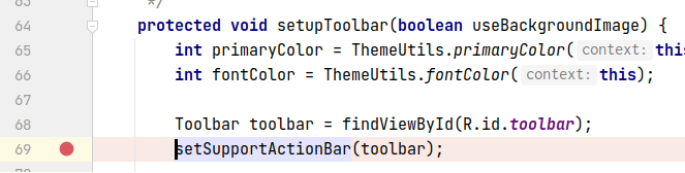
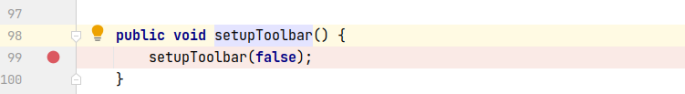
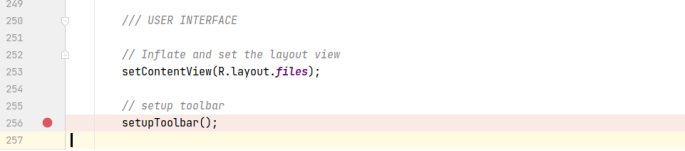
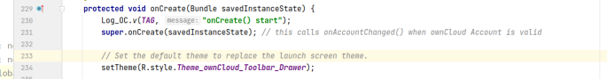
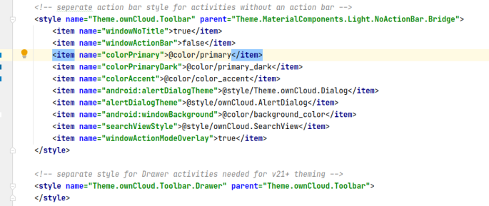
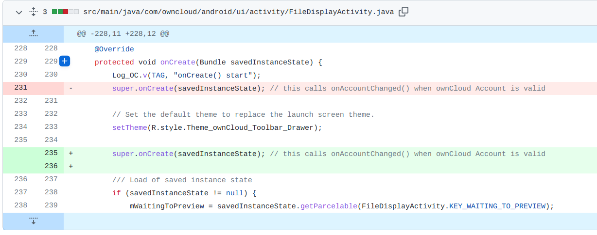

## 基本信息

app: [https://github.com/nextcloud/android](https://github.com/nextcloud/android)

issue: [https://github.com/nextcloud/android/issues/4026](https://github.com/nextcloud/android/issues/4026)

exception version: [https://github.com/nextcloud/android/tree/0bb4e72e95bcae164c3130fbdbd2b9622fd4f1de](https://github.com/nextcloud/android/tree/0bb4e72e95bcae164c3130fbdbd2b9622fd4f1de)

fix version: [https://github.com/nextcloud/android/tree/c16622dd94743a6f14889c7c3db6ba59beabc897](https://github.com/nextcloud/android/tree/c16622dd94743a6f14889c7c3db6ba59beabc897)

## 编译

去掉distributionSha256Sum

依赖用了master, 无法编译, 需要换成历史版本, 根据时间推测是1.5.0

java.lang.OutOfMemoryError: GC overhead limit exceeded的话参考通用的编译错误处理方案

## 复现

复现视频: 目录下的re4026

初始快照: 复现前需要开启don't keep activities, 基于init做一个dontkeepactivity快照

初始用例: 无

错误用例:

最后一步点击后推荐等一段时间, 防止应用没来得及崩溃

|Id|Type|Value|Desc|
|:----|:----|:----|:----|
|1|click|    |click Log in|
|2|editx|[https://shared02.opsone-cloud.ch/](https://shared02.opsone-cloud.ch/)|set url [https://shared02.opsone-cloud.ch/](https://shared02.opsone-cloud.ch/)|
|3|click|    |click enter|
|4|wait|5000|wait 5s|
|5|click|    |click Log in|
|6|editx|droid_fuzzing_9@163.com|set username droid_fuzzing_9@163.com|
|7|editx|droid.fuzzing|set password droid.fuzzing|
|8|click|    |click Log in|
|9|wait|3000|wait 3s|
|10|click|    |click grant access|
|11|wait|10000|wait 10s for crash|

覆盖(all:覆盖总数/代码总数, 其他:只被当前动作覆盖/被当前动作覆盖)

[all]3144/84424 [1]37/317 [2]0/12 [3]3/145 [4]57/152 [5]0/7 [6]0/7 [7]0/0 [8]0/0 [9]0/7 [10]29/173 [11]467/832 

## 崩溃信息

栈信息: 目录下的stack4026

This Activity already has an action bar supplied by the window decor. Do not request Window.FEATURE_SUPPORT_ACTION_BAR and set windowActionBar to false in your theme to use a Toolbar instead.

> com/owncloud/android/ui/activity/ToolbarActivity.java



## 分析

### root cause

先分析一下setupToolbar从何处调用:

> com/owncloud/android/ui/activity/ToolbarActivity.java



> com/owncloud/android/ui/activity/FileDisplayActivity.java



发现是FileDisplayActivity的onCreate调用的. 注意onCreate中的setTheme:

> com/owncloud/android/ui/activity/FileDisplayActivity.java





根据[https://blog.csdn.net/Zzz_Zzz_Z/article/details/51737876](https://blog.csdn.net/Zzz_Zzz_Z/article/details/51737876),  [https://stackoverflow.com/questions/42474038/this-activity-already-has-an-action-bar-supplied-by-the-window-decor-error](https://stackoverflow.com/questions/42474038/this-activity-already-has-an-action-bar-supplied-by-the-window-decor-error), 若主题xml配置不当, setTheme后调用setSupportActionBar会有上述问题. 归为API Usage Error. 标记在`com.owncloud.android.ui.activity.FileDisplayActivity:234`setTheme和`com.owncloud.android.ui.activity.ToolbarActivity:69`setSupportActionBar处.

### fix

不过作者并没有做xml的修复, 而是在super.onCreate前setTheme, 属于设计上的调整(我们不是很清楚为什么这样也可以修复漏洞), 修复模式归为Change Design. 标记在`com.owncloud.android.ui.activity.FileDisplayActivity:231`super.onCreate和`com.owncloud.android.ui.activity.FileDisplayActivity:234`setTheme处.



## fix信息

修复模式: Change Design

与栈信息的关系: >

距离:

|源文件总数|函数总数|回调总数|组件间通信|数据存储|
|:----|:----|:----|:----|:----|
|2|3|1|0|0|

标记(注释中的数字代表覆盖这条语句的动作):

```java
com.owncloud.android.ui.activity.FileDisplayActivity
231 // 0, 11
234 // 0, 11
```
## root cause信息

root cause分类: API Usage Error

与栈信息的关系: >

距离:

|源文件总数|函数总数|回调总数|组件间通信|数据存储|
|:----|:----|:----|:----|:----|
|2|3|1|0|0|

标记(注释中的数字代表覆盖这条语句的动作):

```java
com.owncloud.android.ui.activity.ToolbarActivity
69 // 0, 11
com.owncloud.android.ui.activity.FileDisplayActivity
234 // 0, 11
```
## Ochi排名

art: 自动+手动生成相似用例

two: 错误用例+去除最后一步的正确用例

|用例/标记|fix|root cause|
|:----|:----|:----|
|art|2022,2023|2023,2269|
|two|2022,2023|2023,2269|

简单分析: 错误语句被初始动作覆盖, 效果会很差.

