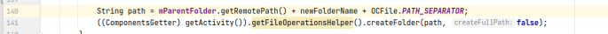
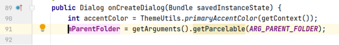
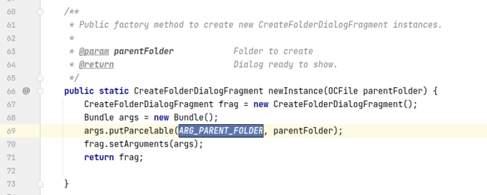
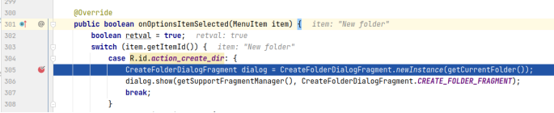
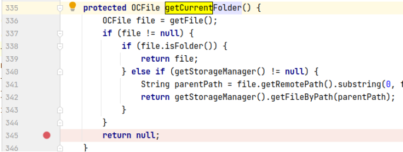
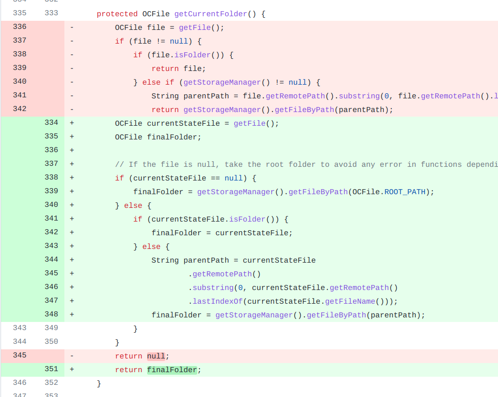

## 基本信息

app: [https://github.com/nextcloud/android](https://github.com/nextcloud/android)

issue: [https://github.com/nextcloud/android/issues/4792](https://github.com/nextcloud/android/issues/4792)

exception version: [https://github.com/nextcloud/android/tree/5c74f2b1bec93d4145489c94e2e52412de3aa96d](https://github.com/nextcloud/android/tree/5c74f2b1bec93d4145489c94e2e52412de3aa96d)

fix version: [https://github.com/nextcloud/android/tree/511a16612d11b94152a2fd2be549be33c0864f42](https://github.com/nextcloud/android/tree/511a16612d11b94152a2fd2be549be33c0864f42)

## 编译

依赖用了master, 无法编译, 需要换成历史版本, 根据时间推测是2.2.0

java.lang.OutOfMemoryError: GC overhead limit exceeded的话参考通用的编译错误处理方案

## 复现

复现视频: 目录下的re4792

初始快照: 无

初始用例: 

|Id|Type|Value|Desc|
|:----|:----|:----|:----|
|1|editx|[https://shared02.opsone-cloud.ch/](https://shared02.opsone-cloud.ch/)|set url [https://shared02.opsone-cloud.ch/](https://shared02.opsone-cloud.ch/)|
|2|click|    |click enter|
|3|wait|5000|wait 5s|
|4|click|    |click login|
|5|editx|droid_fuzzing_9@163.com|set username droid_fuzzing_9@163.com|
|6|editx|droid.fuzzing|set password droid.fuzzing|
|7|click|    |click log in|
|8|wait|2000|wait 2s|
|9|click|    |click grant access|
|10|wait|3000|wait 3s|
|11|click|    |click ALLOW|
|12|wait|3000|wait 3s|

错误用例:

|Id|Type|Value|Desc|
|:----|:----|:----|:----|
|1|click|    |click Open sidebar|
|2|click|    |click Auto upload|
|3|click|    |click More options|
|4|click|    |click Set up a custom folder|
|5|click|    |click Remote folder|
|6|click|    |click More options|
|7|click|    |click New folder|
|8|edit|test|set name test|
|9|click|    |click Create|

覆盖(all:覆盖总数/代码总数, 其他:只被当前动作覆盖/被当前动作覆盖)

[all]6284/93257 [1]22/463 [2]237/1436 [3]207/677 [4]193/450 [5]108/1627 [6]0/17 [7]44/258 [8]0/0 [9]6/6 

## 崩溃信息

栈信息: 目录下的stack4792

java.lang.NullPointerException: Attempt to invoke virtual method 'java.lang.String com.owncloud.android.datamodel.OCFile.getRemotePath()' on a null object reference

> com/owncloud/android/ui/dialog/CreateFolderDialogFragment.java



## 分析

### root cause

分析空指针来源:

> com/owncloud/android/ui/dialog/CreateFolderDialogFragment.java





Activity动态加载fragment时可以通过set/getArguments传值, 这里的parentFolder对象实际上是调用newInstance时传入的. 而newInstance由FolderPickerActivity调用:

> com/owncloud/android/ui/activity/FolderPickerActivity.java



最终确定是getCurrentFolder内的逻辑漏洞:

> com/owncloud/android/ui/activity/FolderPickerActivity.java



root cause归为Resource Not Found. 定位到null的来源`com.owncloud.android.ui.activity.FolderPickerActivity:345`

### fix

作者的修复本质是在修改FolderPickerActivity中getCurrentFolder的逻辑, 避免`com.owncloud.android.ui.activity.FolderPickerActivity:345`返回null, 属于设计上的调整, 归为Change Design. 



## fix信息

修复模式: Change Design

与栈信息的关系: >

距离:

|源文件总数|函数总数|回调总数|组件间通信|数据存储|
|:----|:----|:----|:----|:----|
|2|5|3|1|0|

标记(注释中的数字代表覆盖这条语句的动作):

```java
com.owncloud.android.ui.activity.FolderPickerActivity
345 // 7
```
## root cause信息

root cause分类: Resource Not Found

与栈信息的关系: >

距离:

|源文件总数|函数总数|回调总数|组件间通信|数据存储|
|:----|:----|:----|:----|:----|
|2|5|3|1|0|

标记(注释中的数字代表覆盖这条语句的动作):

```java
com.owncloud.android.ui.activity.FolderPickerActivity
345 // 7
```
## Ochi排名

art: 自动+手动生成相似用例

two: 错误用例+去除最后一步的正确用例

|用例/标记|fix|root cause|
|:----|:----|:----|
|art|4156|4156|
|two|4151|4151|

简单分析: 所有用例中动作7不具备差异性

