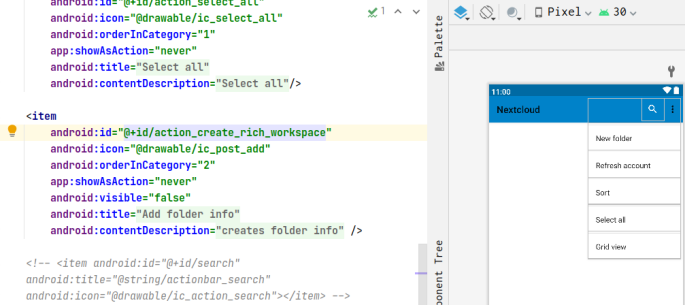

## 基本信息

app: [https://github.com/nextcloud/android](https://github.com/nextcloud/android)

issue: [https://github.com/nextcloud/android/issues/5173](https://github.com/nextcloud/android/issues/5173)

exception version: [https://github.com/nextcloud/android/tree/b1f198ff65433468fd8902d3dfe72edff56327de](https://github.com/nextcloud/android/tree/b1f198ff65433468fd8902d3dfe72edff56327de)

fix version: https://github.com/nextcloud/android/tree/33b0861955de95720ae60a75fc498d55baf75860

## 编译

依赖用了master, 无法编译, 需要换成历史版本, 根据时间推测是2.2.0

```xml
androidLibraryVersion = "master-SNAPSHOT" ->
androidLibraryVersion = "2.2.0"
```
java.lang.OutOfMemoryError: GC overhead limit exceeded的话参考通用的编译错误处理方案
## 复现

复现视频: 目录下的re5173

初始快照: 无

初始用例:

|Id|Type|Value|Desc|
|:----|:----|:----|:----|
|1|click|    |click log in|
|2|editx|[https://shared02.opsone-cloud.ch/](https://shared02.opsone-cloud.ch/)|set url [https://shared02.opsone-cloud.ch/](https://shared02.opsone-cloud.ch/)|
|3|click|    |click enter|
|4|wait|5000|wait 5s|
|5|click|    |click login|
|6|wait|2000|wait 2s|
|7|editx|droid_fuzzing_9@163.com|set username droid_fuzzing_9@163.com|
|8|editx|droid.fuzzing|set password droid.fuzzing|
|9|click|    |click log in|
|10|wait|2000|wait 2s|
|11|click|    |click grant access|
|12|wait|3000|wait 3s|
|13|click|    |click ALLOW|
|14|wait|3000|wait 3s|

错误用例:

|Id|Type|Value|Desc|
|:----|:----|:----|:----|
|1|click|    |click Open sidebar|
|2|click|    |click Auto upload|
|3|click|    |click More options|
|4|click|    |click Set up a custom folder|
|5|click|    |click Remote folder|

覆盖(all:覆盖总数/代码总数, 其他:只被当前动作覆盖/被当前动作覆盖)

[all]6265/92611 [1]23/467 [2]273/1440 [3]269/727 [4]189/443 [5]89/1531 

## 崩溃信息

栈信息: 目录下的stack5173

java.lang.NullPointerException: Attempt to invoke interface method 'android.view.MenuItem android.view.MenuItem.setVisible(boolean)' on a null object reference

> com/owncloud/android/ui/fragment/OCFileListFragment.java


## 分析

### root cause

action_create_rich_workspace对应如下界面(我们称之为界面A):



最后触发崩溃动作的界面(我们称之为界面B)如下:


可以处于界面B时界面A不可用, 故找不到界面A的元素. 为了证明界面A不可用, 我们还尝试find了action_select_all, 同样会空指针异常. root cause为Resource Not Found, 标记在ui元素获取处`com.owncloud.android.ui.fragment.OCFileListFragment:796`, 也是错误数据的源头.

### fix

作者在`com.owncloud.android.ui.fragment.OCFileListFragment:796`加了null判断, 归为Refine Condtition Checks


## fix信息

修复模式: Refine Condtition Checks

与栈信息的关系: =

距离:

|源文件总数|函数总数|回调总数|组件间通信|数据存储|
|:----|:----|:----|:----|:----|
|1|1|1|0|0|

标记(注释中的数字代表覆盖这条语句的动作):

```java
com.owncloud.android.ui.fragment.OCFileListFragment
796 // 0,1,2,5
```
## root cause信息

root cause分类: Resource Not Found

与栈信息的关系: =

距离:

|源文件总数|函数总数|回调总数|组件间通信|数据存储|
|:----|:----|:----|:----|:----|
|1|1|1|0|0|

标记(注释中的数字代表覆盖这条语句的动作):

```java
com.owncloud.android.ui.fragment.OCFileListFragment
796 // 0,1,2,5
```
## Ochi排名

art: 自动+手动生成相似用例

two: 错误用例+去除最后一步的正确用例

|用例/标记|fix|root cause|
|:----|:----|:----|
|art|5494|5494|
|two|5194|5194|

简单分析: 错误语句被初始动作覆盖, 效果会很差.

