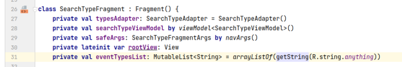
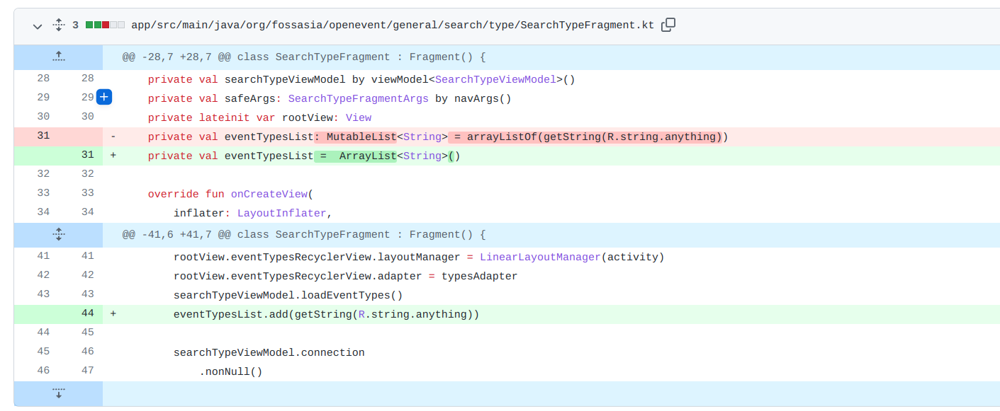

## 基本信息

app: [https://github.com/fossasia/open-event-attendee-android](https://github.com/fossasia/open-event-attendee-android)

issue: [https://github.com/fossasia/open-event-attendee-android/issues/2198](https://github.com/fossasia/open-event-attendee-android/issues/2198)

exception version: [https://github.com/liveHarshit/open-event-attendee-android/tree/4c748e6d9bc3d55259c3395ba4ad5b41f4f61a45](https://github.com/liveHarshit/open-event-attendee-android/tree/4c748e6d9bc3d55259c3395ba4ad5b41f4f61a45)

fix version: [https://github.com/liveHarshit/open-event-attendee-android/tree/4be48103f7fa762ddfe06562ce69dfb7d5075023](https://github.com/liveHarshit/open-event-attendee-android/tree/4be48103f7fa762ddfe06562ce69dfb7d5075023)

## 编译

正常

## 复现

复现视频: 目录下的re2198

初始快照: 无

初始用例: 

|Id|Type|Value|Desc|
|:----|:----|:----|:----|
|1|click|    |click Skip|
|2|click|    |click Skip for now|

错误用例:

|Id|Type|Value|Desc|
|:----|:----|:----|:----|
|1|click|    |click Search|
|2|click|    |click Anything|

覆盖(all:覆盖总数/代码总数, 其他:只被当前动作覆盖/被当前动作覆盖)

[all]699/19664 [1]90/128 [2]7/8 

## 崩溃信息

栈信息: 目录下的stack2198

java.lang.IllegalStateException: Fragment SearchTypeFragment{cb82664 (fe7e72cd-75c9-46ca-9fc6-bfbcee6eef5a)} not attached to a context

> org/fossasia/openevent/general/search/type/SearchTypeFragment.kt



## 分析

### root cause

getString是要调用getResources的, getResources需要context, 但activity和fragment还没有绑定, 应该在onCreateView中做这个操作.

root cause为Component Lifecycle Error. 标记在`org.fossasia.openevent.general.search.type.SearchTypeFragment:31`

### fix

作者将`org.fossasia.openevent.general.search.type.SearchTypeFragment:31`eventTypesList的初始化操作放到了onCreateView中, 属于Work in Right Callbacks.



## fix信息

修复模式: Work in Right Callbacks

与栈信息的关系: =

距离:

|源文件总数|函数总数|回调总数|组件间通信|数据存储|
|:----|:----|:----|:----|:----|
|1|1|0|0|0|

标记(注释中的数字代表覆盖这条语句的动作):

```java
org.fossasia.openevent.general.search.type.SearchTypeFragment
31 // 2
```
## root cause信息

root cause分类: Component Lifecycle Error

与栈信息的关系: =

距离:

|源文件总数|函数总数|回调总数|组件间通信|数据存储|
|:----|:----|:----|:----|:----|
|1|1|0|0|0|

标记(注释中的数字代表覆盖这条语句的动作):

```java
org.fossasia.openevent.general.search.type.SearchTypeFragment
31 // 2
```
## Ochi排名

art: 自动+手动生成相似用例

two: 错误用例+去除最后一步的正确用例

|用例/标记|fix|root cause|
|:----|:----|:----|
|art|7|7|
|two|2|2|

简单分析: 错误语句只和最后一个动作相关. 最后一个动作覆盖范围很小, 效果不错.

