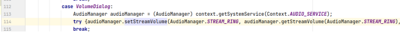
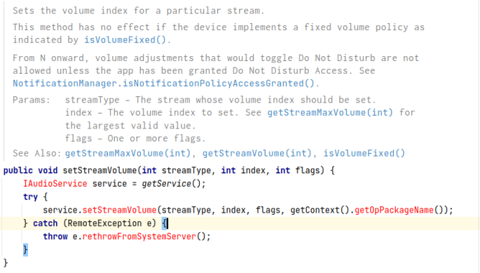
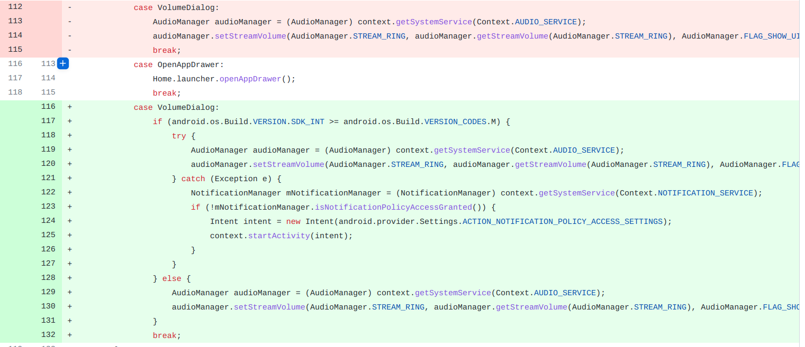

## 基本信息

app: [https://github.com/OpenLauncherTeam/openlauncher](https://github.com/OpenLauncherTeam/openlauncher)

issue: [https://github.com/OpenLauncherTeam/openlauncher/issues/67](https://github.com/OpenLauncherTeam/openlauncher/issues/67)

exception version: [https://github.com/OpenLauncherTeam/openlauncher/tree/56d71364b2bb907fa3e5dbc3b617a6be689747cd](https://github.com/OpenLauncherTeam/openlauncher/tree/56d71364b2bb907fa3e5dbc3b617a6be689747cd)

fix version: [https://github.com/OpenLauncherTeam/openlauncher/tree/5a765078c6193767066e23825471db8982336db5](https://github.com/OpenLauncherTeam/openlauncher/tree/5a765078c6193767066e23825471db8982336db5)

## 编译

使用buildToolsVersion '25.0.1'

in.championswimmer:SimpleFingerGestures_Android_Library:1.2 ->

in.championswimmer:SimpleFingerGestures_Android_Library:1.1

需要使用MyCrash67手动捕捉崩溃.

注意用0.0.1版插桩插件, 兼容android gradle 2~3

## 复现

复现视频: 目录下的re67

初始快照: 设计系统设置的更改, 推荐使用一个干净的快照

初始用例: 

|Id|Type|Value|Desc|
|:----|:----|:----|:----|
|1|click|    |SKIP|
|2|wait|2000|wait 2s|

错误用例:

|Id|Type|Value|Desc|
|:----|:----|:----|:----|
|1|dclick|50|dclick top|
|2|click|    |click Do not disturb|
|3|click|    |click Priority only|
|4|click|    |click Done|
|5|keyevent|KEYCODE_BACK|back|
|6|swipe|20 899 200 899 100|->|
|7|click|    |click Volume|

覆盖(all:覆盖总数/代码总数, 其他:只被当前动作覆盖/被当前动作覆盖)

[all]1843/14062 [1]0/21 [2]0/0 [3]0/0 [4]0/0 [5]0/4 [6]74/108 [7]29/48 

## 崩溃信息

栈信息: 目录下的stack67

Not allowed to change Do Not Disturb state

> com/benny/openlauncher/util/LauncherAction.java



## 分析

### root cause

查看setStreamVolume源码注释:



>  From N onward, volume adjustments that would toggle Do Not Disturb are not allowed unless the app has been granted Do Not Disturb Access. See NotificationManager.isNotificationPolicyAccessGranted()

android版本>=n时`com.benny.openlauncher.util.LauncherAction:114`setStreamVolume需要授权才能在do not disturb时工作, 归为API Usage Error. 

### fix

作者在修复时为`com.benny.openlauncher.util.LauncherAction:114`添加了版本判断, 执行授权操作, 归为特殊的Refine Condition Checks.



## fix信息

修复模式: Refine Condition Checks

与栈信息的关系: =

距离:

|源文件总数|函数总数|回调总数|组件间通信|数据存储|
|:----|:----|:----|:----|:----|
|1|1|0|0|0|

标记(注释中的数字代表覆盖这条语句的动作):

```java
com.benny.openlauncher.util.LauncherAction
114 // 7
```
## root cause信息

root cause分类: API Usage Error

与栈信息的关系: =

距离:

|源文件总数|函数总数|回调总数|组件间通信|数据存储|
|:----|:----|:----|:----|:----|
|1|1|0|0|0|

标记(注释中的数字代表覆盖这条语句的动作):

```java
com.benny.openlauncher.util.LauncherAction
114 // 7
```
## Ochi排名

art: 自动+手动生成相似用例

two: 错误用例+去除最后一步的正确用例

|用例/标记|fix|root cause|
|:----|:----|:----|
|art|26|26|
|two|23|23|

简单分析: 崩溃语句只和最后一个动作相关. 最后一个动作覆盖范围很小, two的效果会不错. art包含two, 效果也不错.

