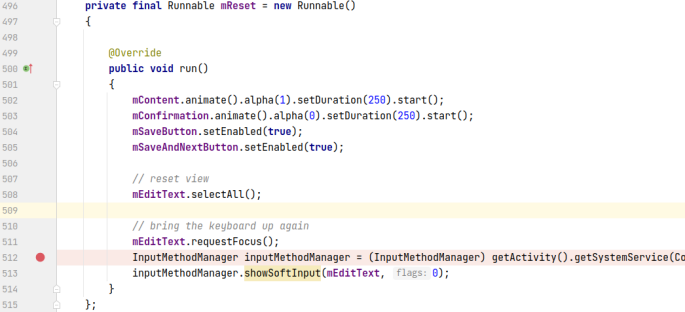
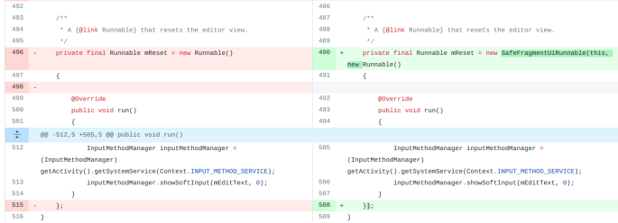
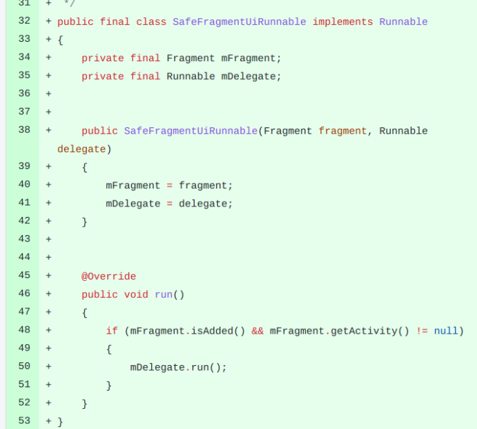

## 基本信息

app: [https://github.com/dmfs/opentasks](https://github.com/dmfs/opentasks)

issue: [https://github.com/dmfs/opentasks/issues/629](https://github.com/dmfs/opentasks/issues/629)

exception version: [https://github.com/dmfs/opentasks/tree/3c3781b9179ee252c72861f5642fcb34a97f02ad](https://github.com/dmfs/opentasks/tree/3c3781b9179ee252c72861f5642fcb34a97f02ad)

fix version: [https://github.com/dmfs/opentasks/tree/8863bcd543667ec43a5d5307ae855c3400e4b4c8](https://github.com/dmfs/opentasks/tree/8863bcd543667ec43a5d5307ae855c3400e4b4c8)

## 编译

正常

## 复现

复现视频: 目录下的re629

初始快照: 无

初始用例: 

|Id|Type|Value|Desc|
|:----|:----|:----|:----|
|1|click|    |CONTINUE|
|2|click|    |ALLOW|

错误用例:

|Id|Type|Value|Desc|
|:----|:----|:----|:----|
|1|click|    |click My tasks|
|2|click|    |click +|
|3|edit|1|set text 1|
|4|click|    |click SAVE AND CONTINUE|
|5|swipe|1065 695 1065 695 20|click a point of background|

覆盖(all:覆盖总数/代码总数, 其他:只被当前动作覆盖/被当前动作覆盖)

[all]1494/31737 [1]23/79 [2]94/180 [3]2/6 [4]94/291 [5]12/176  

## 崩溃信息

栈信息: 目录下的stack629

java.lang.NullPointerException: Attempt to invoke virtual method 'java.lang.Object android.app.Activity.getSystemService(java.lang.String)' on a null object reference

> opentasks/src/main/java/org/dmfs/tasks/QuickAddDialogFragment.java



## 分析

### root cause

主要原因是点击对话框外时，执行了QuickAddDialogFragment的onDestroy方法导致fragment绑定activity对象清掉了，进而getActivity获取为空. root cause属于Component Lifecycle Error, 理论上我们应该标记在QuickAddDialogFragment的onDestroy方法中. 然而作者并没有重写onDestroy, 因此我们标记在`org.dmfs.tasks.QuickAddDialogFragment:512`getActivity()的data loss处

### fix

看一下作者的修复, 内容比较多, 我们只关注当前崩溃的修复:



作者将496的Runnable换成了SafeFragmentUiRunnable. 看一下SafeFragmentUiRunnable的实现:



这里本质是添加了mFragment.getActivity != null的特判, 属于Refine Condition Checks. 标记在SafeFragmentUiRunnable的创建处`org.dmfs.tasks.QuickAddDialogFragment:496`

## fix信息

修复模式: Refine Condition Checks

与栈信息的关系: >

距离:

|源文件总数|函数总数|回调总数|组件间通信|数据存储|
|:----|:----|:----|:----|:----|
|1|1|0|0|0|

标记(注释中的数字代表覆盖这条语句的动作):

```java
org.dmfs.tasks.QuickAddDialogFragment
496 // 2
```
## root cause信息

root cause分类: Component Lifecycle Error

与栈信息的关系: =

距离:

|源文件总数|函数总数|回调总数|组件间通信|数据存储|
|:----|:----|:----|:----|:----|
|1|1|0|0|0|

标记(注释中的数字代表覆盖这条语句的动作):

```java
org.dmfs.tasks.QuickAddDialogFragment
512 // 5(实际上是动作4,后面会有分析)
```
## Ochi排名

art: 自动+手动生成相似用例

two: 错误用例+去除最后一步的正确用例

|用例/标记|fix|root cause|
|:----|:----|:----|
|art|175|2|
|two|109|117|

简单分析:fix语句和动作2有关, 测试用例对动作2都没有差异性, 效果不好. root cause语句比较特殊, 其实这条语句是被动作4覆盖的, 只不过动作5在动作4后立即执行, 使得插桩程序来不及处理. two体现不出动作4的差异, 因此效果不好. 而art中存在一个将click SAVE AND CONTINUE换成click SAVE的用例, 可以体现差异性, 因此效果不错. 
