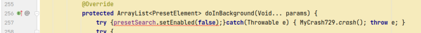
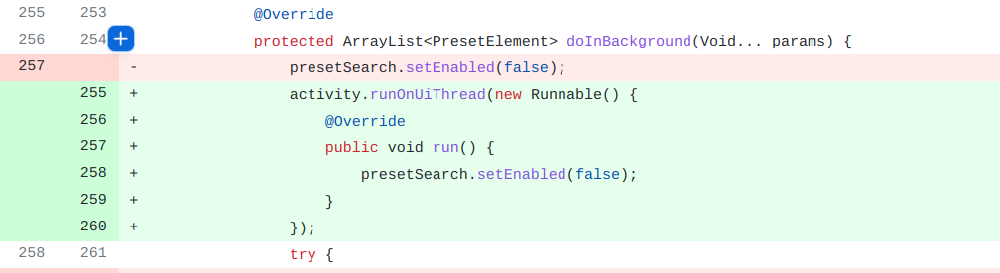

## 基本信息

app: [https://github.com/MarcusWolschon/osmeditor4android](https://github.com/MarcusWolschon/osmeditor4android)

issue: [https://github.com/MarcusWolschon/osmeditor4android/issues/729](https://github.com/MarcusWolschon/osmeditor4android/issues/729)

exception version: [https://github.com/MarcusWolschon/osmeditor4android/tree/fe62684882ec4c0633e3489adf66b1e7d510b341](https://github.com/MarcusWolschon/osmeditor4android/tree/fe62684882ec4c0633e3489adf66b1e7d510b341)

fix version: [https://github.com/MarcusWolschon/osmeditor4android/tree/d1e325c8d3fe7e841980e08213492ef4ac7b1f49](https://github.com/MarcusWolschon/osmeditor4android/tree/d1e325c8d3fe7e841980e08213492ef4ac7b1f49)

## 编译

```xml
markdown-gradle-plugin:1.3.0->1.1.0
ch.poole:preset-utils:0.1.2->0.23.1
```
app会自动捕捉崩溃重启, 需要用MyCrash729手动捕捉崩溃
## 复现

复现视频: 目录下的re729

初始快照: 无

初始用例: 

|Id|Type|Value|Desc|
|:----|:----|:----|:----|
|1|click|    |click ALLOW|
|2|click|    |click ALLOW|
|3|click|    |click OKAY|

错误用例:

|Id|Type|Value|Desc|
|:----|:----|:----|:----|
|1|click|    |click Current location|
|2|click|    |click LOAD|
|3|wait|4000|wait 4s|
|4|click|    |click unlock|
|5|click|    |click center|
|6|click|    |click the first node|
|7|click|    |click Properties|
|8|click|    |click Presets|
|9|edit|test|set text test|
|10|swipe|1017 330 1017 330 20|click Search(by coordinate)|

覆盖(all:覆盖总数/代码总数, 其他:只被当前动作覆盖/被当前动作覆盖)

[all]8299/87444 [1]5/6 [2]95/1624 [3]644/2420 [4]21/1259 [5]282/1373 [6]210/1491 [7]1053/2523 [8]22/160 [9]0/9 [10]45/175 

## 崩溃信息

栈信息: 目录下的stack729

Caused by: android.view.ViewRootImpl$CalledFromWrongThreadException: Only the original thread that created a view hierarchy can touch its views.

> de/blau/android/propertyeditor/PresetFragment.java



## 分析

### root cause

这是一个非ui线程更新ui元素错误, android禁止非ui线程更新ui元素. 作者应该是了解这一点的, 用了AsyncTask. 但在AsyncTask中, ui元素的更新不能放在doInBackground中, 应该放在onProgressUpdate中, 因而产生错误.

root cause为`de.blau.android.propertyeditor.PresetFragment:257`的Framework Constraint Error.

### fix

作者在`de.blau.android.propertyeditor.PresetFragment:257`用了runOnUiThread, 这个函数封装好了异步消息处理机制, 可以修复这个问题. 修复模式属于Move Code into Correct Thread. 另外, 我们只关注当前崩溃的修复, 因此作者修复的其他内容不予讨论.

## fix信息

修复模式: Move Code into Correct Thread

与栈信息的关系: =

距离:

|源文件总数|函数总数|回调总数|组件间通信|数据存储|
|:----|:----|:----|:----|:----|
|1|1|1|0|0|

标记(注释中的数字代表覆盖这条语句的动作):

```java
de.blau.android.propertyeditor.PresetFragment
257 // 10
```
## root cause信息

root cause分类: Framework Constraint Error

与栈信息的关系: =

距离:

|源文件总数|函数总数|回调总数|组件间通信|数据存储|
|:----|:----|:----|:----|:----|
|1|1|1|0|0|

标记(注释中的数字代表覆盖这条语句的动作):

```java
de.blau.android.propertyeditor.PresetFragment
257 // 10
```
