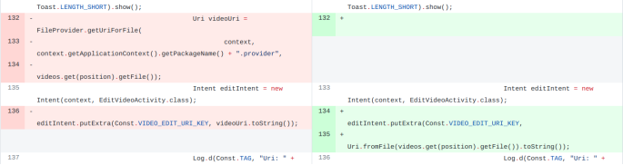
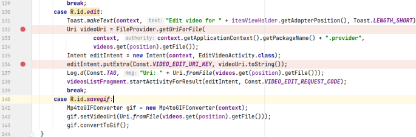
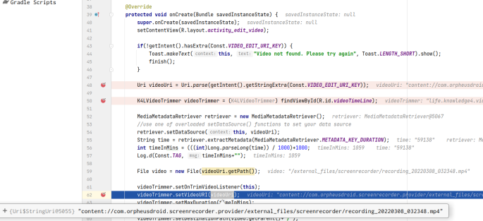
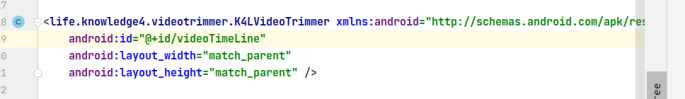
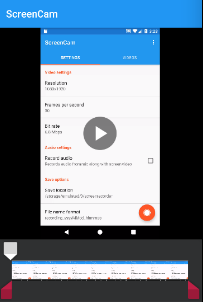
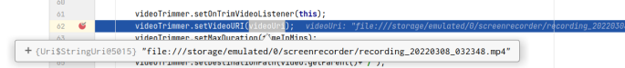

## 基本信息

app: [https://github.com/vijai1996/screenrecorder](https://github.com/vijai1996/screenrecorder)

issue: [https://github.com/vijai1996/screenrecorder/issues/32](https://github.com/vijai1996/screenrecorder/issues/32)

exception version: [https://github.com/vijai1996/screenrecorder/commit/e28390e70a476ecaffab0bc661c60dec2deae997](https://github.com/vijai1996/screenrecorder/commit/e28390e70a476ecaffab0bc661c60dec2deae997)

fix version: [https://github.com/vijai1996/screenrecorder/tree/7ef08c83317e8329a84d53bd145d0e6246b9bac9](https://github.com/vijai1996/screenrecorder/tree/7ef08c83317e8329a84d53bd145d0e6246b9bac9)

## 编译

正常

## 复现

复现视频: 目录下的re32

初始快照: 需要先录一段屏, 这里直接用快照

初始用例: 无

错误用例:

|Id|Type|Value|Desc|
|:----|:----|:----|:----|
|1|click|    |click ...|
|2|click|    |click Edit|
|3|swipe|24 1622 67 1622 200|swipe ->|
|4|click|    |click SAVE|

覆盖(all:覆盖总数/代码总数, 其他:只被当前动作覆盖/被当前动作覆盖)

[all]651/5300 [1]8/13 [2]25/51 [3]0/0 [4]0/0 

## 崩溃信息

栈信息: 目录下的stack32

java.io.FileNotFoundException: /external_files/screenrecorder/recording_20220308_032348.mp4 (No such file or directory)

栈崩溃无法定位到代码中, 原因是库启动了另一条线程, 崩溃发生在另一条线程中.

## 分析

### root cause

虽然无法依靠栈信息作为启动点进行调试, 但我们仍旧可以通过作者的修改分析错误原因. 作者的主要修改如下:



> com/orpheusdroid/screenrecorder/adapter/VideoRecyclerAdapter.java如



可以看到作者将FileProvider.getUriForFile换成了Uri.fromFile. 这个修改主要会对putExtra中的值产生影响, 寻找接收这个值的位置:

> com/orpheusdroid/screenrecorder/EditVideoActivity.java



可以看到此时的路径是content://com.orpheusdroid.screenrecorder.provider/external_files/screenrecorder/recording_20220308_032348.mp4

再仔细观察一下会发现这里用到了R.id.videoTimeLine, 这其实是一个外部依赖控件:





在上面这个页面上的操作其实都是操控的外部控件, 和app源码无关, 上面栈信息定位不到源码中也是这个原因. 不过为了描述方便, 我们将com/orpheusdroid/screenrecorder/EditVideoActivity.java:62视为app源码中的栈崩溃位置.

接着我们运行一下fix版本:

com/orpheusdroid/screenrecorder/EditVideoActivity.java



对比两次路径:

bug: content://com.orpheusdroid.screenrecorder.provider/external_files/screenrecorder/recording_20220308_032348.mp4

fix:

[file:///storage/emulated/0/screenrecorder/recording_20220308_032348.mp4](file:///storage/emulated/0/screenrecorder/recording_20220308_032348.mp4)

可以看到是路径前缀错误引发的崩溃. 

这个问题归为`com.orpheusdroid.screenrecorder.adapter.VideoRecyclerAdapter:132`的API Usage Error. 

### fix

作者将`com.orpheusdroid.screenrecorder.adapter.VideoRecyclerAdapter:132`的FileProvider.getUriForFile换成了Uri.fromFile, 

属于Change API.

## fix信息

修复模式: Change API

与栈信息的关系: >

距离:

|源文件总数|函数总数|回调总数|组件间通信|数据存储|
|:----|:----|:----|:----|:----|
|2|2|2|1|0|

标记(注释中的数字代表覆盖这条语句的动作):

```java
com.orpheusdroid.screenrecorder.adapter.VideoRecyclerAdapter
132 // 2
```
## root cause信息

root cause分类: API Usage Error.

与栈信息的关系: >

距离:

|源文件总数|函数总数|回调总数|组件间通信|数据存储|
|:----|:----|:----|:----|:----|
|2|2|2|1|0|

标记(注释中的数字代表覆盖这条语句的动作):

```java
com.orpheusdroid.screenrecorder.adapter.VideoRecyclerAdapter
132 // 2
```
